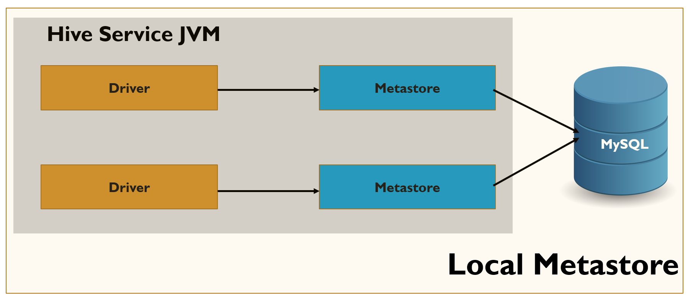

# External Hive Metastore Support

## Overview
Hive Metastore is the central repository of Apache Hive metadata. It contains metadata (column names, data types, partitions, comments, etc.) of the objects that you create in Apache Hive.

All Apache Hive implementations require a Hive service.  **Hive Service** includes three processes; HiveServer2 (includes  compiler and execution engine), MetaStore, and WebHCat. The Thrift interfaces include **Drivers**, which are processes that interpret the query. You can implement the Hive Metastore using the tables in a relational database such as MySQL. By default, Apache Hive uses a built-in Derby SQL server for this purpose. For running Apache Hive on a production cluster, you require  MySQL or any other similar relational database. 

Apache Hive Metastore service supports the following databases. You can change the relational database to use any of the following supported databases:

*	Derby
*	MySQL
*	MS SQL Server
*	Oracle
*	Postgres

TIBCO ComputeDB can connect to the Hive Metastore in any of the following modes:

### Local Mode




In this mode, the Hive Metastore service runs in the same process as that of the main HiveServer process, but the Metastore database runs in a separate process. It can be either on the same machine or a different machine. The Metastore service communicates with the Metastore database over JDBC.  External processes or applications cannot connect to the Metastore service directly. Only Hive clients have this privilege as both the Hive and the Metastore service are running in the same JVM process.

### Remote Mode


In this mode, the Hive Metastore service and the related Metastore database run in their own processes. External processes and applications can communicate with the Metastore service using the Thrift network API. The Metastore service communicates with the Metastore database over JDBC. The database, the HiveServer process, and the Metastore service can all be on the same machine, but running the HiveServer process on a separate machine provides better availability and scalability.

## How Spark Connects to External Hive Metastore

Spark SQL uses a Hive Metastore to manage the metadata of persistent relational entities (for example,  databases, tables, columns, partitions) in a relational database for faster access. By default, Spark SQL uses the embedded deployment mode of a Hive Metastore with an Apache Derby database.

When you create  a SparkSession with Hive support, the external catalog (aka Metastore) is **HiveExternalCatalog**.  In Spark, the **HiveExternalCatalog** uses the **spark.sql.warehouse.dir **directory to locate the databases. Moreover, you can use the following **javax.jdo.option** properties to connect to the Hive Metastore database:

| Item | Description |
|:--------|:--------|
| **javax.jdo.option.ConnectionURL **      | The JDBC connection URL of a Hive Metastore database to use:</br>`jdbc:derby:;databaseName=metastore_db;create=true`</br>`jdbc:derby:memory:;databaseName=${metastoreLocation.getAbsolutePath};create=true`</br>`jdbc:mysql://192.168.175.160:3306/metastore?useSSL=false` |</br>
|javax.jdo.option.ConnectionDriverName| The JDBC driver of a Hive Metastore database to use:</br>`org.apache.derby.jdbc.EmbeddedDriver`|
|javax.jdo.option.ConnectionUserName| The user name to use to connect to a Hive Metastore database.|
|javax.jdo.option.ConnectionPassword| The password to use to connect to a Hive Metastore database.|

From a TIBCO ComputeDB cluster, you can access and query the Hive tables using a Snappy Session. After establishing a connection with the Metastore, you can do the following:

*	Import Hive tables defined in an external Hive catalog into TIBCO ComputeDB catalog tables.
*	Use Hive tables as external tables for queries, including joins with tables defined in the TIBCO ComputeDB catalog.
*	Query the Hive tables. 
*	Define new Hive tables in an external Hive catalog.

Spark optimizations for Hive tables are also available through Snappy Session. 

You can access Hive tables created in the following ecosystems:

*	Apache Hive
*	AWS
*	Azure
*	Cloudera

## How TIBCO ComputeDB Connects to Hive Metastore

The **hive-site.xml** configuration file provides information about the Hive configurations to TIBCO ComputeDB. You must copy this file into the TIBCO ComputeDB **conf** folder, configure the **hive-site.xml** with the required settings, and copy the appropriate JDBC driver into the TIBCO ComputeDB classpath. This establishes the connection between the TIBCO ComputeDB cluster and the  Hive Metastore. After you have established the connection, you can access hive tables and run queries on it from the TIBCO ComputeDB cluster.

For using Hive Metastore in TIBCO ComputeDB, do the following:

1.	Copy the **hive-site.xml** from `<Hive installation folder>`/**conf** directory to **`<TCDB installation folder>`/conf** folder or use the trimmed version of **hive-site.xml**.
2.	If you are using MySQL as the Metastore database, copy the **mysql-connector** jar file (for example, **mysql-connector-java-5.1.48.jar**) from `<Hive installation folder>`/lib to the TIBCO ComputeDB classpath, that is  **`<TIBCO ComputeDB installation folder>`/jars/**. For any other Metastore database, copy the relevant connector jars to the TIBCO ComputeDB **jars** folder.

### Example - Trimmed Version of hive-site.xml

```
<configuration>
  <property>
     <name>javax.jdo.option.ConnectionURL</name>
     <value>jdbc:mysql://dev11:3306/metastore_db?createDatabaseIfNotExist=true</value>
     <description>
       JDBC connect string for a JDBC metastore.
       To use SSL to encrypt/authenticate the connection, provide a database-specific SSL flag in the connection URL.
       For example, jdbc:postgresql://myhost/db?ssl=true for postgres database.
     </description>
   </property>
   <property>
    <name>javax.jdo.option.ConnectionUserName</name>
    <value>hive</value>
    <description>Username to use against metastore database</description>
  </property>
  <property>
    <name>javax.jdo.option.ConnectionPassword</name>
    <value>Snappy!23</value>
    <description>password to use against metastore database</description>
  </property>
</configuration>
```
## List of Ecosystem Connectors
The following connectors are tested with the corresponding ecosytems for TIBCO ComputeDB:

|Ecosystem| Connector | Example|
|:--------|:--------| :--------|
|**Apache Hive **| MySQL|mysql-connector-java-5.1.48.jar|
|**Azure HDInsight**|  MSSQL|mssql-jdbc-7.0.0.jre8.jar|
|**AWS EMR**| MySQL | 	mysql-connector-java-5.1.12.jar|
|**Cloudera**|MySQL|	mysql-connector-java-5.1.48.jar|

## Accessing Hive Tables from TIBCO ComputeDB Cluster
After configuring the settings to connect the TIBCO ComputeDB cluster to an external Metastore, set the property **spark.sql.catalogImplementation = hive**. You can set this property only at the session-level. After setting this property, you can run queries on the Hive table, perform the join operations between Hive and TIBCO ComputeDB native tables, perform the join operations between Hive tables.

If you set the property **spark.sql.catalogImplementation = in-memory**, you cannot access the Hive tables.  TIBCO ComputeDB acts as the execution engine for Hive table query execution. You can refer the following examples to access and query the Hive tables:

*	To point to the external Hive catalog from the snappy session, set the following property. This can be set only at session level and not at global level.
		
        	snappy-sql> set spark.sql.catalogImplementation=hive;

*	To point to TIBCO ComputeDB internal catalog from the snappy session.
		
        	snappy-sql> set spark.sql.catalogImplementation=in-memory;
        
*	To access Hive tables use the following command:
		
        	snappy-sql> show tables in <database name>;

	It is mandatory to specify the **Hive** database to access the Hive tables from Snappy Session. If you have not created any other database,  then you can use the **default** database. For example, in Hive, if you create database **hiveDB**, use the following command:
	
    	snappy-sql> show tables in hiveDB;

*	To read the Hive tables from snappy:

		snappy-sql> SELECT FirstName, LastName FROM default.hive employees ORDER BY LastName;

*	To join TIBCO ComputeDB tables and Hive tables:
	
        snappy-sql> SELECT emp.EmployeeID, emp.FirstName, emp.LastName, o.OrderID, o.OrderDate FROM default.hive_employees emp JOIN snappy_orders o ON (emp.EmployeeID = o.EmployeeID) ORDER BY o.OrderDate;

## Troubleshooting

Following are some issues that you may come across and their corresponding solutions / workarounds:

*	If the property **hive.execution.engine** is set  as Tez then the following exception is shown:

	*java.lang.RuntimeException: java.lang.IllegalArgumentException: Error while instantiating 		'org.apache.spark.sql.hive.HiveExternalCatalog'*

	This exception can occur when you have copied the **hive-site.xml** file to **Conf** folder  and if you have provided the value of the xml property **hive.execution.engine** as Tez. This exception is caused by **java.lang.ClassNotFoundException: org.apache.tez.dag.api.SessionNotRunning**
	
	**Workaround:** In case you have copied all the contents from the hive-site.xml file to the TIBCO ComputeDB conf file, ensure that the value of the XML property hive.execution.engine is left empty.</br>
    
*	*Unable to open a test connection to the given database. JDBC url = jdbc:mysql://dev11:3306/metastore_db?createDatabaseIfNotExist=true, username = hive. Terminating connection pool (set lazyInit to true if you expect to start your database after your app*
	
    This error occurs when the MySQL process (Metadata server process) does not get started. 
	
    **Workaround**: Ensure to start the Metastore service before connecting to Hive Beeline CLI. 

*	When the TIBCO Compute DB cluster, Hive, MySQL (Metadata Server) are running, and MySQL (Metadata Server) process stops abruptly, then Snappy shell becomes unresponsive.

*	While accessing the Hive table, if you do not set the parameter **javax.jdo.option.ConnectionPassword**, then the following exception is shown:
	
    *ERROR XJ001: (SQLState=XJ001 Severity=0) (Server=hostname:port Thread=ThriftProcessor-0) Java exception: 'Unable to open a test connection to the given database. JDBC url = jdbc:mysql://<hostname>:<port>/<databasename>?createDatabaseIfNotExist=true, username = user. Terminating connection pool (set lazyInit to true if you expect to start your database after your app). Original Exception: ------
    java.sql.SQLException: Access denied for user 'user'@'<hostname>' (using password: YES)*
  
*	While accessing the hive table, if you do not set the parameter **javax.jdo.option.ConnectionUserName**, then the following exception is shown:

    *ERROR XJ001: (SQLState=XJ001 Severity=0) (Server=hostname:port Thread=ThriftProcessor-0) Java exception: 'Unable to open a test connection to the given database. JDBC url = jdbc:mysql://<hostname>:<port>/<databasename>?createDatabaseIfNotExist=true, username = APP. Terminating connection pool (set lazyInit to true if you expect to start your database after your app). Original Exception: ------
    java.sql.SQLException: Access denied for user 'APP'@'<hostname>' (using password: YES)*

*	While accessing the hive table, if you do not set the parameter **javax.jdo.option.ConnectionURL**, then an exception is not shown. However, you cannot access the Hive tables. 
	
    **For example:**
    
            snappy> show tables in default;
            schemaName                 |tableName                             |isTemporary
            -------------------------------------------------------------------------------

            0 rows selected
            snappy> set spark.sql.catalogImplementation=hive;
            snappy> show tables in default;
            schemaName                  |tableName                             |isTemporary
            -------------------------------------------------------------------------------

            0 rows selected

*	While using Azure HDInsight, if you do not set the parameter **fs.azure.account.key.hadoopmetastohdistorage.blob.core.windows.net**, the following exception is shown:

	*ERROR 38000: (SQLState=38000 Severity=20000) (Server=hostname:port  Thread=ThriftProcessor-0) The exception 'com.pivotal.gemfirexd.internal.engine.jdbc.GemFireXDRuntimeException: myID: 127.0.0.1(22841)<v1>:51028, caused by org.apache.hadoop.fs.azure.AzureException: org.apache.hadoop.fs.azure.AzureException: Container hadoopmetastore-2019-12-13t09-18-59-359z in account hadoopmetastohdistorage.blob.core.windows.net not found, and we can't create  it using anoynomous credentials.' was thrown while evaluating an expression.*