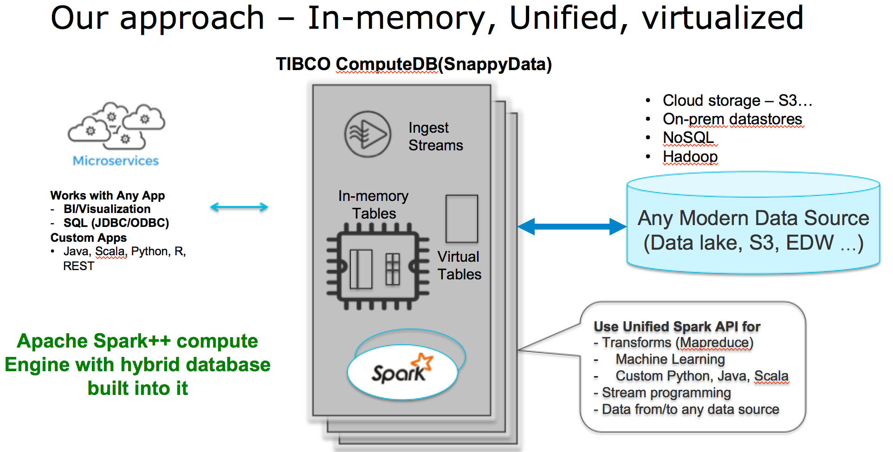

## Introduction 
TIBCO ComputeDB(aka SnappyData) is a distributed, in-memory optimized, analytics database. TIBCO ComputeDB delivers high throughput, low latency, and high concurrency for unified analytics workloads. By fusing an in-memory hybrid database inside Apache Spark, it provides analytic query processing, mutability/transactions, access to virtually all big data sources/formats and stream processing all in one unified cluster.

One common use case for TIBCO ComputeDB is to provide analytics at interactive speeds over large volumes of data with minimal or no pre-processing of the dataset. For instance, often, there is no need to pre-aggregate/reduce or generate cubes over your large data sets for ad-hoc visual analytics. This is made possible by smartly managing data in-memory, dynamically generating code, using vectorization optimizations and maximizing the potential of modern multi-core CPUs.

TIBCO ComputeDB is based on the [open source community project called SnappyData](https://github.com/SnappyDataInc/snappydata)



!!!Note
	*TIBCO ComputeDB is not another Enterprise Data Warehouse (EDW) platform, but rather a high performance computational and caching cluster that augments traditional EDWs and data lakes.*

### Important Capabilities

<!---<TODO> - we could shorten the description of each capability and retain the description in the new concepts chapter later.--->

*	**Easily discover and catalog big data sets** </br>
	You can connect and discover datasets in SQL DBs, Hadoop, NoSQL stores, file systems, or even cloud data stores such as S3 by using SQL, infer schemas automatically and register them in a secure catalog. A wide variety of data formats are supported out of the box such as JSON, CSV, text, Objects, Parquet, ORC, SQL, XML, and more.</br>


*	**Rich connectivity** </br>
	TIBCO ComputeDB is built with Apache Spark inside. Therefore, any data store that has a Spark connector can be accessed using SQL or by using the Spark RDD/Dataset API. Virtually all modern data stores provide a Spark connector. see [SparkPackages](https://spark-packages.org/). You can also dynamically deploy connectors to a running TIBCO ComputeDB cluster.</br>

*	**Virtual or in-memory data**</br>
	You can decide which datasets need to be provisioned into distributed memory or left at the source. When the data is left at source, after being modeled as virtual/external tables, the analytic query processing is parallelized, and the query fragments are pushed down whenever possible and executed at high speed.
When speed is essential, applications can selectively copy the external data into memory using a single SQL command. </br>

*	**In-memory Columnar + Row store**</br> 
	You can choose in-memory data to be stored in any of the following forms:
    *	**Columnar**: The form that is compressed and designed for scanning/aggregating large data sets.
    *	**Row store**: The form that has an extremely fast key access or highly selective access.
	The columnar store is automatically indexed using a skipping index. Applications can explicitly add indexes for the row store. </br>

*	**High performance** </br>
	When data is loaded, the engine parallelizes all the accesses by carefully taking into account the available distributed cores, the available memory, and whether the source data can be partitioned to deliver extremely high-speed loading. Therefore, unlike a traditional warehouse, you can bring up TIBCO ComputeDB whenever required, load, process, and tear it down. Query processing uses code generation and vectorization techniques to shift the processing to the modern-day multi-core processor and L1/L2/L3 caches to the possible extent. </br>

*	**Flexible rich data transformations** </br>
	External data sets when discovered automatically through schema inference will have the schema of the source. Users can cleanse, blend, reshape data using a SQL function library (Spark SQL+) or even submit Apache Spark jobs and use custom logic. The entire rich Spark API is at your disposal. This logic can be written in SQL, Java, Scala, or even Python.</br>

*	**Prepares data for data science** </br>
	Through the use of Spark API for statistics and machine learning, raw or curated datasets can be easily prepared for machine learning. You can understand the statistical characteristics such as correlation, independence of different variables and so on. You can generate distributed feature vectors from your data. For instance, you can use algorithms such as one-hot encoder, binarizer, and a range of functions built into the Spark ML library. Generated features can be stored back into column tables and shared across a group of users with security and avoid dumping copies to disk, which is slow and error-prone.</br>
 
*	**Stream ingestion and liveness** </br>
	Popular big data systems today resort to periodic refreshing of data sets from the source as the managed data often cannot be mutated. 
    In TIBCO ComputeDB, operational systems can feed data updates through Kafka to TIBCO ComputeDB. The incoming data can be CDC(Change-data-capture) events (insert, updates, or deletes) and can be easily ingested into in-memory tables with ease, consistency, and exactly-once semantics. The Application can apply custom logic to do sophisticated transformations and get the data ready for analytics. This incremental and continuous process is far more efficient than batch refreshes. </br> 

*	**Approximate Query Processing(AQP)** </br>
	When dealing with huge data sets, for example, IoT sensor streaming time-series data, it may not be possible to provision the data in-memory, and if left at the source (say Hadoop or S3) your analytic query processing can take too long. In TIBCO ComputeDB, you can create one or more stratified data samples on the full data set. The query engine automatically uses these samples for aggregation queries, and a nearly accurate answer returned to clients. This can be immensely valuable when visualizing a trend, plotting a graph or bar chart.</br>

*	**Access from anywhere** </br>
	You can use JDBC, ODBC, REST, or any of the Spark APIs. The product is fully compatible with Spark 2.1.1. TIBCO ComputeDB natively supports modern visualization tools such as TIBCO Spotfire, Tableau, and Qlikview.


## Downloading and Installing TIBCO ComputeDB
You can download and install the latest version of TIBCO ComputeDB from [here](https://edelivery.tibco.com/storefront/index.ep). Refer to the [documentation](/install.md) for installation steps.

## Getting Started
Multiple options are provided to get started with TIBCO ComputeDB. Easiest way to get going with ComputeDB is on your laptop. You can also use any of the following options:

*	On-premise clusters

*	AWS

*	Docker
*	Kubernetes

You can find more information on options for running TIBCO ComputeDB [here](/quickstart.md).

## Quick Test to Measure Performance of TIBCO ComputeDB vs Apache Spark
If you are already using Spark, experience upto 20x speedup for your query performance with TIBCO ComputeDB. Try out this [test](https://github.com/SnappyDataInc/snappydata/blob/master/examples/quickstart/scripts/Quickstart.scala) using the Spark Shell.

## Documentation
To understand TIBCO ComputeDB and its features refer to the [documentation](https://tibco-computedb.readthedocs.io).

### Other Relevant content
- [Paper](http://cidrdb.org/cidr2017/papers/p28-mozafari-cidr17.pdf) on Snappydata at Conference on Innovative Data Systems Research (CIDR) - Info on key concepts and motivating problems.
- [Another early Paper](https://www.snappydata.io/snappy-industrial) that focuses on overall architecture, use cases, and benchmarks. ACM Sigmod 2016.
- [TPC-H benchmark](https://www.snappydata.io/whitepapers/snappydata-tpch) comparing Apache Spark with SnappyData
- Checkout the [SnappyData blog](https://www.snappydata.io/blog) for developer content
-	[TIBCO community page](https://community.tibco.com/products/tibco-computedb) for the latest info.

## Community Support

We monitor the following channels comments/questions:

*	[Stackoverflow](http://stackoverflow.com/questions/tagged/snappydata) 

*	[Slack](http://snappydata-slackin.herokuapp.com/) 

*	[Gitter](https://gitter.im/SnappyDataInc/snappydata) 

*	[Mailing List](https://groups.google.com/forum/#!forum/snappydata-user) 

*	[Reddit](https://www.reddit.com/r/snappydata)           

*	[JIRA](https://jira.snappydata.io/projects/SNAP/issues) 

## Link with TIBCO ComputeDB Distribution

### Using Maven Dependency

TIBCO ComputeDB artifacts are hosted in Maven Central. You can add a Maven dependency with the following coordinates:

```
groupId: io.snappydata
artifactId: snappydata-cluster_2.11
version: 1.1.1
```

### Using SBT Dependency

If you are using SBT, add this line to your **build.sbt** for core TIBCO ComputeDB artifacts:

```
libraryDependencies += "io.snappydata" % "snappydata-core_2.11" % "1.1.1"
```

For additions related to SnappyData cluster, use:

```
libraryDependencies += "io.snappydata" % "snappydata-cluster_2.11" % "1.1.1"
```

You can find more specific SnappyData artifacts [here](http://mvnrepository.com/artifact/io.snappydata)

!!!Note
	If your project fails when resolving the above dependency (that is, it fails to download `javax.ws.rs#javax.ws.rs-api;2.1`), it may be due an issue with its pom file. </br> As a workaround, you can add the below code to your **build.sbt**:

```
val workaround = {
  sys.props += "packaging.type" -> "jar"
  ()
}
```

For more details, refer [https://github.com/sbt/sbt/issues/3618](https://github.com/sbt/sbt/issues/3618).


## Building from Source
If you would like to build TIBCO ComputeDB from source, refer to the [documentation on building from source](/install/building_from_source.md).


## How is TIBCO ComputeDB different than Apache Spark? 

Apache Spark is a general purpose parallel computational engine for analytics at scale. At its core, it has a batch design center and is capable of working with disparate data sources. While this provides rich unified access to data, this can also be quite inefficient and expensive. Analytic processing requires massive data sets to be repeatedly copied and data to be reformatted to suit Spark. In many cases, it ultimately fails to deliver the promise of interactive analytic performance.
For instance, each time an aggregation is run on a large Cassandra table, it necessitates streaming the entire table into Spark to do the aggregation. Caching within Spark is immutable and results in stale insight.

### The TIBCO ComputeDB Approach

##### Snappy Architecture


TIBCO ComputeDB takes a different approach. TIBCO ComputeDB fuses a low latency, highly available in-memory transactional database (GemFireXD) into Spark with shared memory management and optimizations. Data can be managed in columnar form (similar to Spark caching) or in a row oriented manner(commonly used in popular relational databases like postgres). But, many query engine operators are significantly more optimized through better vectorization, code generation and indexing. </br>
The net effect is, an order of magnitude performance improvement when compared to native Spark caching, and more than two orders of magnitude better performance when Spark is used in conjunction with external data sources.
Spark is turned into an in-memory operational database capable of transactions, point reads, writes, working with Streams (Spark) and running analytic SQL queries without losing the computational richness in Spark.


## Streaming Example - Ad Analytics
Here is a stream + Transactions + Analytics use case example to illustrate the SQL as well as the Spark programming approaches in TIBCO ComputeDB - [Ad Analytics code example](https://github.com/SnappyDataInc/snappy-poc). Here is a [screencast](https://www.youtube.com/watch?v=bXofwFtmHjE) that showcases many useful features of TIBCO ComputeDB. The example also goes through a benchmark comparing TIBCO ComputeDB to a Hybrid in-memory database and Cassandra.

## Contributing to TIBCO ComputeDB

If you are interested in contributing, please visit the [community page](http://www.snappydata.io/community) for ways in which you can help.

