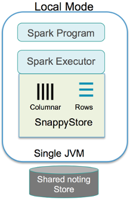

<a id="localmode"></a>
# Local Mode

In this mode, you can execute all the components (client application, executors, and data store) locally in the application's JVM. It is the simplest way to start testing and using TIBCO ComputeDB™, as you do not require a cluster, and the  executor threads are launched locally for processing.

**Key Points**

* No cluster required

* Launch Single JVM (Single-node Cluster)

* Launches executor threads locally for processing

* Embeds the TIBCO ComputeDB in-memory store in-process

* For development purposes only
 


**Example: Using the Local mode for developing TIBCO ComputeDB programs**

You can use an IDE of your choice, and provide the below dependency to get TIBCO ComputeDB binaries:

**Example: Maven dependency**

```pre
<!-- https://mvnrepository.com/artifact/io.snappydata/snappydata-cluster_2.11 -->
<dependency>
    <groupId>io.snappydata</groupId>
    <artifactId>snappydata-cluster_2.11</artifactId>
    <version>1.0.2.1</version>
</dependency>
```

**Example: SBT dependency**

```pre
// https://mvnrepository.com/artifact/io.snappydata/snappydata-cluster_2.11
libraryDependencies += "io.snappydata" % "snappydata-cluster_2.11" % "1.0.2.1"
```

**Note**:</br>
If your project fails when resolving the above dependency (that is, it fails to download javax.ws.rs#javax.ws.rs-api;2.1), it may be due an issue with its pom file. </br>As a workaround, add the below code to the **build.sbt**:

```pre
val workaround = {
  sys.props += "packaging.type" -> "jar"
  ()
}
```

For more details, refer [https://github.com/sbt/sbt/issues/3618](https://github.com/sbt/sbt/issues/3618).

**Create Snappy Session**:

To start TIBCO ComputeDB store you need to create a Snappy Session in your program:

```pre
 val spark: SparkSession = SparkSession
         .builder
         .appName("SparkApp")
         .master("local[*]")
         .getOrCreate
 val snappy = new SnappySession(spark.sparkContext)
```
  
  
  
**Example**: **Launch Apache Spark shell and provide TIBCO ComputeDB dependency as a Spark package**:

If you already have Spark2.0 installed in your local machine you can directly use `--packages` option to download the TIBCO ComputeDB binaries.

```pre
./bin/spark-shell --packages "SnappyDataInc:snappydata:1.0.2.1-s_2.11"
```
