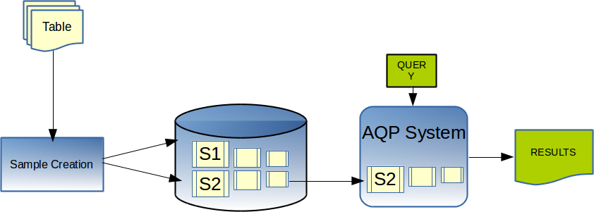

# Approximate Query Processing (AQP)

!!! Note
	This feature is not supported in the Smart Connector mode. 

The following topics are covered in this section:

* [Key Concepts](sde/key_concepts.md)

* [Working with Stratified Samples](sde/working_with_stratified_samples.md)

* [Running Queries](sde/running_queries.md)

* [More Examples](sde/more_examples.md)

* [Sample Selection](sde/sample_selection.md)

* [High-level Accuracy Contracts (HAC)](sde/hac_contracts.md)

* [Sketching](sde/sketching.md)

   
The TIBCO ComputeDB Approximate Query Processing (AQP) offers a novel and scalable system to analyze large datasets. AQP uses statistical sampling techniques and probabilistic data structures to answer analytic queries with sub-second latency. There is no need to store or process the entire dataset. The approach trades off query accuracy for fast response time. 

For instance, in exploratory analytics, a data analyst might be slicing and dicing large datasets to understand patterns, trends or to introduce new features. Often the results are rendered in a visualization tool through bar charts, map plots and bubble charts. It would increase the productivity of the engineer by providing a near perfect answer that can be rendered in seconds instead of minutes (visually, it is identical to the 100% correct rendering), while the engineer continues to slice and dice the datasets without any interruptions. 

When accessed using a visualization tool (Apache Zeppelin), users immediately get their almost-perfect answer to analytical queries within a couple of seconds, while the full answer can be computed in the background. Depending on the immediate answer, users can choose to cancel the full execution early, if they are either satisfied with the almost-perfect initial answer or if after viewing the initial results they are no longer interested in viewing the final results. This can lead to dramatically higher productivity and significantly less resource consumption in multi-tenant and concurrent workloads on shared clusters.

While in-memory analytics can be fast, it is still expensive and cumbersome to provision large clusters. Instead, AQP allows you to retain data in existing databases and disparate sources, and only caches a fraction of the data using stratified sampling and other techniques. In many cases, data explorers can use their laptops and run high-speed interactive analytics over billions of records. 

Unlike existing optimization techniques based on OLAP cubes or in-memory extracts that can consume a lot of resources and work for a prior known queries, the TIBCO ComputeDB Synopses data structures are designed to work for any ad-hoc query.

<heading2>How does it work?</heading2>

The following diagram provides a simplified view of how the AQP works. The AQP is deeply integrated with the TIBCO ComputeDB store and its general purpose SQL query engine. Incoming rows (could come from static or streaming sources) are continuously sampled into one or more "sample" tables. These samples can be considered much like how a database utilizes indexes - for optimization. There can, however, be one difference, that is, the "exact" table may or may not be managed by TIBCO ComputeDB (for instance, this may be a set of folders in S3 or Hadoop). When queries are executed, the user can optionally specify their tolerance for error through simple SQL extensions. AQP transparently goes through a sample selection process to evaluate if the query can be satisfied within the error constraint. If so, the response is generated directly from the sample. 

<heading2>Using AQP</heading2>

In the current release AQP queries only work for SUM, AVG and COUNT aggregations. Joins are only supported to non-samples in this release. The TIBCO ComputeDB AQP module will gradually expand the scope of queries that can be serviced through it. But the overarching goal here is to dramatically cut down on the load on current systems by diverting at least some queries to the sampling subsystem and increasing productivity through fast response times. 
