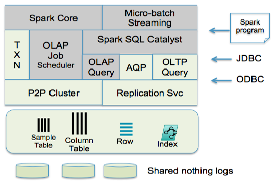

## Core Components
The following figure depicts the core components of TIBCO ComputeDB™, where Spark’s original components are highlighted in gray. To simplify, the standard components such as security and monitoring have been omitted.

The storage layer is primarily in-memory and manages data in either row or column formats. The column format is derived from Spark’s RDD caching implementation and allows for compression. Row-oriented tables can be indexed on keys or secondary columns, supporting fast reads and writes on index keys. Refer to the [Row/Column table](../programming_guide/tables_in_snappydata.md) section for details on the syntax and available features. 

Two primary programming models are supported by TIBCO ComputeDB — SQL and Spark’s API. SQL access is through JDBC/ODBC and it supports the Spark SQL dialect with several extensions, to make the language compatible with the SQL standard. One could perceive TIBCO ComputeDB as an SQL database that uses Spark API as its language for stored procedures. Our [stream processing](../programming_guide/stream_processing_using_sql.md) is primarily through Spark Streaming, but it is integrated and runs within our store.

The OLAP scheduler and job server coordinate all OLAP and Spark jobs and are capable of working with external cluster managers, such as YARN or Mesos (not yet supported). All OLTP operations are routed immediately to appropriate data partitions without incurring any scheduling overhead.

To support replica consistency, fast point updates, and instantaneous detection of failure conditions in the cluster, TIBCO ComputeDB uses a P2P (peer-to-peer) cluster membership service that ensures view consistency and virtual synchrony in the cluster. Any of the in-memory tables can be synchronously replicated using this P2P cluster.

In addition to the exact Dataset, data can also be summarized using probabilistic data structures, such as stratified samples and other forms of synopses. Using our API the applications can choose to trade accuracy for performance. The query engine of TIBCO ComputeDB has built-in support for Synopsis Data Engine (SDE) and exploits appropriate probabilistic data structures to meet the user’s requested level of accuracy or performance.

To understand the data flow architecture, you are first walked through a real-time use case that involves stream processing, ingesting into an in-memory store and interactive analytics.
