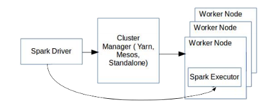

## Hybrid Cluster Manager

Spark applications run as independent processes in the cluster, coordinated by the application’s main program, called the driver program. Spark applications connect to cluster managers (for example, YARN and Mesos) to acquire executors on nodes in the cluster. Executors are processes that run computations and store data for the running application. The driver program owns a singleton (SparkContext) object which it uses to communicate with its set of executors. The following figure represents the same:

While Spark’s approach is appropriate and geared towards compute-heavy tasks that scan large datasets, TIBCO ComputeDB must meet the following additional requirements as an operational database.

1. **High Concurrency**: TIBCO ComputeDB use cases involve a mixture of compute-intensive workloads and low latency (sub-millisecond) OLTP operations such as point lookups (index-based search), and insert/update of a single record. The fair scheduler of Spark is not designed to meet the low latency requirements of such operations.

2. **State Sharing**: Each application submitted to Spark works in isolation. State sharing across applications requires an external store, which increases latency and is not viable for near real-time data sharing.

3. **High Availability (HA)**: As a highly concurrent distributed system that offers low latency access to data, applications must be protected from node failures (caused by software bugs and hardware/network failures). High availability of data and transparent handling of failed operations, therefore, become an important requirement for TIBCO ComputeDB.

4. **Consistency**: As a highly available system that offers concurrent data access, it becomes vital to ensure that all applications have a consistent view of data.

After an overview of our cluster architecture, how TIBCO ComputeDB meets each of these requirements is explained in the subsequent sections.
