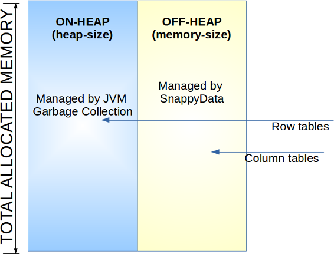
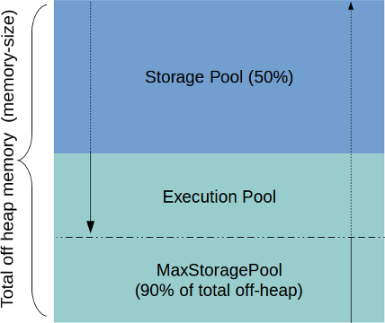

# Memory Management
Spark executors and TIBCO ComputeDB in-memory store share the same memory space. TIBCO ComputeDB extends the Spark's memory manager providing a unified space for spark storage, execution and TIBCO ComputeDB column and row tables. This Unified MemoryManager smartly keeps track of memory allocations across Spark execution and the Store, elastically expanding into the other if the room is available. Rather than a pre-allocation strategy where Spark memory is independent of the store, TIBCO ComputeDB uses a unified strategy where all allocations come from a common pool. Essentially, it optimizes memory utilization to the extent possible.

TIBCO ComputeDB also monitors the JVM memory pools and avoids running into out-of-memory conditions in most cases. You can configure the threshold for when data evicts to disk and the critical threshold for heap utilization. When the usage exceeds this critical threshold, memory allocations within TIBCO ComputeDB fail, and a LowMemoryException error is reported. This, however, safeguards the server from crashing due to OutOfMemoryException.

<a id="memory-row-table"></a>
## Estimating Memory Size for Column and Row Tables
Column tables use compression by default, and the amount of compression is dependent on the data itself. While commonly compression of 50% is seens, it is also possible to achieve much higher compression ratios when the data has many repeated strings or text.</br>
Row tables, on the other hand, consume more space than the original data size. There is a per row overhead in TIBCO ComputeDB. While this overhead varies and is dependent on the options configured on the Row table, as a simple guideline it is suggested that you assume 100 bytes per row as overhead. Thus, it is clear that it is not straightforward to compute the memory requirements.</br> 
It is recommended that you take a sample of the data set (as close as possible to your production data) and populate each of the tables. Ensure that you create the required indexes and note down the size estimates (in bytes) in the TIBCO ComputeDB Monitoring UI. You can then extrapolate this number given the total number of records you anticipate to load or grow into, for the memory requirements for your table.

## Disk and Memory Sizing
For efficient use of the disk, the best alternative is to load some sample data and extrapolate for both memory and disk requirements. The disk usage is the sum of all the **Total size** of the tables. You can check the value of **Total Size** on the TIBCO ComputeDB Monitoring UI. 
For total disk requirement, the rule of thumb is ~4X data size which accounts for temporary space required for the compactor and the space required for [spark.local.dir](../best_practices/important_settings.md#spark-local-dir). In case of concurrent thread execution,the requirement will differ as mentioned in [spark.local.dir](../best_practices/important_settings.md#spark-local-dir).
If the data and the temporary storage set with `spark.local.dir` are in separate locations, then the disk for data storage can be 2X of the total estimated data size while temporary storage can be 2X. The temporary storage is used to shuffle the output of large joins, and a query can potentially shuffle the entire data. Likewise, a massive import can also shuffle data before inserting into partitioned tables.

<a id="table-memory"></a>
## Table Memory Requirements

TIBCO ComputeDB column tables encode data for compression and hence require memory that is less than or equal to the on-disk size of the uncompressed data. If the memory-size is configured (off-heap is enabled), the entire column table is stored in off-heap memory.

TIBCO ComputeDB row tables memory requirements have to be calculated by taking into account row overheads. Row tables have different amounts of heap memory overhead per table and index entry, which depends on whether you persist table data or configure tables for overflow to disk.

| TABLE IS PERSISTED?	 | OVERFLOW IS CONFIGURED?	 |APPROXIMATE HEAP OVERHEAD |
|--------|--------|--------|
|No|No|64 bytes|
|Yes|No|120 bytes|
|Yes|Yes|152 bytes|

!!! Note
	For a persistent, partitioned row table, TIBCO ComputeDB uses an additional 16 bytes per entry used to improve the speed of recovering data from disk. When an entry is deleted, a tombstone entry of approximately 13 bytes is created and maintained until the tombstone expires or is garbage-collected in the member that hosts the table. (When an entry is destroyed, the member temporarily retains the entry to detect possible conflicts with operations that have occurred. This retained entry is referred to as a tombstone.)
    
    
| TYPE OF INDEX ENTRY | APPROXIMATE HEAP OVERHEAD |
|--------|--------|
|New index entry     |80 bytes|
|First non-unique index entry|24 bytes|
|Subsequent non-unique index entry|8 bytes to 24 bytes*|

If there are more than 100 entries for a single index entry, the heap overhead per entry increases from 8 bytes to approximately 24 bytes.

<a id="memory-execution"></a>
## Estimating Memory Size for Execution
Spark and TIBCO ComputeDB also need room for execution. This includes memory for sorting, joining data sets, Spark execution, application managed objects (for example, a UDF allocating memory), etc. Most of these allocations automatically overflow to disk.  But it is strongly recommended to allocate minimum 6-8 GB of heap per data server/lead node for production systems that run large scale analytic queries.

TIBCO ComputeDB is a Java application and by default supports on-heap storage. It also supports off-heap storage, to improve the performance for large blocks of data (for example, columns stored as byte arrays).
</br>It is recommended to use off-heap storage for column tables. Row tables are always stored on on-heap. The [memory-size](../configuring_cluster/property_description.md#memory-size) and [heap-size](../configuring_cluster/property_description.md#heap-size) properties control the off-heap and on-heap sizes of the TIBCO ComputeDB server process.



TIBCO ComputeDB uses JVM heap memory for most of its allocations. Only column tables can use off-heap storage (if configured). It is suggested that you go through the following options and configure them appropriately based on the indicated sizing estimates.

<a id="heap"></a>
## TIBCO ComputeDB Heap Memory

Heap is provided for row tables and working/temp object memory. For large imports, most external connectors still do not use off-heap for temporary buffers.
TIBCO ComputeDB heap memory regions are divided into two parts called `Heap Storage Pool` and `Heap Execution Pool`. Sizes of each pool are determined by the configuration parameters provided at boot time to each server. These two regions are only tentative demarcation and can grow into each other based on some conditions.


### Heap Storage Pool
The heap objects which belong to TIBCO ComputeDB storage of Spark storage are accounted here. For example, when a row is inserted into a table or deleted, this pool accounts the memory size of that row. Objects that are temporary and die young are not considered here. As it is difficult and costly to do a precise estimation, this pool is an approximation of heap memory for objects that are going to be long-lived. Since precise estimation of heap memory is difficult, there is a heap monitor thread running in the background. </br>
If the total heap as seen by JVM (and not SnappyUnifiedMemoryManager) exceeds `critical-heap-percentage` the database engine starts canceling jobs and queries, and a LowMemoryException is reported. This is also an indication of heap pressure on the system.

### Heap Execution Pool:
During query execution or while running a Spark job, all temporary object allocations are done from this pool. For instance, queries like HashJoin and aggregate queries creates expensive in-memory maps. This pool is used to allocate such memory.

You can set the following configuration parameters to control the pools:

|Parameter Name |Default Value|Description|
|--------|--------|--------|
|`heap-size`|4GB in TIBCO ComputeDB Embedded mode cluster|Max heap size which can be used by the JVM|
|`spark.memory.storageFraction`|50|Fraction of workable memory allocated for storage pool and the remaining memory is allocated to the execution pool. It is recommended that you do not change this setting.|
|`critical-heap-percentage`|95| The heap percent beyond which the system considers itself in a critical state. This is to safeguard the system from crashing due to an OutOfMemoryException. Beyond this point, TIBCO ComputeDB starts canceling all jobs and queries and a LowMemoryException is reported.</br> This means (100 minus `critical-heap-percent`) memory is not allocated to any pool and is unused.|
|`eviction-heap-percentage`|85.5|Initially, the amount of memory that is available for storage pool is 50% of the total workable memory. This can however grow up to `eviction-heap-percentage` (default 85.5%). On reaching this threshold it starts evicting table data as per the eviction clause that was specified when creating the table.|
|`spark.memory.fraction`|0.97|Total workable memory for execution and storage. This fraction is applied after removing reserved memory (100 minus `critical-heap-percentage`). This gives a cushion before the system reaches a critical state. It is recommended that you do not change this setting.

At the start, each of the two pools is assigned a portion of the available memory. This is driven by `spark.memory.storageFraction` property (default 50%). However, TIBCO ComputeDB allows each pool to "balloon" into the other if capacity is available subject to the following rules:

* The storage pool can grow to the execution pool if the execution pool has some capacity, but not beyond the `eviction-heap-percentage`.

* If the storage pool cannot borrow from the executor pool, it evicts some of its own blocks to make space for incoming blocks.

* If the storage pool has already grown into the execution pool, the execution pool evicts block from the storage pool until the earlier limit (that is, 50% demarcation) is reached. Beyond that, the executor threads cannot evict blocks from the storage pool. If sufficient memory is not available, it can either fall back to disk overflow or wait until sufficient memory is available.

* If the storage pool has some free memory, the execution pool can borrow that memory from the storage pool during execution. The borrowed memory is returned once execution is over.


**Example**: Configuration for memory (typically configured in **conf/leads** or **conf/servers**) 
```scala
-heap-size=20g -critical-heap-percentage=95 -eviction-heap-percentage=85.5
```

**Example**: Depicts how TIBCO ComputeDB derives different memory region sizes.

```scala
Reserved_Heap_Memory => 20g * (1 - 0.95) = 1g ( 0.95 being derived from critical_heap_percentage)
Heap_Memory_Fraction => (20g - Reserved_Memory) *(0.97) = 17.4 ( 0.97 being derived from spark.memory.fraction)
Heap_Storage_Pool_Size => 17.4 * (0.5) = 8.73 ( 0.5 being derived from spark.memory.storageFraction)
Heap_Execution_Pool_Size => 17.4 * (0.5) = 8.73
Heap_Max_Storage_pool_Size => 17.4 * 0.85 = 14.7 ( 0.85 derived from eviction_heap_percentage)
```
<a id="off-heap"></a>
## TIBCO ComputeDB Off-Heap Memory 

<ent>This feature is available only in the Enterprise version of TIBCO ComputeDB. </br></ent>

In addition to heap memory, TIBCO ComputeDB can also be configured with off-heap memory. If configured, column table data, as well as many of the execution structures use off-heap memory. For a serious installation, the off-heap setting is recommended. However, several artifacts in the product need heap memory, so some minimum heap size is also required for this.

| Parameter Name | Default Value | Description	 |
|--------|--------|--------|
|memory-size|The default value is either 0 or it gets auto-configured in [specific scenarios](../configuring_cluster/configuring_cluster.md#autoconfigur_offheap).|Total off-heap memory size|

Similar to heap pools, off-heap pools are also divided between off-heap storage pool and off-heap execution pool. The rules of borrowing memory from each other also remains the same.



**Example**: Off-heap configuration: 

```scala
-heap-size = 4g -memory-size=16g -critical-heap-percentage=95 -eviction-heap-percentage=85.5
```

**Example**: How TIBCO ComputeDB derives different memory region sizes.

```scala
Reserved_Memory ( Heap Memory) => 4g * (1 - 0.95) = 200m ( 0.95 being derived from critical_heap_percentage)
Memory_Fraction ( Heap Memory) => (4g - Reserved_Memory) *(0.97) = 3.5g
Heap Storage_Pool_Size => 3.5 * (0.5) = 1.75
Heap Execution_Pool_Size => 3.5 * (0.5) = 1.75
Max_Heap_Storage_pool_Size => 3.5g * 0.85 = 2.9 ( 0.85 derived from eviction_heap_percentage)


Off-Heap Storage_Pool_Size => 16g * (0.5) = 8g
Off-Heap Execution_Pool_Size => 16g * (0.5) = 8g
Max_Off_Heap_Storage_pool_Size => 16g * 0.9 = 14.4 ( 0.9 System default)
```

!!! Note

	* For row tables: According to the requirements of your row table size, configure the heap size. Row tables in TIBCO ComputeDB do not use off-heap memory.

	* To read-write Parquet and CSV: Parquet and CSV read-write are memory consuming activities for which heap memory is used. Ensure that you provision sufficient heap memory for this.

	* When most of your data reside in column tables: Use off-heap memory, as they are faster and puts less pressure on garbage collection threads.

	* When configuring eviction: The tables are evicted to disk by default. This impacts performance to some degree and hence it is recommended to size your VM before you begin.
