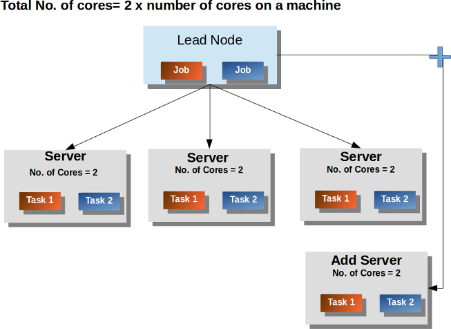

# Tuning for Concurrency and Computation

## Handling Low Latency vs Analytic Jobs
Unlike Spark, SnappyData can distinguish requests that are cheap (low latency) vs requests that require a lot of computational resources (high latency). This is done by a resource scheduler that can balance the needs of many contending users/threads.

For instance, when a SQL client executes a ‘fetch by primary key’ query, there is no need to involve any scheduler or spawn many tasks for such a simple request. The request is immediately delegated to the data node (single thread) and the response is directly sent to the requesting client (probably within a few milliseconds).  
In the current version of the product, all query requests that filter on a primary key, a set of keys, or can directly filter using an index are executed without routing to the SnappyData scheduler. Only Row tables can have primary keys or indexes. 

When the above conditions are not met, the request is routed to the ‘Lead’ node where the Spark plan is generated and ‘jobs’ are scheduled for execution. The scheduler uses a FAIR scheduling algorithm for higher concurrency, that is, all concurrent jobs are executed in a round-robin manner.

Each job is made up of one or more stages and the planning phase computes the number of  parallel tasks for the stage. Tasks from scheduled jobs are then allocated to the logical cores available until all cores are allocated. 
A round-robin algorithm picks a task from Job1, a task from Job2 and so on. If more cores are available, the second task from Job1 is picked and the cycle continues. But, there are circumstances a single job can completely consume all cores. 
For instance, when all cores are available, if a large loading job is scheduled it receives all available cores of which, each of the tasks can be long running. During this time, if other concurrent jobs are assigned, none of the executing tasks is preempted.

!!! Note 
	This above scheduling logic is applicable only when queries are fully managed by SnappyData cluster. When running your application using the smart connector, each task running in the Spark cluster directly accesses the store partitions.

## Computing the Number of Cores for a Job

Executing queries or code in SnappyData results in the creation of one or more Spark jobs. Each Spark job first calculates the number of partitions on the underlying dataset and a task is assigned and scheduled for each partition.  
But, the number of concurrent tasks executing is limited by the available core count. If the scheduled task count is larger then they will be executed in a staggered manner. Each task is assigned a single core to execute. 

By default, SnappyData sets total available spark executor cores on any data server to be 2 multiplied by the total number of physical ccores on a machine. 

**spark executor cores = 2 * C** 
Where **C** = Total number of physical processor cores on a machine.

This is done keeping in mind some threads which do the IO (Input/Output) reads while the other threads can get scheduled by the operating system. However, increasing this number does not improve query performance.

If you start multiple SnappyData server instances on a machine, then **spark.executor.cores** should be explicitly set using the following formula:

**spark executor cores = N * C **
Where **N** is the number of SnappyData server instaces started on the machine and **C** = Total number of physical processor cores on a machine.

This can impact thread scheduling and query performance. Also, the heap requirement for each server is suggested to be 8/16 GB on larger virtual machines. In the case of off-heap storage, the heap is only used for some execution and temporary buffers. If you have more servers per machine, more percentage of actual memory would be allocated to the heap and less for the off-heap actual storage of data. This can also lead to more disk reads which further impacts the query performance.

For example, on a machine with 64 GB RAM, you can allocate 8GB to the heap and 40 GB to off-heap.
If you start 2 serves, then both the servers must have 8 GB heap. This will reduce the off-heap storage to 16 GB each. It will reduce the off-heap storage by 8 GB (40 GB-2*16 GB).

Therefore, it is recommended that you maintain only one server per machine so that the total number of threads and amount of memory allocated to the heap is minimum. If more than one server is running on a machine, you can use the `spark.executor.cores` to override the number of cores per server. The cores should be divided accordingly and specified using the `spark.executor.cores` property.

**Spark executor cores = 2 x total physical cores on a machine / No of servers per machine**

!!! Note
	We do not recommended to reduce the heap size even if you start multiple servers per machine.

For example, for a cluster with 2 servers running on two different machines with 4 CPU cores each, a maximum number of tasks that can run concurrently is 16.   
If a table has 16 partitions (buckets, for the row or column tables), a scan query on this table creates 16 tasks. This means, 16 tasks run concurrently and the last task runs when one of these 16 tasks has finished execution.

SnappyData uses an optimization method which joins multiple partitions on a single machine to form a single partition when there are fewer cores available. This reduces the overhead of scheduling partitions.

In SnappyData, multiple queries can be executed concurrently, if they are submitted by different threads or different jobs. For concurrent queries, SnappyData uses fair scheduling to manage the available resources such that all the queries get a fair distribution of resources.
 
For example, In the following figure, 6 cores are available on 3 systems, and 2 jobs have 4 tasks each. Because of fair scheduling, both jobs get 3 cores and hence three tasks per job execute concurrently.

Pending tasks have to wait for the completion of the current tasks and are assigned to the core that is first available.

When you add more servers to SnappyData, the processing capacity of the system increases in terms of available cores. Thus, more cores are available so more tasks can concurrently execute.

### Configuring the Scheduler Pools for Concurrency
SnappyData out of the box comes configured with two execution pools:

* **Low-latency pool**: This pool is automatically used when SnappyData determines that a request is of low latency, that is, the queries that are partition pruned to two or fewer partitions.  

* **Default pool**: This is the pool that is used for the remaining requests.

Two cores are statically assigned to the low latency pool. Also, the low latency pool has weight twice that of the default pool. Thus, if there are 30 cores available to an executor for a query that has 30 partitions, only 28 would be assigned to it and two cores would be reserved to not starve the low latency queries. When the system has both low latency and normal queries, 20 cores are used for the low latency queries as it has higher priority (weight=2).
If a query requires all 30 partitions and no low latency queries are running at that time, all 30 cores are assigned to the first query. However, when a low latency query is assigned, the scheduler does its best to allocate cores as soon as tasks from the earlier query finish.
 

Applications can explicitly configure to use a particular pool for the current session using a SQL configuration property, `snappydata.scheduler.pool`. For example, the `set snappydata.scheduler.pool=lowlatency` command sets the pool as low latency pool for the current session. 

New pools can be added and properties of the existing pools can be configured by modifying the **conf/fairscheduler.xml** file. We do not recommend changing the pool names (`default` and `lowlatency`).

#### Controlling CPU Usage for User Jobs

You can control the CPU usage for user jobs by configuring separate pools for different kinds of jobs.   See configuration [here](https://spark.apache.org/docs/2.1.1/job-scheduling.html#configuring-pool-properties).  
The product is configured with two out-of-the-box pools, that is the **Default pool** and the **Low-latency pool**. The **Default pool** has higher priority and also has a **minShare**, so that some minimum cores are reserved for those jobs if possible. 
The [**Stages**](/monitoring/monitoring.md#stages) tab on the SnappyData Monitoring Console shows the available pools.  When you track a job for an SQL query on the [**SQL**](/monitoring/monitoring.md#sql) tab, it shows the pool that is used in the **Pool Name** column. In-built tasks such as ingestion can show lower priority pools by default to give priority to foreground queries. To configure such priority, do the following: 

1.	Define the pools in **conf/fairscheduler.xml** 
2.	Set a pool for a job using Spark API  or use `set snappydata.scheduler.pool` property in a SnappySession.

To configure the priority based on specific requirements, you can also either permit the users to set the priority for queries or add some pool allocation logic in the application as per client requirements.

### Using a Partitioning Strategy to Increase Concurrency

The best way to increasing concurrency is to design your schema such that you minimize the need to run your queries across many partitions. The common strategy is to understand your application patterns and choose a partitioning strategy such that queries often target a specific partition. Such queries will be pruned to a single node and SnappyData automatically optimises such queries to use a single task. 
For more information see, [How to design your schema](design_schema.md).

## Using Smart Connector for Expanding Capacity of the Cluster

One of the instances, when [SnappyData Smart connector mode](../affinity_modes/connector_mode.md) is useful, is when the computations is separate from the data. This allows  you to increase the computational capacity without adding more servers to the SnappyData cluster. Thus, more executors can be provisioned for a Smart Connector application than the number of SnappyData servers. 
 Also, expensive batch jobs can be run in a separate Smart Connector application and it does not impact the performance of the SnappyData cluster. See, [How to Access SnappyData store from an Existing Spark Installation using Smart Connector](../howto/spark_installation_using_smart_connector.md).

