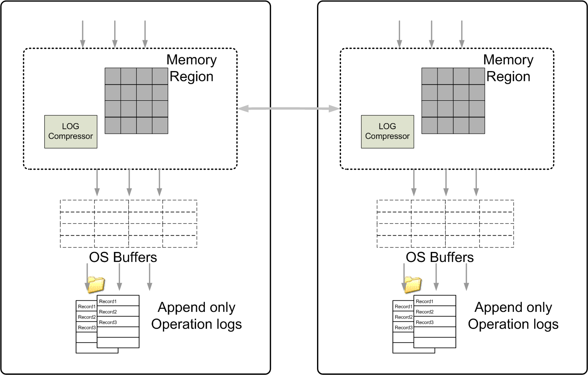

# Factors Contributing to High Disk Throughput

SnappyData disk store design contains several factors that contribute to very high disk throughput. They include pooling, avoiding seeks, and buffered logging.

## Pooling

Each SnappyData member manages its own disk store, and no disk contention exists between processes. Each partition can manage its data on local disks.

If the application "write" load can be uniformly balanced across the cluster, the aggregate disk throughput is equal to the disk transfer rate time the number of partitions, assuming a single disk per partition. Disk transfer rates can be up to 100MB/sec on commodity machines today.

## Avoiding Seeks

Random access on disk, which causes disk heads to seek for hundreds of concurrent thread, is probably the single biggest reason why traditional databases do not scale. Average disk seek times today are still 2ms or higher. SnappyData manages most (or all) of the data in cluster memory, and all reads are served without navigating through BTree-based indexes and data files on disk. This is the case when data is persistent. Note, however, that in overflow-only mode, data files on disk are accessed as necessary. 

## Buffered Logging

When writes do occur, SnappyData simply logs the operations to disk in "append-only" oplog files. By appending, SnappyData can continuously write to consecutive sectors on disk without requiring disk head movement. SnappyData flushes writes to the OS buffer rather than 'fsync' all the way to disk. The writes are buffered by the IO subsystem in the kernel, which allows the IO scheduler to merge and sort disk writes to achieve the highest possible disk throughput. Write requests need not initiate any disk I/O until some time in the future.

Thus, from the perspective of a user application, write requests stream at much higher speeds, unencumbered by the performance of the disk. Risk of data loss due to sudden failures at a hardware level are mitigated by having multiple members writing in parallel to disk. In fact, it is assumed that hardware will fail, especially in large clusters and data centers, and that software needs to take these failures into account. The SnappyData system is designed to recover in parallel from disk and to guarantee data consistency when data copies on disk do not agree with each other. Each member of the distributed system logs membership changes to its persistent files and uses this information during recovery to determine the replica that has the latest changes, and members automatically synchronize these changes at startup.
