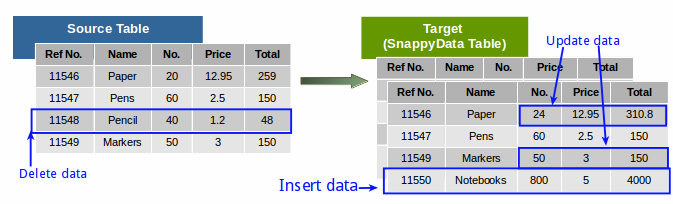
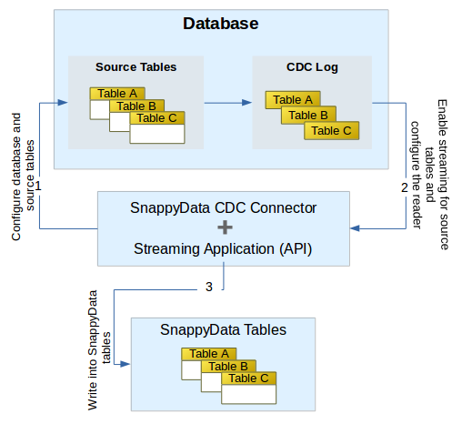

# Using the TIBCO ComputeDB™ Change Data Capture (CDC) Connector

<ent>This feature is available only in the Enterprise version of TIBCO ComputeDB.</ent>

As data keeps growing rapidly techniques like Change Data Capture (CDC) is crucial for handling and processing the data inflow.
The CDC technology is used in a database to track changed data so that the identified changes can be used to keep target systems in sync with the changes made to the source systems.

A CDC enabled system (SQL database) automatically captures changes from the source table, these changes are then updated on the target system (TIBCO ComputeDB tables).</br>
It provides an efficient framework which allows users to capture *individual data changes* like insert, update, and delete in the source tables (instead of dealing with the entire data), and apply them to the TIBCO ComputeDB tables to keep both the source and target tables in sync.

!!! Info
	Spark structured streaming and TIBCO ComputeDB mutable APIs are used to keep the source and target tables in sync. For writing a Spark structured streaming application, refer to the Spark documentation.



CDC is supported on both the Smart Connector Mode and the Embedded mode. For more  information on the modes, refer to the documentation on [Smart Connector Mode](../affinity_modes/connector_mode.md) and [Embedded TIBCO ComputeDB Store Mode](../affinity_modes/embedded_mode.md).

In this topic, we explain how TIBCO ComputeDB uses the JDBC streaming connector to pull changed data from the SQL database and ingest it into TIBCO ComputeDB tables.

The following image illustrates the data flow for change data capture:</br>


## Prerequisites

- Ensure that change data capture is enabled for the database and table. Refer to your database documentation for more information on enabling CDC.

- A user account with the required roles and privileges to the database.

- Ensure that a JDBC source to which TIBCO ComputeDB CDC Connector can connect is running and available from the node where CDC connector is running.

- The **snappydata-jdbc-stream-connector_<version>.jar**, which is available in the **$SNAPPY_HOME/jars** directory. </br>If you are using Maven or Gradle project to develop the streaming application, you need to publish the above jar into a local maven repository.

## Understanding the Program Structure

The RDB CDC connector ingests data into TIBCO ComputeDB from any CDC enabled JDBC source. We have a custom source with alias **jdbcStream** and a custom Sink with alias **snappystore**. </br>
*Source* has the capability to read from a JDBC source and *Sink* can perform inserts, updates or deletes based on CDC operations.

## Configuring the Stream Reader

Structured streaming and Spark’s JDBC source is used to read from the source database system.

To enable this, set a stream referring to the source table.</br>

For example:

       DataStreamReader reader = snappySession.readStream()
          .format("jdbcStream")
          .option("spec", "org.apache.spark.sql.streaming.jdbc.SqlServerSpec")
          .option("sourceTableName", sourceTable)
          .option("maxEvents", "50000")
          .options(connectionOptions);
          
The JDBC Stream Reader options are:

- **jdbcStream**: The format in which the source data is received from the JDBC source. This parameter is mandatory. Currently, only JDBC stream is supported.

- **spec**: A CDC spec class name which is used to query offsets from different databases. We have a default specification for CDC enabled SQL server. You can extend the `org.apache.spark.sql.streaming.jdbc.SourceSpec` trait to provide any other implementation.

        trait SourceSpec {

          /** A fixed offset column name in the source table. */
          def offsetColumn: String

          /** An optional function to convert offset
            * to string format, if offset is not in string format.
            */
          def offsetToStrFunc: Option[String]

          /** An optional function to convert string offset to native offset format. */
          def strToOffsetFunc: Option[String]

          /** Query to find the next offset */
          def getNextOffset(tableName : String, currentOffset : String, maxEvents : Int): String
        }

	The default implementation of SQLServerSpec can be:

        class SqlServerSpec extends SourceSpec {

          override def offsetColumn: String = "__$start_lsn"

          override def offsetToStrFunc: Option[String] = Some("master.dbo.fn_varbintohexstr")

          override def strToOffsetFunc: Option[String] = Some("master.dbo.fn_cdc_hexstrtobin")

          /** make sure to convert the LSN to string and give a column alias for the
            * user defined query one is supplying. Alternatively, a procedure can be invoked
            * with $table, $currentOffset Snappy provided variables returning one string column
            * representing the next LSN string.
            */
          override def getNextOffset(tableName : String, currentOffset : String, maxEvents : Int): String =
            s"""select master.dbo.fn_varbintohexstr(max(${offsetColumn})) nextLSN
                 from (select ${offsetColumn}, sum(count(1)) over
                 (order by ${offsetColumn}) runningCount
                from $tableName where ${offsetColumn} > master.dbo.fn_cdc_hexstrtobin('$currentOffset')
                  group by ${offsetColumn}) x where runningCount <= $maxEvents"""
        }

- **sourceTableName**: The source table from which the data is read. For example, **testdatabase.cdc.dbo_customer_CT**.

- **maxEvents**: Number of rows to be read in one batch.

- **connectionOptions**: A map of key values containing different parameters to access the source database.

    | Key | Value |
    |--------|--------|
    |`driver`|The JDBC driver to be used to access source database. E.g. `com.microsoft.sqlserver.jdbc.SQLServerDriver`|
    |`url`|The JDBC connection url|
    |`user`|User name to access the database |
    |`password`|Password to access the database |
    |`databaseName`|The name of the database|
    |`poolImpl`|Connection pool implementation(default Tomcat). Currently, only Tomcat and Hikari are supported|
    |`poolProperties`|Comma separated pool specific properties. For more details see Tomcat or Hikari JDBC connection pool documents. Example: connectionTestQuery=select 1,minimumIdle=5 |

Optionally, you can use any Spark API to transform your data obtained from the stream reader.

The sample usage can be as follows:

```pre
Dataset<Row> ds = reader.load();
ds.filter(<filter_condition>)
```

## Writing into TIBCO ComputeDB tables

To write into TIBCO ComputeDB tables you need to have a StreamWriter as follows:

```pre
ds.writeStream()
        .trigger(ProcessingTime.create(10, TimeUnit.SECONDS))
        .format("snappystore")
        .option("sink", ProcessEvents.class.getName())
        .option("tableName", tableName)
        .start();
```

Here, the value of the `.format` parameter is always `snappystore` and is a mandatory.

### TIBCO ComputeDB Stream Writer options

The **sink** option is mandatory for SnappyStore sink. This option is required to give the user control of the obtained data frame. When writing streaming data to the tables, you can also provide any custom option.

| Key | Value |
|--------|--------|
|sink|A user-defined callback class which gets a data frame in each batch. The class must implement `org.apache.spark.sql.streaming.jdbc.SnappyStreamSink` interface.|

**org.apache.spark.sql.streaming.jdbc.SnappyStreamSink**

The above trait contains a single method, which user needs to implement. A user can use TIBCO ComputeDB mutable APIs (INSERT, UPDATE, DELETE, PUT INTO) to maintain tables.

```pre
    def process(snappySession: SnappySession, sinkProps: Map[String, String],
      batchId: Long, df: Dataset[Row]): Unit
```

The following examples illustrates how you can write into a [TIBCO ComputeDB table](/programming_guide/building_snappydata_applications_using_spark_api.md):

```pre
package io.snappydata.app;

import java.util.List;

import org.apache.log4j.Logger;
import org.apache.spark.sql.Dataset;
import org.apache.spark.sql.Row;
import org.apache.spark.sql.SnappySession;
import org.apache.spark.sql.streaming.jdbc.SnappyStreamSink;

import static java.util.Arrays.asList;
import static org.apache.spark.SnappyJavaUtils.snappyJavaUtil;

public class ProcessEvents implements SnappyStreamSink {

  private static Logger log = Logger.getLogger(ProcessEvents.class.getName());

  private static List<String> metaColumns = asList("__$start_lsn",
      "__$end_lsn", "__$seqval", "__$operation", "__$update_mask", "__$command_id");

  @Override
  public void process(SnappySession snappySession,
      scala.collection.immutable.Map<String, String> sinkProps, long batchId, Dataset<Row> df) {

    String snappyTable = sinkProps.apply("tablename").toUpperCase();

    log.info("SB: Processing for " + snappyTable + " batchId " + batchId);

    df.cache();

    Dataset<Row> snappyCustomerDelete = df
        // pick only delete ops
        .filter("\"__$operation\" = 1")
        // exclude the first 5 columns and pick the columns that needs to control
        // the WHERE clause of the delete operation.
        .drop(metaColumns.toArray(new String[metaColumns.size()]));

    if (snappyCustomerDelete.count() > 0) {
      snappyJavaUtil(snappyCustomerDelete.write()).deleteFrom("APP." + snappyTable);
    }

    Dataset<Row> snappyCustomerUpsert = df
        // pick only insert/update ops
        .filter("\"__$operation\" = 4 OR \"__$operation\" = 2")
        .drop(metaColumns.toArray(new String[metaColumns.size()]));
    snappyJavaUtil(snappyCustomerUpsert.write()).putInto("APP." + snappyTable);

  }
}

```

## Additional Information

- **Offset Management**: </br>
	TIBCO ComputeDB keeps a persistent table for offset management (Offset table name for application = SNAPPY_JDBC_STREAM_OFFSET_TABLE). </br>
    The schema of the table is:

    |APP_NAME|TABLE_NAME|LAST_OFFSET|
    |--------|--------|--------|

    Initially, the table contains no rows. The connector inserts a row for the table with minimum offset queried from the database. On subsequent intervals, it consults this table to get the offset number. </br>
    If connector application crashes, it refers to this table on a restart to query further.

- **Idempotency for Streaming application**: </br>
	If `DELETE` and `PUT INTO` APIs are used, TIBCO ComputeDB ensures idempotent behavior. This is useful when the application restarts after a crash and some of the CDC events are replayed. The PUT INTO API either inserts a record (if not present) or updates the record (if already exists).</br> The existence of the record is checked based on the key columns defined when a table is created. As primary keys are not supported for column tables, you can use `key_columns` instead, to uniquely identify each row/record in a database table. </br> For more information, see [CREATE TABLE](../reference/sql_reference/create-table.md).</br>

    For example:

		CREATE TABLE <table_name> USING column OPTIONS(partition_by '<column_name>', buckets '<num_partitions>',key_columns '<primary_key>') AS (SELECT * FROM from external table);

!!! Note

	- Writing data from different tables to a single table is currently not supported as the schema for incoming data frame cannot be changed. 

	- For every source table that needs to be tracked for changes, ensure that there is a corresponding destination table in TIBCO ComputeDB.
