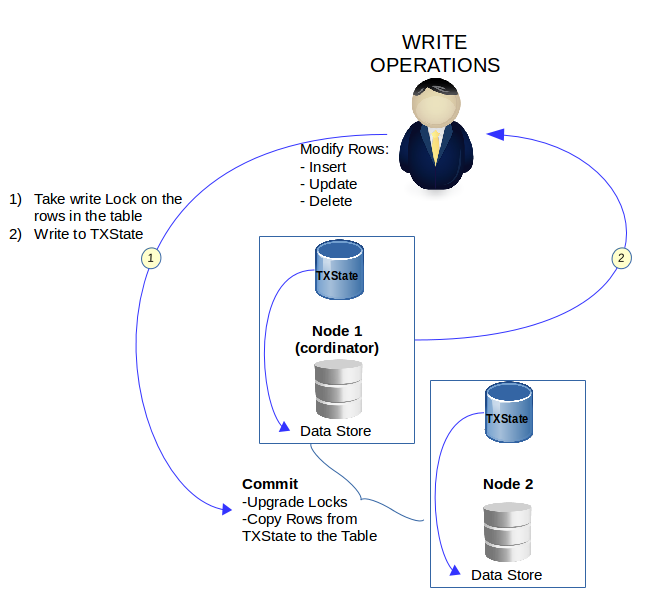

# How Transactions Work for Row Tables

!!! Note
	Distributed transaction is supported only for row tables.

There is no centralized transaction coordinator in SnappyData. Instead, the member on which a transaction was started acts as the coordinator for the duration of the transaction. If the application updates one or more rows, the transaction coordinator determines which owning members are involved, and acquires local "write" locks on all of the copies of the rows. At commit time, all changes are applied to the local store and any redundant copies. If another concurrent transaction attempts to change one of the rows, the local "write" acquisition fails for the row, and that transaction is automatically rolled back.

Unlike traditional distributed databases, SnappyData does not use write-ahead logging for transaction recovery in case the commit fails during replication or redundant updates to one or more members. The most likely failure scenario is one where the member is unhealthy and gets forced out of the distributed system, guaranteeing the consistency of the data. When the failed member comes back online, it automatically recovers the replicated/redundant data set and establishes coherency with the other members. If all copies of some data go down before the commit is issued, then this condition is detected using the group membership system, and the transaction is rolled back automatically on all members.

!!! Note
	SnappyData does not support transactions is new data store members are added while in progress. If you add a new member to the cluster in the middle of a transaction and the new member is involved in the transaction (e.g. owns a partition of the data or is a replica), SnappyData implicitly rolls back the transaction and throws an SQLException (SQLState: "X0Z05").


The following images represent the functioning of read and write operations in the transaction model:




<a id="transactions-rowtable"></a>
## Using Transactions for Row Tables

Transactions specify an [isolation level](../reference/sql_reference/set-isolation.md) that defines the degree to which one transaction must be isolated from resource or data modifications made by other transactions. The transaction isolation levels define the type of locks acquired on read operations. Only one of the isolation level options can be set at a time, and it remains set for that connection until it is explicitly changed.

!!! Note

	* If you set the isolation level to `READ_COMMITTED` or `REPEATABLE_READ`, queries on column table report an error if [autocommit](../reference/interactive_commands/autocommit.md) is set to off (false). </br>Queries on column tables are supported when isolation level is set to `READ_COMMITTED` or `REPEATABLE_READ` and autocommit is set to **true**.

	* DDL execution (for example [CREATE TABLE](../reference/sql_reference/create-table.md) /[DROP TABLE](../reference/sql_reference/drop-table.md)) is not allowed when `autocommit` is set to `false`  and transaction isolation level is `READ_COMMITTED` or `REPEATABLE_READ`.  DDL commands reports syntax error in such cases. DDL execution is allowed if `autocommit` is `true` for `READ_COMMITTED` or `REPEATABLE_READ` isolation levels.


The following isolation levels are supported for row tables:

| Isolation level | Description |
|--------|--------|
|NONE|Default isolation level. This corresponds to the JDBC TRANSACTION_NONE isolation level. At this level writes performed by a single thread are seen by all other threads in the order in which they were issued, but writes from different threads may be seen in a different order by other threads.|
|READ_COMMITTED|SnappyData ensures that ongoing transactional as well as non-transactional (isolation-level NONE) operations never read uncommitted (dirty) data. SnappyData accomplishes this by maintaining transactional changes in a separate transaction state that are applied to the actual data-store for the table only at commit time. SnappyData detects only Write-Write conflicts while in READ_COMMITTED isolation level. </br>In READ COMMITTED, a read view is created at the start of each statement and lasts only as long as each statement execution.|
|REPEATABLE_READ|In this isolation level, a lock-based concurrency control DBMS implementation keeps read and write locks (acquired on selected data) until the end of the transaction. In REPEATABLE READ every lock acquired during a transaction is held for the duration of the transaction.|

For more information, see, [SET ISOLATION](../reference/sql_reference/set-isolation.md)

<a id="transactions-rollback"></a>
## Rollback Behavior and Member Failures

Within the scope of a transaction, SnappyData automatically initiates a rollback if it encounters a constraint violation.

Any errors that occur while parsing queries or while binding parameters in a SQL statement *do not* cause a rollback. For example, a syntax error that occurs while executing a SQL statement does not cause previous statements in the transaction to rollback. However, a column constraint violation would cause all previous SQL operations in the transaction to roll back.

<a id="transactions-failures"></a>
### Handling Member Failures

The following steps describe specific events that can occur depending on which member fails and when the failure occurs during a transaction:

1. If the transaction coordinator member fails before a commit is fired, then each of the cohort members aborts the ongoing transaction.

2. If a participating member fails before a commit is fired, then it is simply ignored. If the copies/replicas go to zero for certain keys, then any subsequent update operations on those keys throw an exception as in the case of non-transactional updates. If a commit is fired in this state, then the whole transaction is aborted.

3. If the transaction coordinator fails before completing the commit process (with or without sending the commit message to all cohorts), the surviving cohorts determine the outcome of the transaction.

    If all of the cohorts are in the PREPARED state and successfully apply changes to the cache without any unique constraint violations, the transaction is committed on all cohorts. Otherwise, if any member reports failure or the last copy the associated rows go down during the PREPARED state, the transaction is rolled back on all cohorts.

4. If a participating member fails before acknowledging to the client, then the transaction continues on other members without any interruption. However, if that member contains the last copy of a table or bucket, then the transaction is rolled back.

5. The transaction coordinator might also fail while executing a rollback operation. In this case, the client would see such a failure as an SQLState error. If the client was performing a SELECT statement in a transaction, the member failure would result in SQLState error X0Z01::

	``` 
	ERROR X0Z01: Node 'node-name' went down or data no longer available while iterating the results (method 'rollback()'). Please retry the operation. 
	```

    Clients that were performing a DML statement in the context of a transaction would fail with one of the SQLState errors: X0Z05, X0Z16, 40XD2, or 40XD0.

    !!! Note
    	Outside the scope of a transaction, a DML statement would not see an exception due to a member failure. Instead, the statement would be automatically retried on another SnappyData member. However, SELECT statements would receive the X0Z01 statement even outside of a transaction.</p>

If this type of failure occurs, the remaining members of the SnappyData distributed system clean-up the open transactions for the failed node, and no additional steps are needed to recover from the failure.

!!! Note
	In this release of SnappyData, a transaction fails if any of the cohorts depart abnormally. 

<a id="transactions-rollback"></a>
### Other Rollback Scenarios

SnappyData may cancel an executing statement due to low memory, a timeout, or a manual request to cancel the statement.

If a statement that is being executed within the context of a transaction is canceled due to low memory or a manual cancellation request, then SnappyData rolls back the associated transaction. 

!!! Note
	SnappyData does not roll back a transaction if a statement is canceled due to a timeout.

<a id="transactions-limitations"></a>
## Transaction Functionality and Limitations

In this release of SnappyData, the scope for transactional functionality is:

-   The result set that is obtained from executing a query should either be completely consumed, or the result set is explicitly closed. Otherwise, DDL operations wait until the ResultSet is garbage-collected.

-   Transactions for persistent tables are enabled by default, but the full range of fault tolerance is not yet implemented. It is assumed that at least one copy of a row is always available (redundant members are available) in the event of member failures.

-   SQL statements that implicitly place locks, such as `select for update`, are not supported outside of transactions (default isolation level).

-   The supported isolation levels are 'READ COMMITTED' and 'READ UNCOMMITTED' where both behave as 'READ COMMITTED.' Autocommit is OFF by default in SnappyData, unlike in other JDBC drivers.

-   Transactions always do "write-write" conflict detection at operation or commit time. Applications do not need to use `select for update` or explicit locking to get this behavior, as compared to other databases. (`select for update` is not supported outside of a transaction.)

-   Nested transactions and savepoints are not supported.

-   SnappyData does not support transactions on partitioned tables that are configured with the DESTROY evict action. This restriction exists because the requirements of ACID transactions can conflict with the semantics of destroying evicted entries. For example, a transaction may need to update a number of entries that is greater than the amount allowed by the eviction setting. Transactions are supported with the OVERFLOW evict action because the required entries can be loaded into memory as necessary to support transaction semantics.

-   SnappyData does not restrict concurrent non-transactional clients from updating tables that may be involved in transactions. This is by design, to maintain very high performance when no transactions are in use. If an application uses transactions on a table, make sure the application consistently uses transactions when updating that table.

-   All DML on a single row is atomic in nature inside or outside of transactions.

-   There is a small window during a commit when the committed set is being applied to the underlying table and concurrent readers, which do not consult any transactional state, have visibility to the partially-committed state. The larger the transaction, the larger the window. Also, transaction state is maintained in a memory-based buffer. The shorter and smaller the transaction, the less likely the transaction manager will run short on memory.

<a id="transactions-selectforupdate"></a>
## Transactions with SELECT FOR UPDATE

The `SELECT FOR UPDATE` statement and other statements that implicitly place locks are not supported outside of a transaction (default isolation level).

A SELECT FOR UPDATE begins by obtaining a read lock, which allows other transactions to possibly obtain read locks on the same data. A transaction's read lock is immediately upgraded to an exclusive write lock after a row is qualified for the SELECT FOR UPDATE statement. At this point, any other transactions that obtained a read lock on the data receive a conflict exception and can roll back and release their locks.

The transaction that has the exclusive lock can successfully commit only after all other read locks on the table have been released. In some cases, it is possible for one transaction to obtain an exclusive lock for data on one SnappyData member, while another transaction obtains an exclusive lock on a different member. In this case, both transactions will fail during the commit.
