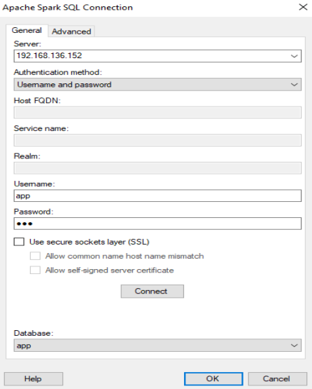
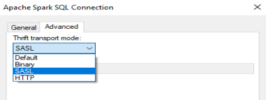
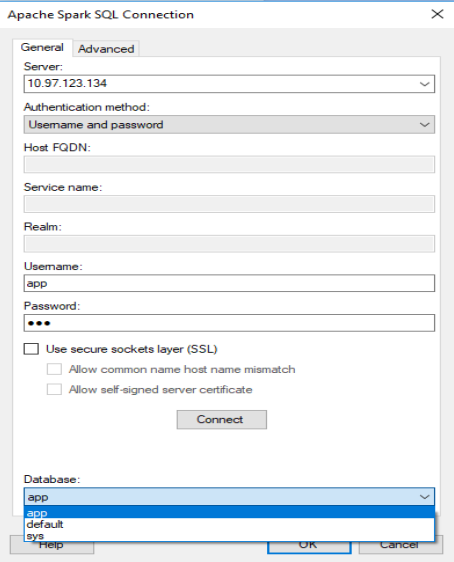

# How to Connect TIBCO Spotfire® Desktop to TIBCO ComputeDB

TIBCO Spotfire® Desktop allows users to easily author and update ad-hoc analytics, applications, and dashboards. 
To connect TIBCO Spotfire® Desktop to TIBCO ComputeDB, setup and launch the TIBCO ComputeDB cluster. 

## Download and Launch TIBCO ComputeDB

Check the [system requirements](/install/system_requirements.md), [download and install](/install.md) TIBCO ComputeDB, and then [start the TIBCO ComputeDB cluster](./start_snappy_cluster.md). Hive Thrift server is enabled by default. If you want to securely access the Hive Thrift server using SSL encryption, you must set these additional properties in the [Lead Node Configuration](/configuring_cluster/configuring_cluster.md#lead):

*	`-hive.server2.use.SSL=true`
*	`-hive.server2.keystore.path=<keystore-file-path>` 
*	`-hive.server2.keystore.password=<keystore file password>`
   
<!--- For more details about setting the Hive Thrift server, refer to [placeholder]--->

## Connecting Spotfire® Desktop to TIBCO ComputeDB

Login and download TIBCO Spotfire® Desktop from the [TIBCO eDelivery website]( https://edelivery.tibco.com/storefront/eval/tibco-spotfire-desktop/prod10954.html). Follow the setup guidelines to install the product. After installation, you can use the following steps to connect Spotfire® Desktop to TIBCO ComputeDB.

1.	On the Spotfire® Desktop application, from the left panel, click **Connect to** > **Apache Spark SQL** > **New Connection**.   The **Apache Spark SQL Connection** dialog box is displayed.  
2.	In the **General** tab, enter the following details:

	*	**Server**: Enter the hostname/IP of the Lead node in TIBCO ComputeDB cluster
	
    	!!! Note
    		The Hive2 Thrift server uses port 10000 by default. If you have explicitly configured the port number, then you must specify the port number as: `<IP or Hostname>:<port number>`
    
	*	**Authentication** **Method**: Select **username and password** option.
	*	**Username/Password**: Provide a username and password. You could choose to use APP/APP for username/password if authentication was not configured in the cluster.
	
3.	Select the **Use secure sockets layer** check box if you want to access the Hive Thrift server securely. Else, you can clear the check box.

	!!! Note
    	Ensure to configure the lead node with additional properties for securely accessing the Hive Thrift server with SSL encryption. See [Setting TIBCO ComputeDB](#tibcomputsetup). 
        
4.	Click the **Advanced** tab and set the **Thrift transport mode** to **SASL**.   
5.	Go to **General** tab and then click the **Connect** button.
6.	From the **Database** dropdown, either choose the existing database (schema) **app** or **default** or you can choose a database (schema) that is created in the TIBCO ComputeDB cluster.    
7.	Click **OK**. The **View In Connection (VIC)** box is displayed which lists the tables from the selected database.
