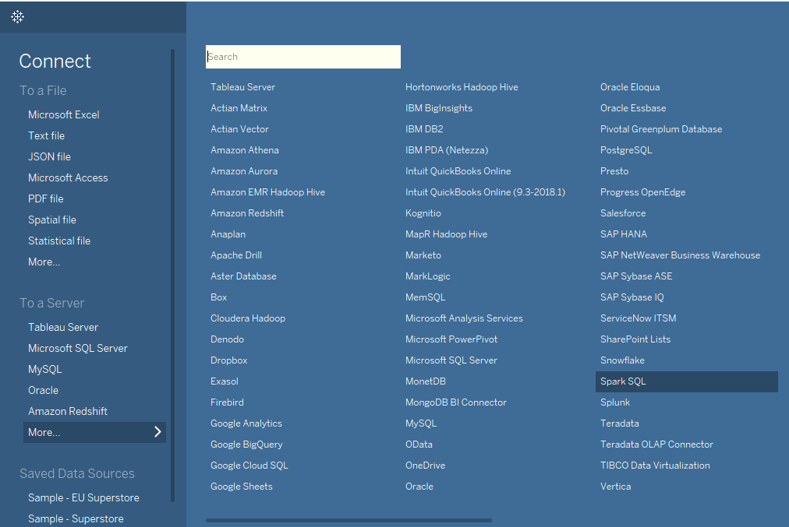
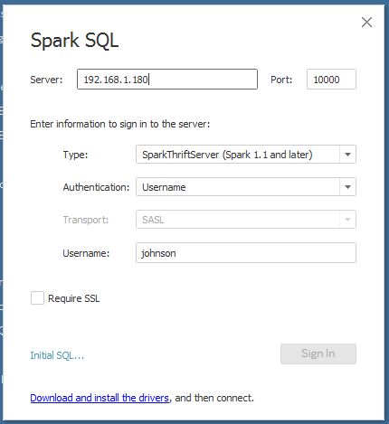

# How to Connect Tableau to SnappyData

Download and install SnappyData Enterprise edition to connect Tableau to SnappyData. You can connect Tableau using one of the following options:

*	[Thrift Server](#hivesertab) compatible with Apache HiveServer2 (HS2)
*	[SnappyData ODBC driver](#odbcdritab)

## Connect Tableau using Thrift Server 

Use the following steps to connect Tableau to SnappyData using Thrift Server that is compatible with Apache HiveServer2. This is also fully compatible with Spark's Thrift.

### Step 1: Enable Thrift Server in SnappyData Cluster
1. Download and Install the SnappyData Enterprise version 1.0.2.1 from the [SnappyData Release page](https://github.com/SnappyDataInc/snappydata/releases). 
2.	[Configure the SnappyData Cluster](../configuring_cluster/configuring_cluster.md).
3.	In the [Lead node configuration](../configuring_cluster/configuring_cluster.md#configuring-leads), set the following property: `snappydata.hiveServer.enabled=true`
4.	Launch the SnappyData cluster.  `./sbin/snappy-start-all.sh`

### Step 2: Connect to Tableau Desktop
1.	Download and install **Tableau Desktop v2018.3.x** from the [Tableau Download page](https://www.tableau.com/support/releases/online/2018.3). You may also need to register your product.
2. Open the Tableau Desktop application, on the left panel, from the **To A Server **section, select **Spark SQL connector** option. 
	
3. In the **Spark SQL** configuration dialog box, enter the following details:

	
    
    *	Enter the host/IP of the Lead node in SnappyData cluster. The default port used by the Hive thrift server is 10000.
    *	Select **SparkThriftServer** option from **Type** dropdown.
    *	Select **username and password** option from the **Authentication** dropdown.
    *	Set **Transport** field to **SASL**.
    *	Provide a username/password. You could choose to use **APP/APP** for username/password if authentication was not configured in the cluster.

    !!! Note
		For more information about Spark SQL configurations, click [here](https://onlinehelp.tableau.com/current/pro/desktop/en-us/examples_sparksql.htm).

4. Click the **Sign In **button to connect to SnappyData. Tableau displays the page where you can browse and select Schema and Tables as per your requirements to create data visualizations.

	!!! Note
    	The **Sign In** button is disabled if Simba Spark ODBC Driver is not already installed on your system.  To enable it, click the **Download and Install the drivers **link and install Simba Spark ODBC Driver. Now the **Sign in** button is enabled.

!!!Note
When using **Tableau extract** feature, you may need to configure the following two options if your extracted data set size will be large. 

1) **Set the max result size allowed by Snappydata**: By default, Snappydata will terminate a query whose result exceeds 1GB. You can set spark.driver.MaxResultSize option on the Lead node and bounce your cluster. This option is described here - https://github.com/SnappyDataInc/snappydata/blob/master/docs/configuring_cluster/property_description.md

2) **Configure streaming of result set to Tableau from SnappyData hive server**:  Tableau permits 'initial SQL' to be sent to the server when creating a data source connection as described here - https://onlinehelp.tableau.com/current/pro/desktop/en-us/connect_basic_initialsql.htm. 
In the Initial SQL window type - set spark.sql.thriftServer.incrementalCollect=true 

## Connect Tableau using SnappyData ODBC Driver

Get latest version of SnappyData and SnappyData ODBC driver from [SnappyData Release page](https://github.com/SnappyDataInc/snappydata/releases). 

Use the following instructions to connect Tableau using SnappyData ODBC driver:

### Step 1: Setup SnappyData ODBC Driver

Follow the instructions provided [here](/setting_up_odbc_driver-tableau_desktop.md) to setup SnappyData ODBC Driver.

### Step 2: Install Tableau Desktop (10.1 or Higher)

To install Tableau desktop:

1. [Download Tableau Desktop](https://www.tableau.com/products/desktop).

2. Depending on your Windows installation, download the 32-bit or 64-bit version of the installer.

3. Follow the steps to complete the installation and ensure that you register and activate your product.

### Step 3: Connect Tableau Desktop to SnappyData Server

When using Tableau with the SnappyData ODBC Driver for the first time, you must add the **odbc-snappydata.tdc** file that is available in the downloaded **snappydata-odbc-1.0.2.zip**.

To connect the Tableau Desktop to the SnappyData Server:

1. Copy the **odbc-snappydata.tdc** file to the <_User_Home_Path_>/Documents/My Tableau Repository/Datasources directory.

2. Open the Tableau Desktop application.

3. On the Start Page,

	a. Under **Connect** > **To a Server**, click **Other Databases (ODBC)**. The Other Databases (ODBC) window is displayed.

	b. In the DSN drop-down list, select the name that you provided for your SnappyData ODBC connection (for example *snappydsn*), and then click **Connect**.

4. When the connection to the SnappyData server is established, the **Sign In** option is enabled. Click **Sign In** to log into Tableau.

5. From the **Schema** drop-down list, select a schema. For example, *app*.  All tables from the selected schema are listed.

6. Select the required table(s) and drag it to the canvas. A view generated using the selected tables is displayed.  If you make changes to the table, click **Update Now** to refresh and view your changes.

7. In the **Worksheets** tab, click **sheet** to start the analysis.  

8. On this screen, you can click and drag a field from the **Dimensions** area to **Rows** or **Columns**.  Refer to the Tableau documentation for more information on data visualization.
