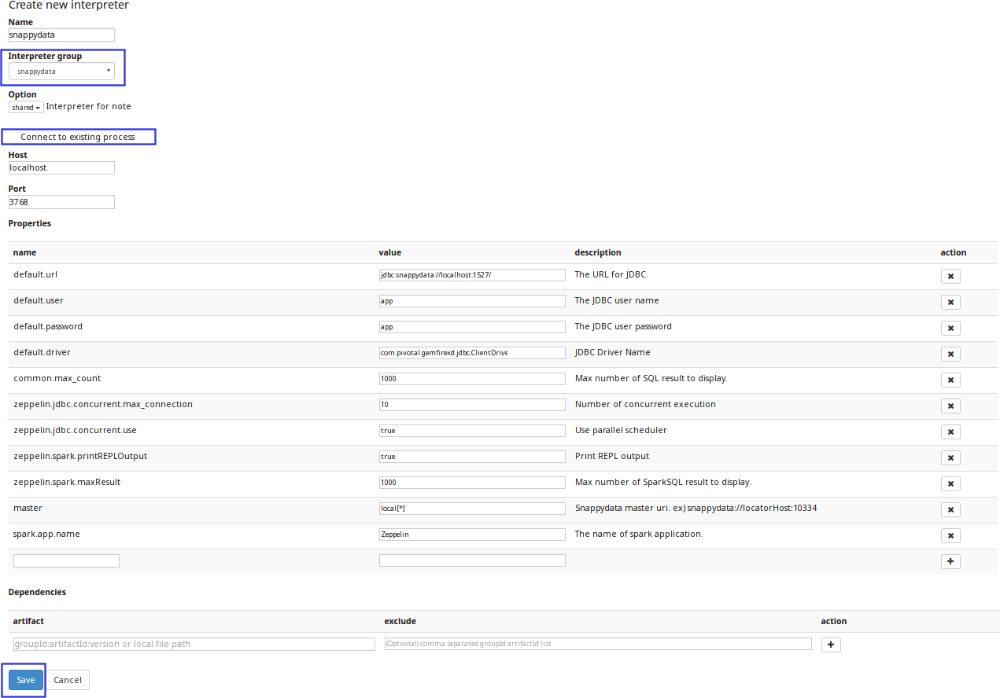

# How to Use Apache Zeppelin with TIBCO ComputeDB

## Step 1: Download, Install and Configure TIBCO ComputeDB
1. [Download and Install TIBCO ComputeDB](../install/install_on_premise.md#download-snappydata)  
 The table below lists the version of the TIBCO ComputeDB Zeppelin Interpreter and Apache Zeppelin Installer for the supported TIBCO ComputeDB Releases.

    | TIBCO ComputeDB Zeppelin Interpreter | Apache Zeppelin Binary Package | TIBCO ComputeDB Release|
	|--------|--------|--------|
    |[Version 0.7.3.4](https://github.com/SnappyDataInc/zeppelin-interpreter/releases/tag/v0.7.3.4) |[Version 0.7.3](http://archive.apache.org/dist/zeppelin/zeppelin-0.7.3/zeppelin-0.7.3-bin-netinst.tgz) |[Release 1.0.2.1](https://github.com/SnappyDataInc/snappydata/releases/tag/v1.0.2.1)|
    |[Version 0.7.3.2](https://github.com/SnappyDataInc/zeppelin-interpreter/releases/tag/v0.7.3.2) |[Version 0.7.3](http://archive.apache.org/dist/zeppelin/zeppelin-0.7.3/zeppelin-0.7.3-bin-netinst.tgz) |[Release 1.0.2](https://github.com/SnappyDataInc/snappydata/releases/tag/v1.0.2)|
    |[Version 0.7.3](https://github.com/SnappyDataInc/zeppelin-interpreter/releases/tag/v0.7.3) |[Version 0.7.3](http://archive.apache.org/dist/zeppelin/zeppelin-0.7.3/zeppelin-0.7.3-bin-netinst.tgz) |[Release 1.0.1](https://github.com/SnappyDataInc/snappydata/releases/tag/v1.0.1)|
    |[Version 0.7.2](https://github.com/SnappyDataInc/zeppelin-interpreter/releases/tag/v0.7.2) |[Version 0.7.2](http://archive.apache.org/dist/zeppelin/zeppelin-0.7.2/zeppelin-0.7.2-bin-netinst.tgz) |[Release 1.0.0](https://github.com/SnappyDataInc/snappydata/releases/tag/v1.0.0)|

2. [Configure the TIBCO ComputeDB Cluster](../configuring_cluster/configuring_cluster.md).

3. In [lead node configuration](../configuring_cluster/configuring_cluster.md#configuring-leads) set the following properties:

	- Enable the TIBCO ComputeDB Zeppelin interpreter by adding `-zeppelin.interpreter.enable=true` 

    - In the classpath option, define the location where the TIBCO ComputeDB Interpreter is downloaded by adding 
    `-classpath=/<download_location>/snappydata-zeppelin-<version_number>.jar`

    - In the **conf/spark-env.sh** file, set the `SPARK_PUBLIC_DNS` property to the public DNS name of the lead node. This enables the Member Logs to be displayed correctly to users accessing the [TIBCO ComputeDB Monitoring UI](../monitoring/monitoring.md) from outside the network.

4. [Start the TIBCO ComputeDB cluster](start_snappy_cluster.md).

5. Extract the contents of the Zeppelin binary package.   

6. Install the TIBCO ComputeDB Zeppelin interpreter in Apache Zeppelin by executing the following command from Zeppelin's bin directory:  

        ./install-interpreter.sh --name snappydata --artifact io.snappydata:snappydata-zeppelin:<TIBCO ComputeDB_interpreter_version_number> 

    Zeppelin interpreter allows the TIBCO ComputeDB interpreter to be plugged into Zeppelin using which, you can run queries.

7. Rename the **zeppelin-site.xml.template** file (located in zeppelin-<_version_number_>-bin-all/conf directory) to **zeppelin-site.xml**.

8. Edit the **zeppelin-site.xml** file: 

    In the `zeppelin.interpreters` property, add the following interpreter class names: `org.apache.zeppelin.interpreter.SnappyDataZeppelinInterpreter,org.apache.zeppelin.interpreter.SnappyDataSqlZeppelinInterpreter`

9. Download the predefined TIBCO ComputeDB notebooks [notebook.tar.gz](https://github.com/SnappyDataInc/zeppelin-interpreter/blob/notes/examples/notebook/notebook.tar.gz).   Extract and copy the contents of the notebook.tar.gz  compressed file to the **notebook** folder in the Zeppelin installation on your local machine.

10. Start the Zeppelin daemon using the command:   `bin/zeppelin-daemon.sh start`

11. To ensure that the installation is successful, log into the Zeppelin UI (**http://localhost:8080**) from your web browser.

## Step 2: Configure Interpreter Settings

1. Log on to Zeppelin from your web browser and select **Interpreter** from the **Settings** option.

2. Click **Create** to add an interpreter.  	 

3. From the **Interpreter group** drop-down select **TIBCO ComputeDB**.
	 

	!!! Note
    	If **TIBCO ComputeDB** is not displayed in the **Interpreter group** drop-down list, try the following options, and then restart Zeppelin daemon: 

    	* Delete the **interpreter.json** file located in the **conf** directory (in the Zeppelin home directory).

    	* Delete the **zeppelin-spark_<_version_number_>.jar** file located in the **interpreter/TIBCO ComputeDB** directory (in the Zeppelin home directory).

4. Click the **Connect to existing process** option. The fields **Host** and **Port** are displayed.

5. Specify the host on which the TIBCO ComputeDB lead node is executing, and the TIBCO ComputeDB Zeppelin Port (Default is 3768).
	
	| Property | Default Values | Description |
	|--------|--------| -------- |
	|Host|localhost        |Specify host on which the TIBCO ComputeDB lead node is executing  |
	|Port        |3768        |Specify the Zeppelin server port  |
	
6. Configure the interpreter properties.  The table lists the properties required for TIBCO ComputeDB.

	| Property | Value | Description |
	|--------|--------| -------- |
	|default.url|jdbc:snappydata://localhost:1527/	| Specify the JDBC URL for SnappyData cluster in the format `jdbc:snappydata://<locator_hostname>:1527` |
	|default.driver|io.snappydata.jdbc.ClientDriver| Specify the JDBC driver for SnappyData|
	|snappydata.connection|localhost:1527| Specify the `host:clientPort` combination of the locator for the JDBC connection |
	|master|local[*]| Specify the URI of the spark master (only local/split mode) |
	|zeppelin.jdbc.concurrent.use|true| Specify the Zeppelin scheduler to be used.  Select **True** for Fair and **False** for FIFO | 

7. If required, edit other properties, and then click **Save** to apply your changes. 

!!! Note
	You can modify the default port number of the Zeppelin interpreter by setting the property: 
	`-zeppelin.interpreter.port=<port_number>` in [lead node configuration](../configuring_cluster/configuring_cluster.md#configuring-leads). 

## Additional Settings

1. Create a note and bind the interpreter by setting TIBCO ComputeDB as the default interpreter.  TIBCO ComputeDB Zeppelin Interpreter group consist of two interpreters. Click and drag *<_Interpreter_Name_>* to the top of the list to set it as the default interpreter.

	| Interpreter Name | Description |
	|--------|--------|
    | %snappydata.snappydata or   %snappydata.spark | This interpreter is used to write Scala code in the paragraph. SnappyContext is injected in this interpreter and can be accessed using variable **snc** |
    |%snappydata.sql | This interpreter is used to execute SQL queries on the TIBCO ComputeDB cluster. It also has features of executing approximate queries on the TIBCO ComputeDB cluster.|

2. Click **Save** to apply your changes.

<heading2> Known Issue</heading2>

If you are using TIBCO ComputeDB Zeppelin Interpreter 0.7.1 and Zeppelin Installer 0.7 with TIBCO ComputeDB or future releases, the approximate result does not work on the sample table, when you execute a paragraph with the `%sql show-instant-results-first` directive.

