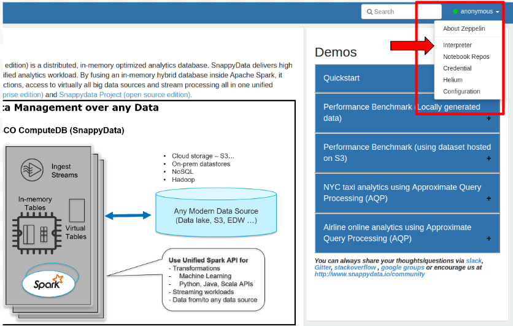
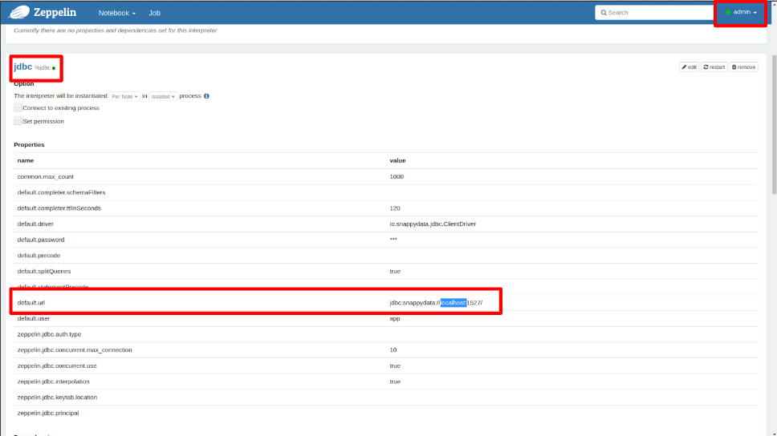

# Using Apache Zeppelin with SnappyData

Do the following to use Apache Zeppelin with SnappyData:

1.	[Download and Install SnappyData](/install/install_on_premise.md). The install zip for computeDB contains the Apache Zeppelin zip folder. 
2.	[Configure the SnappyData Cluster](/configuring_cluster/configuring_cluster.md).
3.	Unzip the Apache Zeppelin artifact<name>.
4.	Change to **Zeppelin** directory and start Zeppelin.
			cd Zeppelin directory
			./bin/zeppelin-daemon.sh start
5.	Go to localhost:8080 or (AWS-AMI_PublicIP):8080.

Refer [here](concurrent_apache_zeppelin_access_to_secure_snappydata.md) for instructions to configure Apache Zeppelin for securely accessing SnappyData Cluster.

## FAQs

*	**I am on the homepage, what should I do next?**
	*	If you are using SnappyData for the first time, you can start with the QuickStart notebooks to start exploring the capabilities of the product. 
	*	If you have used SnappyData earlier and just want to explore the new interface, you can download data from external sources using the notebooks in the External Data Sources section.

*	**I get an error when I run a paragraph?**
	*	By design, the anonymous user is not allowed to execute notebooks.
	*	You may clone the notebook and proceed in the cloned notebook.

*	**Do I need to change any setting in Zeppelin to work with the multi-node cluster?**
	*	Yes, but this requires Zeppelin’s admin user access. By default, you access the Zeppelin notebooks as an anonymous user. For admin user access, click the **Interpreter** tab and enter your credentials in the **Login** box. You can find the admin credentials in the **zeppelin-dir/conf/shiro.ini** file.
	
	*	Update the appropriate IP of a server node in the jdbc URL (highlighted in the following image).
	

*	**I already have a Zeppelin installation, do I still need to install SnappyData’s Zeppelin separately?**
	*	No. You may download the notebooks from [here](https://github.com/SnappyDataInc/zeppelin-interpreter/tree/master/examples/notebook) and import them into your Zeppelin.
	*	Additionally, you must set up the JDBC interpreter to connect to SnappyData. [Configure JDBC Interpreter](concurrent_apache_zeppelin_access_to_secure_snappydata.md#configinterpreter).

*	**Do these notebooks depend on specific Zeppelin version?**
	Yes, these notebooks were developed on Zeppelin version 0.8.2.

*	**Are there any configuration files of Zeppelin that I need to be aware of?**
	For advanced multi-user settings, refer to the **zeppelin-site.xml** and **shiro.ini**. For more details and options,  refer to the Apache Zeppelin documentation.

*	**Is Zeppelin the only interface to interact with SnappyData?**
	No, if you prefer a command-line interface, then the product provides two command-line interfaces. The SQL interface, which can be accessed using **./bin/snappy** and the experimental scala interpreter can be invoked using **./bin/snappy-scala**. 

*	**How to configure Apache Zeppelin to securely and concurrently access the SnappyData Cluster?**
	Refer to [How to Configure Apache Zeppelin to Securely and Concurrently access the SnappyData Cluster](concurrent_apache_zeppelin_access_to_secure_snappydata.md).

<!--- 
## Step 1: Download, Install and Configure SnappyData
1. [Download and Install SnappyData](../install/install_on_premise.md#download-snappydata)  
 The table below lists the version of the SnappyData Zeppelin Interpreter and Apache Zeppelin Installer for the supported SnappyData Releases.

    | SnappyData Zeppelin Interpreter | Apache Zeppelin Binary Package | SnappyData Release|
	|--------|--------|--------|
    |[Version 0.7.3.6](https://github.com/SnappyDataInc/zeppelin-interpreter/releases/tag/v0.7.3.6) |[Version 0.7.3](http://archive.apache.org/dist/zeppelin/zeppelin-0.7.3/zeppelin-0.7.3-bin-netinst.tgz) |[Release 1.1.1](https://edelivery.tibco.com)|

2. [Configure the SnappyData Cluster](../configuring_cluster/configuring_cluster.md).

3. In [lead node configuration](../configuring_cluster/configuring_cluster.md#configuring-leads) set the following properties:

	- Enable the SnappyData Zeppelin interpreter by adding `-zeppelin.interpreter.enable=true` 

    - In the classpath option, define the location where the SnappyData Interpreter is downloaded by adding 
    `-classpath=/<download_location>/snappydata-zeppelin-<version_number>.jar`

    - In the **conf/spark-env.sh** file, set the `SPARK_PUBLIC_DNS` property to the public DNS name of the lead node. This enables the Member Logs to be displayed correctly to users accessing the [SnappyData Monitoring Console](../monitoring/monitoring.md) from outside the network.

4. [Start the SnappyData cluster](start_snappy_cluster.md).

5. Extract the contents of the Zeppelin binary package.   

6. Install the SnappyData Zeppelin interpreter in Apache Zeppelin by executing the following command from Zeppelin's bin directory:  

        ./install-interpreter.sh --name snappydata --artifact io.snappydata:snappydata-zeppelin:<interpreter_version_number> 

    Zeppelin interpreter allows the SnappyData interpreter to be plugged into Zeppelin using which, you can run queries.

7. Rename the **zeppelin-site.xml.template** file (located in zeppelin-<_version_number_>-bin-all/conf directory) to **zeppelin-site.xml**.

8. Edit the **zeppelin-site.xml** file: 

    In the `zeppelin.interpreters` property, add the following interpreter class names: `org.apache.zeppelin.interpreter.SnappyDataZeppelinInterpreter,org.apache.zeppelin.interpreter.SnappyDataSqlZeppelinInterpreter`

9. Download the predefined SnappyData notebooks [notebook.tar.gz](https://github.com/SnappyDataInc/zeppelin-interpreter/blob/notes/examples/notebook/notebook.tar.gz).   Extract and copy the contents of the notebook.tar.gz  compressed file to the **notebook** folder in the Zeppelin installation on your local machine.

10. Start the Zeppelin daemon using the command:   `bin/zeppelin-daemon.sh start`

11. To ensure that the installation is successful, log into the Zeppelin UI (**http://localhost:8080**) from your web browser.

## Step 2: Configure Interpreter Settings

1. Log on to Zeppelin from your web browser and select **Interpreter** from the **Settings** option.

2. Click **Create** to add an interpreter.  	 

3. From the **Interpreter group** drop-down select **SnappyData**.
	 

	!!! Note
    	If **SnappyData** is not displayed in the **Interpreter group** drop-down list, try the following options, and then restart Zeppelin daemon: 

    	* Delete the **interpreter.json** file located in the **conf** directory (in the Zeppelin home directory).

    	* Delete the **zeppelin-spark_<_version_number_>.jar** file located in the **interpreter/SnappyData** directory (in the Zeppelin home directory).

4. Click the **Connect to existing process** option. The fields **Host** and **Port** are displayed.

5. Specify the host on which the SnappyData lead node is executing, and the SnappyData Zeppelin Port (Default is 3768).
	
	| Property | Default Values | Description |
	|--------|--------| -------- |
	|Host|localhost        |Specify host on which the SnappyData lead node is executing  |
	|Port        |3768        |Specify the Zeppelin server port  |
	
6. Configure the interpreter properties.  The table lists the properties required for SnappyData.

	| Property | Value | Description |
	|--------|--------| -------- |
	|default.url|jdbc:snappydata://localhost:1527/	| Specify the JDBC URL for SnappyData cluster in the format `jdbc:snappydata://<locator_hostname>:1527` |
	|default.driver|io.snappydata.jdbc.ClientDriver| Specify the JDBC driver for SnappyData|
	|snappydata.connection|localhost:1527| Specify the `host:clientPort` combination of the locator for the JDBC connection |
	|master|local[*]| Specify the URI of the spark master (only local/split mode) |
	|zeppelin.jdbc.concurrent.use|true| Specify the Zeppelin scheduler to be used.  Select **True** for Fair and **False** for FIFO | 

7. If required, edit other properties, and then click **Save** to apply your changes. 

!!! Note
	You can modify the default port number of the Zeppelin interpreter by setting the property: 
	`-zeppelin.interpreter.port=<port_number>` in [lead node configuration](../configuring_cluster/configuring_cluster.md#configuring-leads). 

## Additional Settings

1. Create a note and bind the interpreter by setting SnappyData as the default interpreter.  SnappyData Zeppelin Interpreter group consist of two interpreters. Click and drag *<_Interpreter_Name_>* to the top of the list to set it as the default interpreter.

	| Interpreter Name | Description |
	|--------|--------|
    | %snappydata.snappydata or   %snappydata.spark | This interpreter is used to write Scala code in the paragraph. SnappyContext is injected in this interpreter and can be accessed using variable **snc** |
    |%snappydata.sql | This interpreter is used to execute SQL queries on the SnappyData cluster. It also has features of executing approximate queries on the SnappyData cluster.|

2. Click **Save** to apply your changes.

<heading2> Known Issue</heading2>

If you are using SnappyData Zeppelin Interpreter 0.7.1 and Zeppelin Installer 0.7 with SnappyData or future releases, the approximate result does not work on the sample table, when you execute a paragraph with the `%sql show-instant-results-first` directive.

--->
