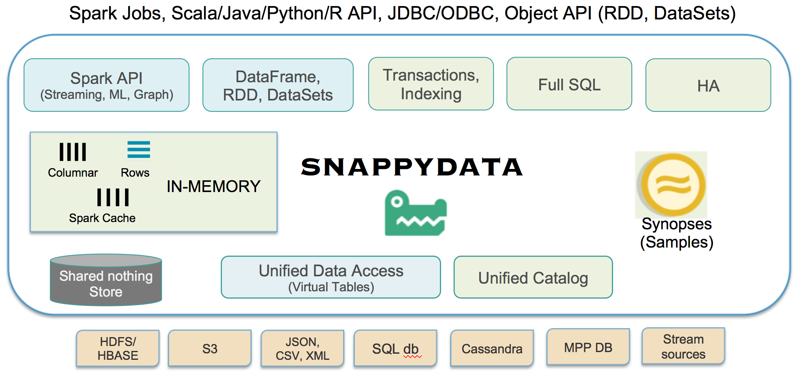

## Introduction
SnappyData fuses Apache Spark with an in-memory database to deliver a compute+data engine capable of stream processing, transactions, interactive analytics and prediction in a single cluster.

!!! Attention
	This document assumes that you have familiarity with Apache Spark and its concepts. If you are new to Spark, refer to the [Spark documentation](https://spark.apache.org/docs/2.1.1/) to learn more about using Spark. 
The current release of SnappyData is fully compatible with Spark 2.1.1

## The Challenge with Spark and Remote Data Sources
Apache Spark is a general purpose parallel computational engine for analytics at scale. At its core, it has a batch design center and can access disparate data sources in a highly parallelized manner for its distributed computations. Typically, data is fetched lazily as a result of SQL query or a Dataset (RDD) getting materialized. This can be quite inefficient and expensive since most workloads require the data set to be repeatedly processed. 

Analytic processing requires large datasets to be repeatedly copied from an external data source like HDFS, into Spark. Copying data, reformatting it (into a columnar format, depending on where the data is being copied from) and moving it across process and machine boundaries can be very expensive. As a result, we see that in several cases, applications using Spark with an external data source fail to deliver the promise of interactive analytic performance. For instance, each time an aggregation is run on a large Cassandra table, it necessitates streaming the entire table into Spark to do the aggregation. The alternative to working with a stateful store is to cache the data in Spark. This, of course, suffers from the problems associated with stale data.

## The SnappyData Approach
SnappyData fuses a low latency, highly available in-memory transactional database (Pivotal GemFire/Apache Geode) into Spark with shared memory management and several optimizations that deliver performance and concurrency for mixed workloads. Data in the highly available in-memory store is laid out using a custom columnar format somewhat similar to the layout used by Spark caching. Query engine operators are optimized through better vectorization and code generation. The net effect of these changes is, an order of magnitude performance improvement when compared to native Spark caching, and more than two orders of magnitude better Spark performance when working with external data sources.

Essentially, Spark is turned into an in-memory operational database capable of transactions, point reads, writes, working with streams and running analytic SQL queries.

SnappyData is an in-memory database that runs Spark’s compute engine directly in the database, and offers **Spark's API and SQL as its interface and computational engine**. The fusion with Spark allows SnappyData to work with a large number of data sources like HDFS, NoSQL etc. through bespoke Spark connectors.  
While the SnappyData engine (that builds on Spark Catalyst SQL engine) is primarily designed for SQL processing, applications can also work with Objects through Spark RDDs and the Spark Datasets API.

Any Spark DataFrame can be easily managed as a SnappyData table or conversely any table can be accessed as a DataFrame.

By default, when the cluster is started, the data store is bootstrapped and when any Spark Jobs/OLAP queries are submitted, Spark executors are automatically launched within the SnappyData process space (JVMs). There is no need to connect and manage external data store clusters. The SnappyData store can synchronously replicate for high availability (HA) with strong consistency and store/recover from disk for additional reliability.

## Key Features

* **100% compatible with Spark**- Use SnappyData as a database, and additionally use any of the Spark APIs - ML, Graph, etc.

* **In-memory row and column stores**: Run the store colocated in Spark executors or in its own process space (that is, a computational cluster and a data cluster)

* **SQL standard compliance**: Spark SQL + several SQL extensions: DML, DDL, indexing, constraints.

* **SQL based extensions for streaming processing**: Use native Spark streaming, DataFrame APIs or declaratively specify your streams and how you want it processed. You do not need to learn Spark APIs to get going with stream processing or its subtleties when processing in parallel.

* **Not-Only SQL**: Use either as a SQL database or work with JSON or even arbitrary Application Objects. Essentially, any Spark RDD/DataSet can also be persisted into SnappyData tables (type system same as Spark Datasets). 

* **Mutate, transact on data in Spark**: You can use SQL to insert, update, delete data in tables as one would expect. Extensions to Spark’s context are also provided so you can mutate data in your Spark programs. Tables defined in SnappyData are automatically visible as DataFrames. By eliminating the need to store data separately in a data store and then cache it in Spark for computing, SnappyData simplifies system architecture and reduces the overall cost of ownership while simultaneously offering much better performance.

* **Optimizations - Indexing**: From version 1.0, you can add indexes to your row format tables and the query optimizer automatically uses in-memory indexes when available, to provide better performance.

* **[Optimizations - colocation](howto/perform_a_colocated_join.md)**: SnappyData implements several optimizations to improve data locality and avoid shuffling data for queries on partitioned data sets. All related data can be colocated using declarative custom partitioning strategies (for example, common shared business key). Reference data tables can be modeled as replicated tables when tables cannot share a common key. Replicas are always consistent.

* **High availability not just Fault tolerance**: Data can be instantly replicated (one at a time or batch at a time) to other nodes in the cluster. It is deeply integrated with a membership-based distributed system to detect and handle failures, instantaneously providing applications continuous HA.

* **Durability and recovery:** Tables can be configured to be persisted to disk (the default) and recovered upon startup. Utilities for backup, restore and import/export are provided with the system.

* **[Interactive analytics using Synopsis Data Engine (SDE)](aqp.md)**: Multiple synopses techniques are introduced through data structures like count-min-sketch and stratified sampling to dramatically reduce the in-memory space requirements and provide true interactive speeds for analytic queries. These structures can be created and managed by developers with little to no statistical background and are completely transparent to the SQL developer running queries. Error estimators are also integrated with simple mechanisms to get to the errors through built-in SQL functions or SparkSession API extensions. 

## Extensions to the Spark Runtime

SnappyData makes the following contributions to deliver a unified and optimized runtime.

* **Integrating an operational in-memory data store with Spark’s computational model**: A number of extensions are introduced to fuse our runtime with that of Spark. Spark executors run in the same process space as our store’s execution threads, sharing the same pool of memory. When Spark executes tasks in a partitioned manner, it is designed to keep all the available CPU cores busy.   This design is extended by allowing low latency and fine-grained operations to interleave and get higher priority, without involving the scheduler. Furthermore, to support high concurrency, the runtime is extended with a “Job Server” that decouples applications from data servers, operating much in the same way as a traditional database, whereby the state is shared across many clients and applications.  

* **Unified API for OLAP, OLTP, and Streaming**: Spark builds on a common set of abstractions to provide a rich API for a diverse range of applications, such as MapReduce, Machine learning, stream processing, and SQL.
SnappyData extends Spark’s unified API: 
	
	* Allow for OLTP operations, for example, transactions and mutations (inserts/updates/deletions) on tables 
 
	* Conform with SQL standards, for example, allowing tables alterations, constraints, and indexes   

	* Support declarative stream processing in SQL

	* A unique addition of SnappyData is ability to mutate (all of inserts/updates/deletes) even column format tables efficiently without much change in query performance profile.

* **Optimizing Spark application execution times**: Our goal is to eliminate the need for yet another external store (for example, a KV store) for Spark applications. With a deeply integrated store, SnappyData improves overall performance by minimizing network traffic and serialization costs. In addition, by promoting colocated schema designs (tables and streams) where related data is colocated in the same process space, SnappyData eliminates the need for shuffling altogether in several scenarios.

* **Synopsis Data Engine support built into Spark**: The SnappyData [Synopsis Data Engine (SDE)](aqp.md) offers a novel and scalable system to analyze large data sets. SDE uses statistical sampling techniques and probabilistic data structures to answer analytic queries with sub-second latency. There is no need to store or process the entire data set. The approach trades off query accuracy for fast response time.  The SDE engine enables you to:

	- Intelligently sample the data set on frequently accessed dimensions to have a good representation across the entire data set (stratified sampling). Queries can execute on samples and return answers instantly.

	- Compute estimates for any ad hoc query from the sample(s). It can also provide error estimates for arbitrarily complex queries on streams.

	- Provide simple knobs for the user to trade off speed for accuracy, that is, simple SQL extensions so the user can specify the error tolerance for all queries. When query error is higher than tolerance level, the system automatically delegates the query to the source.

	-	Express their accuracy requirements as high-level accuracy contracts (HAC), without overwhelming them with numerous statistical concepts.

## Morphing Spark to support mixed workloads (OLTP, OLAP)
Spark is designed as a computational engine for processing batch jobs. Each Spark application (for example, a Map-reduce job) runs as an independent set of processes (that is, executor JVMs) in the cluster. These JVMs are reused for the lifetime of the application. While, data can be cached and reused in these JVMs for a single application, sharing data across applications or clients require an external storage tier, such as HDFS. SnappyData, on the other hand, targets a real-time, “always-on”, operational design center— clients can connect at will, and share data across any number of concurrent connections. This is similar to any operational database in the market today. Thus, to manage data in the same JVM, our first challenge is to alter the life cycle of these executors so that they are long-lived and decoupled from individual applications.

A second but related challenge is Spark’s design for how user requests (jobs) are handled. A single driver orchestrates all the work done on the executors. Given our need for high concurrency and a hybrid OLTP-OLAP workload, this driver introduces:

1. A single point of contention for all requests, and 

2. A barrier for achieving high availability (HA). Executors are shut down if the driver fails, requiring a full refresh of any cached state.

Spark’s primary usage of memory is for caching RDDs and for shuffling blocks to other nodes. Data is managed in blocks and is immutable. On the other hand, more complex data structure needs to be managed (along with indexes) for point access and updates. Therefore, another challenge is merging these two disparate storage systems with little impedance to the application. This challenge is exacerbated by current limitations of Spark SQL—mostly related to mutability characteristics and conformance to SQL.

Finally, Spark’s strong and growing community has zero tolerance for incompatible forks. This means that no changes can be made to Spark’s execution model or its semantics for existing APIs. In other words, our changes have to be an extension.
