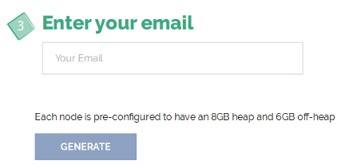
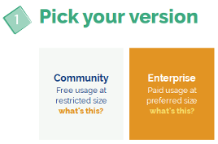
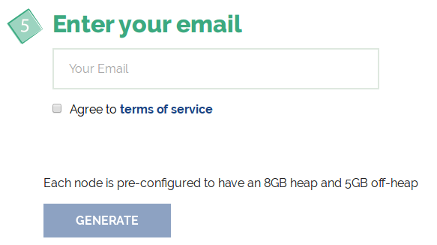
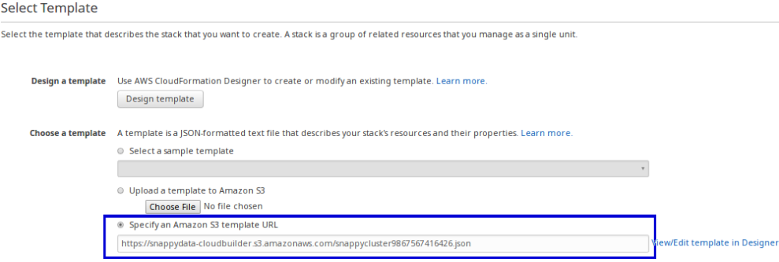
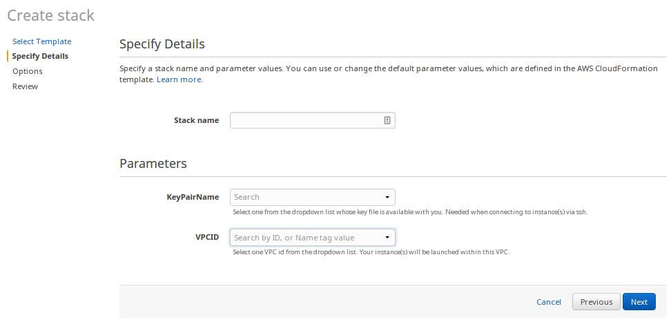
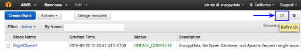

<a id="setting-up-cluster-on-amazon-web-services-aws"></a>
# Setting up Cluster on Amazon Web Services (AWS)

Amazon Web Services (AWS) is a comprehensive, evolving cloud computing platform that offers a suite of cloud-computing services. The services provided by this platform that is important for SnappyData are Amazon Elastic Compute Cloud (EC2) and Amazon Simple Storage Service (S3).
You can set up SnappyData cluster on Amazon Web Services using one of the following options:

<!---*	[SnappyData CloudBuilder](#usingcloudbuiler)--->
*	[EC2 Scripts](#EC2)	
*	[AWS Management Console](#usingawsmgmtconsole)

<!---
<a id="usingcloudbuiler"></a>
## SnappyData CloudBuilder
[SnappyData CloudBuilder](http://www.snappydata.io/cloudbuilder) is a web based utility that allows you to quickly launch SnappyData cluster on AWS instances. It also launches Apache Zeppelin server that allows you to build notebooks that visually represent key elements of your business.

This method is recommended as the fastest way to deploy SnappyData. All you need is an existing AWS account and login credentials to get started.


* [Prerequisites](#prerequisitescloudbuiler)
* [Deploying SnappyData Cloud Cluster Using SnappyData CloudBuilder](#DeployingClusterCloudFormation)


<a id="prerequisitescloudbuiler"></a>
### Prerequisites

* Ensure that you have an existing AWS account with required permissions to launch EC2 resources with AWS CloudFormation.

* Sign into the AWS console using your AWS account-specific URL. This ensures that the account-specific URL is stored as a cookie in the browser, which then redirects you to the appropriate AWS URL for subsequent logins.

* Create an EC2 Key Pair in the region where you want to launch the SnappyData cluster.

<a id="DeployingClusterCloudFormation"></a>
### Deploying SnappyData Cluster with SnappyData CloudBuilder
SnappyData uses the AWS CloudFormation feature to automatically install, configure and start a SnappyData cluster.

It is recommended that you select an instance type with higher processing power and more memory for the leads and servers  of the cluster.


#### Step 1: Go to [SnappyData CloudBuilder](http://www.snappydata.io/cloudbuilder) page

#### Step 2: Define your Cluster

##### For Community Edition

1. **Pick your version**</br> Select the **Community** option. </br>
	

2. **Pick your Instance**</br>Select an instance based on the capacity that you require.</br>
	

3. **Enter your email**: Provide your email address. </br>
	

4. Click **Generate**.

5. The next page is displayed where you can [Select the Region and Launch your Cluster](#region).

##### For Enterprise Edition
1. **Pick your version**</br> Select the **Enterprise** option.

	

2. **Make Locators & Leads Highly Available?**</br>

	* **Select HA/Non-HA for the [Locators](../best_practices/ha_considerations.md)**

	* **Select HA/Non-HA for the [Leads](../best_practices/ha_considerations.md)** </br>

	

3. [Pick total Memory & Disk](../best_practices/memory_management.md) (GB): </br>

	* **Memory**: Click and drag the bar to select the required memory.

	* **Disk (3x Memory Recommended)**: Click and drag the bar to select the required disk size. Currently, Amazon Elastic Block Storage (EBS) is provided.

	

4. **Recommended Cluster**: Select an instance based on the required capacity.

	* **Add servers to support high availability?**: Select this option to add servers to support high availability.

	* **Do your workloads have high query volumes?**: Select this option if your workloads have high query volumes.

	Click the **Edit Nodes** option to modify the number of nodes.

	

5. Enter your email address and select the **Agree to terms of service** check-box. </br>

	

6. Click **Generate**. The next page is displayed where you can [Select the Region and Launch your Cluster](#region).

<a id="region"></a>
#### Step 3: Select the Region and Launch your Cluster
1. On this page, select the AWS region, and then click **Launch Cluster** to launch your single-node cluster.

    !!! Note

		* The region you select must match the EC2 Key Pair you created.

		* If you are not already logged into AWS, you are redirected to the AWS sign-in page. 	

    

2. On the **Select Template** page, the URL for the Amazon S3 template is pre-populated. Click **Next** to continue.   <br>

	

3. On the **Specify Details** page:

	* **Stack name**: You can change the stack name.</br>

	!!! Note
    	The stack name must contain only letters, numbers, dashes, and should start with an alpha character.

    * **KeyPairName**: Enter a name of an existing EC2 KeyPair. This enables SSH access to the cluster. Refer to the Amazon documentation for more information on [generating your own EC2 Key Pair](http://docs.aws.amazon.com/AWSEC2/latest/UserGuide/ec2-key-pairs.html).

    * **VPCID**: From the drop-down list, select *default* Virtual Private Cloud (VPC) ID of your selected region. Your instances are launched within this VPC.</br> Click **Next** to continue.

    

4. Specify the tags (key-value pairs) for resources in your stack or leave the field empty and click **Next**.

5. On the **Review** page, verify the details and click **Create** to create a stack.

	!!! Note
    	This operation may take a few minutes to complete.

6. The next page lists the existing stacks. Click **Refresh** to view the updated list and the status of the stack creation.
When the cluster has started, the status of the stack changes to **CREATE_COMPLETE**. <br>

<a id="Stack"></a>

7. Click on the **Outputs** tab, to view the links (URL) required for launching Apache Zeppelin, which provides web-based notebooks for data exploration. <br>
	

	!!! Note
    	If the status of the stack displays **ROLLBACK_IN_PROGRESS** or **DELETE_COMPLETE**, the stack creation may have failed. Some common problems that might have caused the failure are:

		* **Insufficient Permissions**: Verify that you have the required permissions for creating a stack (and other AWS resources) on AWS.

		* **Invalid Keypair**: Verify that the EC2 key pair exists in the region you selected in the SnappyData CloudBuilder creation steps.

		* **Limit Exceeded**: Verify that you have not exceeded your resource limit. For example, if you exceed the allocated limit of Amazon EC2 instances, the resource creation fails and an error is reported.*

!!! Warning
	To stop incurring charges for the instance, you can either terminate the instance or delete the stack. You cannot connect to or restart an instance after you have terminated it.

For more information, refer to the [Apache Zeppelin](#LoggingZeppelin) section or refer to the [Apache Zeppelin documentation](http://zeppelin.apache.org/).--->

<a id="EC2"></a>
## SnappyData EC2 Scripts

The SnappyData EC2 scripts enable you to quickly launch and manage SnappyData clusters on Amazon EC2 instances. They also allow you to provide custom configuration for the cluster via SnappyData configuration files, before launching the cluster.

The `snappy-ec2` script is the entry point for these EC2 scripts and is derived from the `spark-ec2` script available in [Apache Spark 1.6](https://github.com/apache/spark/tree/branch-1.6/ec2).

The scripts are available on GitHub in the [snappy-cloud-tools repository](https://github.com/SnappyDataInc/snappy-cloud-tools/tree/master/aws/ec2) and also as a **.tar.gz** file on [the release page](https://github.com/SnappyDataInc/snappy-cloud-tools/releases) file.

!!! Note
	The EC2 scripts are provided on an experimental basis. Feel free to try it out and provide your feedback as via GitHub issues.

This section covers the following:
*	[Prerequisites](#EC2prereq)
*	[Deploying SnappyData Cluster with EC2 Scripts](#launchclusterec2script)
*	[Cluster Management](#clusermanagementec2script)
*	[Known Limitations](#ec2knownlimit)

<a id="EC2prereq"></a>
### Prerequisites

* Ensure that you have an existing AWS account with required permissions to launch EC2 resources

* Create an EC2 Key Pair in the region where you want to launch the SnappyData Cloud cluster
<br/>Refer to the Amazon Web Services EC2 documentation for more information on [generating your own EC2 Key Pair](http://docs.aws.amazon.com/AWSEC2/latest/UserGuide/ec2-key-pairs.html).

* Using the AWS Secret Access Key and the Access Key ID, set the two environment variables, `AWS_SECRET_ACCESS_KEY` and `AWS_ACCESS_KEY_ID`. You can find information about generating these keys in the AWS IAM console page.<br/>
If you already have set up the AWS Command Line Interface on your local machine, the script automatically detects and uses the credentials from the AWS credentials file.

For example:
```pre
export AWS_SECRET_ACCESS_KEY=abcD12efGH34ijkL56mnoP78qrsT910uvwXYZ1112
export AWS_ACCESS_KEY_ID=A1B2C3D4E5F6G7H8I9J10
```

* Ensure Python v 2.7 or later is installed on your local computer.

<a id="launchclusterec2script"></a>
### Deploying SnappyData Cluster with EC2 Scripts

In the command prompt, go to the directory where the **snappydata-ec2-`<version>`.tar.gz** is extracted or to the
aws/ec2 directory where the [SnappyData cloud tools repository](https://github.com/SnappyDataInc/snappy-cloud-tools) is cloned locally.

**Syntax**

```pre
./snappy-ec2 -k <your-key-name> -i <your-keyfile-path> <action> <your-cluster-name> [options]
```

Here:

* `<your-key-name>` refers to the EC2 key pair.

* `<your-keyfile-path>` refers to the path to the key file.

* `<action>` refers to the action to be performed. Some of the available actions are `launch`, `destroy`, `stop`, `start` and `reboot-cluster`.
Use `launch` action to create a new cluster while `stop` and `start` actions work on existing clusters.

By default, the script starts one instance of a locator, lead, and server each.
The script identifies each cluster by its unique cluster name that you provide and internally ties the members
(locators, leads, and stores/servers) of the cluster with EC2 security groups, whose names are derived from the cluster name.

When running the script, you can also specify options to configure the cluster such as the number of stores in the
cluster and the region where the EC2 instances should be launched.

**Example**

```pre
./snappy-ec2 -k my-ec2-key -i ~/my-ec2-key.pem --stores=2 --with-zeppelin --region=us-west-1 launch my-cluster
```

The above example launches a SnappyData cluster named **my-cluster** with 2 stores or servers.
The locator is associated with security group named **my-cluster-locator** and the servers are associated with **my-cluster-store** security group.

The cluster is launched in the **N. California (us-west-1)** region on AWS and has an Apache Zeppelin server running on the instance where the lead is running.</br>

The example assumes that you have the key file (my-ec2-key.pem) in your home directory for EC2 Key Pair named 'my-ec2-key'.

#### Assuming IAM role in the AWS EC2 Scripts

An IAM user in AWS can gain additional (or different) permissions, or get permissions to perform actions in a different AWS account through EC2 scripts. You can configure the AWS EC2 scripts to use an IAM role by passing the following properties:

*	**assume-role-arn**:
	The Amazon Resource Name (ARN) of the IAM role to be assumed. This IAM role's credentials are used to launch the cluster. If you are using the switch role functionality, this property is mandatory.
    
*	**assume-role-timeout**: 
	Timeout in seconds for the temporary credentials of the assumed IAM role, min is 900 seconds and max is 3600 seconds.
    
*	**assume-role-session-name**:
	Name of this session in which this IAM role is assumed by the user.

**Example**

```
-./snappy-ec2 -k <your-key-name> -i <your-keyfile-path> stop snap_ec2_cluster --with-zeppelin --authorized-address=<Authorized IP Address> --assume-role-arn=<role-arn> --assume-role-timeout=<timeout> --assume-role-session-name=<name-for-session>
```

!!! Note
	By default, the cluster is launched in the **N. Virginia (us-east-1)** region on AWS. To launch the cluster in a specific region use option `--region`.

<a id="clusermanagementec2script"></a>
### Cluster Management

This section covers the following:

* [Using custom build](#ec2custombuild)
*	[Specifying Properties](#ecsspecifyprop)
*	[Stopping the Cluster](#ec2stopcluster)
*	[Resuming the Cluster](#ec2resumecluster)
*	[Adding Servers to the Cluster](#ec2addservertocluster)
*	[Listing Members of the Cluster](#ec2listmember)
*	[Connecting to the Cluster](#connectclusterec2)
*	[Destroying the Cluster](#ec2destroycluster)
*	[Starting Cluster with Apache Zeppelin](#ec2startclustrezeppelin)
*	[More Options](#ec2moreoption)

<a id="ec2custombuild"></a>
#### Using Custom build

This script by default uses the SnappyData OSS build available on the GitHub releases page to launch the cluster.
To select a version of the OSS build available on GitHub, use option `--snappydata-version`.

You can also provide your own SnappyData build to the script to launch the cluster, by using
option `--snappydata-tarball` to the `launch` command.
The build can be present either on a local filesystem or as a resource on the web.

For example, to use **SnappyData Enterprise** build to launch the cluster, download the build tarball from
www.snappydata.io/download on your local machine and give its path as value to above option.

```pre
./snappy-ec2 -k my-ec2-key -i ~/my-ec2-key.pem launch my-cluster --snappydata-tarball="/home/ec2-user/snappydata/distributions/snappydata-1.1.1-bin.tar.gz" 
```

Alternatively, you can also put your build file on a public web server and provide its URL to this option.
```pre
./snappy-ec2 -k my-ec2-key -i ~/my-ec2-key.pem launch my-cluster --snappydata-tarball="https://s3-us-east-2.amazonaws.com/mybucket/distributions/snappydata-1.1.1-bin.tar.gz" 
```

The build file should be in **.tar.gz** format.

<a id="ecsspecifyprop"></a>
#### Specifying Properties

You can specify the configuration for the cluster via command line options. Use `--locator-conf` to specify the
configuration properties for all the locators in the cluster. Similarly, `--server-conf` and `--lead-conf` allow you
to specify the configuration properties for servers and leads in the cluster, respectively.

Following is a sample configuration for all the three processes in a SnappyData cluster:

```pre
./snappy-ec2 -k my-ec2-key -i ~/my-ec2-key.pem --stores=2 launch my-cluster \
  --locator-conf="-peer-discovery-port=9999 -heap-size=1024m" \
  --lead-conf="-spark.executor.cores=10 -heap-size=4096m -spark.ui.port=3333" \
  --server-conf="-client-port=1530"
```

The utility also reads **snappy-env.sh**, if present in the directory where helper scripts are present.

!!! Note
  * The earlier method of specifying the configuration properties by placing the actual
  configuration files in the directory, where helper scripts are available, is discontinued.
  * Ensure that the configuration properties specified are correct. Otherwise, launching the
  SnappyData cluster may fail but the EC2 instances would still be running.

<a id="ec2stopcluster"></a>
#### Stopping the Cluster

When you stop a cluster, it shuts down the EC2 instances and any data saved on the local instance stores is lost.
However, the data saved on EBS volumes is retained, unless the spot-instances are used.

```pre
./snappy-ec2 -k my-ec2-key -i ~/my-ec2-key.pem stop cluster-name
```
<a id="ec2resumecluster"></a>
#### Resuming the Cluster

When you start a cluster, it uses the existing EC2 instances associated with the cluster name and launches SnappyData processes on them.

```pre
./snappy-ec2 -k my-ec2-key -i ~/my-ec2-key.pem start cluster-name
```
!!! Note
	The `start` command, or `launch` command with `--resume` option, ignores the `--locators`, `--leads`, or `--stores` options and launches the SnappyData cluster on existing instances.
	However, if the configuration options are provided, they are read and processed, thus overriding their values that were provided when the cluster was launched or started previously.

<a id="ec2addservertocluster"></a>
#### Adding Servers to the Cluster

This is not yet supported using the script. You must manually launch an instance with `(cluster-name)-stores` group and
then use `launch` command with the `--resume` option.

<a id="ec2listmember"></a>
#### Listing Members of the Cluster

**To get the first locator's hostname:**
```pre
./snappy-ec2 -k my-ec2-key -i ~/my-ec2-key.pem get-locator cluster-name
```
Use the `get-lead` command to get the first lead's hostname.

<a id="connectclusterec2"></a>
#### Connecting to the Cluster

You can connect to any instance of a cluster with SSH using the login command. It logs you into the first lead instance.
You can then use SSH to connect to any other member of the cluster without a password. </br>
The SnappyData product directory is located at **/opt/snappydata/** on all the members.
```pre
./snappy-ec2 -k my-ec2-key -i ~/my-ec2-key.pem login cluster-name
```
<a id="ec2destroycluster"></a>
#### Destroying the Cluster

Destroying a cluster permanently destroys all the data on the local instance stores and on the attached EBS volumes.
```pre
./snappy-ec2 -k my-ec2-key -i ~/my-ec2-key.pem destroy cluster-name
```
This also deletes the security groups created for this cluster.

<a id="ec2startclustrezeppelin"></a>
#### Starting Cluster with Apache Zeppelin

Optionally, you can start an instance of Apache Zeppelin server with the cluster.
[Apache Zeppelin](https://zeppelin.apache.org/) provides a web-based interactive notebook that is pre-configured to
communicate with the SnappyData cluster. The Zeppelin server is launched on the same EC2 instance where the lead node is running.

```pre
./snappy-ec2 -k my-ec2-key -i ~/my-ec2-key.pem --with-zeppelin launch cluster-name
```
<a id="ec2moreoption"></a>
#### More Options

For a complete list of options provided by the script, simply run `./snappy-ec2`. The options are also provided below
for quick reference.


```pre
Usage: snappy-ec2 [options] <action> <cluster_name>

<action> can be: launch, destroy, login, stop, start, get-locator, get-lead, reboot-cluster

Options:
  --version             show program's version number and exit
  -h, --help            show this help message and exit
  -s STORES, --stores=STORES
                        Number of stores to launch (default: 1)
  --locators=LOCATORS   Number of locator nodes to launch (default: 1)
  --leads=LEADS         Number of lead nodes to launch (default: 1)
  -w WAIT, --wait=WAIT  DEPRECATED (no longer necessary) - Seconds to wait for
                        nodes to start
  -k KEY_PAIR, --key-pair=KEY_PAIR
                        Name of the key pair to use on instances
  -i IDENTITY_FILE, --identity-file=IDENTITY_FILE
                        SSH private key file to use for logging into instances
  -p PROFILE, --profile=PROFILE
                        If you have multiple profiles (AWS or boto config),
                        you can configure additional, named profiles by using
                        this option (default: none)
  -t INSTANCE_TYPE, --instance-type=INSTANCE_TYPE
                        Type of server and lead instance to launch (default:
                        m4.large). WARNING: must be 64-bit; small instances
                        won't work
  --locator-instance-type=LOCATOR_INSTANCE_TYPE
                        Locator instance type (default: t2.medium)
  -r REGION, --region=REGION
                        EC2 region used to launch instances in, or to find
                        them in (default: us-east-1)
  -z ZONE, --zone=ZONE  Availability zone to launch instances in, or 'all' to
                        spread stores across multiple (an additional $0.01/Gb
                        for bandwidthbetween zones applies) (default: a single
                        zone chosen at random)
  -a AMI, --ami=AMI     Amazon Machine Image ID to use
  --snappydata-tarball=SNAPPYDATA_TARBALL
                        HTTP URL or local file path of the SnappyData
                        distribution tarball with which the cluster will be
                        launched. (default: )
  --locator-conf=LOCATOR_CONF
                        Configuration properties for locators (default: )
  --server-conf=SERVER_CONF
                        Configuration properties for servers (default: )
  --lead-conf=LEAD_CONF
                        Configuration properties for leads (default: )
  -v SNAPPYDATA_VERSION, --snappydata-version=SNAPPYDATA_VERSION
                        Version of SnappyData to use: 'X.Y.Z' (default:
                        LATEST)
  --with-zeppelin       Launch Apache Zeppelin server with the cluster. It'll
                        be launched on the same instance where lead node will
                        be running.
  --deploy-root-dir=DEPLOY_ROOT_DIR
                        A directory to copy into / on the first locator. Must
                        be absolute. Note that a trailing slash is handled as
                        per rsync: If you omit it, the last directory of the
                        --deploy-root-dir path will be created in / before
                        copying its contents. If you append the trailing
                        slash, the directory is not created and its contents
                        are copied directly into /. (default: none).
  -D [ADDRESS:]PORT     Use SSH dynamic port forwarding to create a SOCKS
                        proxy at the given local address (for use with login)
  --resume              Resume installation on a previously launched cluster
                        (for debugging)
  --root-ebs-vol-size=SIZE
                        Size (in GB) of root EBS volume for servers and leads.
                        SnappyData is installed on root volume.
  --root-ebs-vol-size-locator=SIZE
                        Size (in GB) of root EBS volume for locators.
                        SnappyData is installed on root volume.
  --ebs-vol-size=SIZE   Size (in GB) of each additional EBS volume to be
                        attached.
  --ebs-vol-type=EBS_VOL_TYPE
                        EBS volume type (e.g. 'gp2', 'standard').
  --ebs-vol-num=EBS_VOL_NUM
                        Number of EBS volumes to attach to each node as
                        /vol[x]. The volumes will be deleted when the
                        instances terminate. Only possible on EBS-backed AMIs.
                        EBS volumes are only attached if --ebs-vol-size > 0.
                        Only support up to 8 EBS volumes.
  --placement-group=PLACEMENT_GROUP
                        Which placement group to try and launch instances
                        into. Assumes placement group is already created.
  --spot-price=PRICE    If specified, launch stores as spot instances with the
                        given maximum price (in dollars)
  -u USER, --user=USER  The SSH user you want to connect as (default:
                        ec2-user)
  --delete-groups       When destroying a cluster, delete the security groups
                        that were created
  --use-existing-locator
                        Launch fresh stores, but use an existing stopped
                        locator if possible
  --user-data=USER_DATA
                        Path to a user-data file (most AMIs interpret this as
                        an initialization script)
  --authorized-address=AUTHORIZED_ADDRESS
                        Address to authorize on created security groups
                        (default: 0.0.0.0/0)
  --additional-security-group=ADDITIONAL_SECURITY_GROUP
                        Additional security group to place the machines in
  --additional-tags=ADDITIONAL_TAGS
                        Additional tags to set on the machines; tags are
                        comma-separated, while name and value are colon
                        separated; ex: "Task:MySnappyProject,Env:production"
  --copy-aws-credentials
                        Add AWS credentials to hadoop configuration to allow
                        Snappy to access S3
  --subnet-id=SUBNET_ID
                        VPC subnet to launch instances in
  --vpc-id=VPC_ID       VPC to launch instances in
  --private-ips         Use private IPs for instances rather than public if
                        VPC/subnet requires that.
  --instance-initiated-shutdown-behavior=INSTANCE_INITIATED_SHUTDOWN_BEHAVIOR
                        Whether instances should terminate when shut down or
                        just stop
  --instance-profile-name=INSTANCE_PROFILE_NAME
                        IAM profile name to launch instances under
  --assume-role-arn=The Amazon Resource Name (ARN) of the IAM role to be assumed. 
  						This IAM role's credentials are used to launch the cluster. 
                        If you are using the switch role functionality, this property is mandatory.
 --assume-role-timeout=Timeout in seconds for the temporary credentials of the 
 						assumed IAM role, min is 900 seconds and max is 
                        3600 seconds.
--assume-role-session-name=Name of this session in which this IAM role is 
							assumed by the user.                        
```
<a id="ec2knownlimit"></a>
### Known Limitations

* Launching the cluster on custom AMI (specified via `--ami` option) does not work if the user 'ec2-user' does not have sudo permissions.

* Support for option `--user` is incomplete.


<a id="usingawsmgmtconsole"></a>
## AWS Management Console

You can launch a SnappyData cluster on Amazon EC2 instance(s) using Linux-based AMIs available on AWS. For more information
on launching an EC2 instance, refer to the [AWS documentation](http://docs.aws.amazon.com/AWSEC2/latest/UserGuide/launching-instance.html).
This section covers the following:

*	[Prerequisites](#prereqaws)
*	[Launching the Instance](#launchawsinstance)


!!! Attention
	The AMIs of SnappyData are currently unavailable on AWS.


<a id="prereqaws"></a>
### Prerequisites
*   Ensure that you have an existing AWS account with required permissions to launch the EC2 resources.
*   Create an EC2 Key Pair in the region where you want to launch the SnappyData cluster.

<a id="launchawsinstance"></a>
### Deploying SnappyData Cluster with AWS Management Console
To launch the instance and start the SnappyData cluster on a single EC2 instance:

1. Open the [Amazon EC2 console](https://console.aws.amazon.com/ec2/) and sign in using your AWS login credentials.

2. The current region is displayed at the top of the screen. Select the region where you want to launch the instance.

3. Click **Launch Instance** from the Amazon EC2 console dashboard.

4. On the **Choose an Amazon Machine Image (AMI)** page, select your preferred Linux-based AMI. For example, you can select **Amazon Linux 2 AMI** or **Ubuntu Server 16.04 LTS**. See [this page](./system_requirements.md#operating-systems-supported) for recommended Operating Systems.

	* The AMIs with pre-installed SnappyData distribution are currently unavailable under **AWS Marketplace** or **Community AMIs**.

5. On the **Choose an Instance Type** page, select the instance type as per the requirement of your use case and then click **Review and Launch** to launch the instance with default configurations. <br/>

	!!! Note

		* You can also continue customizing your instance before you launch the instance. Refer to the AWS documentation for more information.

		* On **Configure Security Group** page, ensure that you open at least ports 22 (for SSH access to the EC2 instance) and 5050 (to access SnappyData Monitoring Console) for public IP address of your laptop or client terminal.

		* If you need to connect to the SnappyData cluster via a JDBC client application or tool, open ports 1527 and 1528 for the public IP of the host where your application/tool is running, in the security group.

6. You are directed to the last step **Review Instance Launch**. Check the details of your instance, and click **Launch**.

7. In the **Select an existing key pair or create a new key pair** dialog box, select your key pair.

8. Click **Launch**. The Launch Status page is displayed.

9. Click **View Instances**. The dashboard which lists the EC2 instances is displayed.

10. Click **Refresh** to view the updated list and the status of the instance you just created.

11. Once the status of the instance changes to **running**, connect to the instance via SSH. You require:

	* The private key (.pem) file of the key pair with which the instance was launched,

	* The public DNS or IP address of the instance, and

	* The username to connect with. It depends on the AMI you selected above. For example, it could be **ec2-user** for Amazon Linux AMIs or **ubuntu** for Ubuntu-based AMIs.

Refer to the following documentation, for more information on [accessing an EC2 instance](http://docs.aws.amazon.com/AWSEC2/latest/UserGuide/AccessingInstancesLinux.html).


	!!! Note

		* The public DNS/IP of the instance is available on the EC2 dashboard > **Instances** page. Select your EC2 instance and look for it in the lower half of the page.

12. Download the required SnappyData distribution (.tar.gz) into this EC2 instance. You can find the latest SnappyData Community Edition (OSS) release [here](https://github.com/snappydatainc/snappydata/releases/latest).

    * When we make the SnappyData AMI available on AWS in future, it'll have the distribution pre-installed. In that case, you can jump to step 15.

13. Extract the tarball to /opt/snappydata/.

		tar -xvf snappydata-<version>-bin.tar.gz
		sudo mv snappydata-<version>-bin /opt/snappydata
		chown -R ec2-user:ec2-user /opt/snappydata

14. Make Sure Java 8 is installed and set as default. For Amazon Linux 2018.03, you may need to uninstall Java 7 first. Below commands update OpenJDK to 8.

		sudo yum -y -q remove  jre-1.7.0-openjdk
		sudo yum -y -q install java-1.8.0-openjdk-devel
		java -version  # Ensure it prints correct Java version

15. Setup [passwordless ssh](../reference/misc/passwordless_ssh.md) on this instance. This requirement may be removed in future, for single-instance installation on AWS.

16. Run below commands to update the cluster configuration.

		curl http://169.254.169.254/latest/meta-data/local-ipv4 > /opt/snappydata/conf/locators
		curl http://169.254.169.254/latest/meta-data/local-ipv4 > /opt/snappydata/conf/servers
		curl http://169.254.169.254/latest/meta-data/local-ipv4 > /opt/snappydata/conf/leads

17. Go to the **/opt/snappydata** directory. Run the following command to start a basic cluster with one data node, one lead, and one locator.

		./sbin/snappy-start-all.sh

<a id="accesssnappydatacluster"></a>
### Accessing SnappyData Cluster

The quickest way to connect to your SnappyData cluster is probably using the snappy shell utility packaged with the distribution.

You can launch the snappy shell either from the same EC2 instance or from your laptop where you have SnappyData installed.

1. Connecting to the cluster from the same EC2 instance:

    * Launch the snappy shell.

	    	./bin/snappy

    * **Important** Before connecting to the cluster, make sure the security group attached to this EC2 instance has ports 1527-1528 open for the public IP of the same ec2 instance.

    * Now, connect to the cluster using its private IP (you can also use the public DNS/IP instead):

	    	snappy> connect client '(private-ip-of-EC2-instance):1527';

2. Connecting to the cluster from your laptop (or any host outside AWS VPC):

    * Launch the snappy shell:

    		${SNAPPY_HOME}/bin/snappy

    * **Important** Before connecting to the cluster, make sure the security group attached to this EC2 instance has ports 1527-1528 open for the public IP of your laptop (i.e. the host with SnappyData installed).

    * Now, connect to the cluster using the public DNS/IP of its EC2 instance:

    		snappy> connect client '<public-ip-of-EC2-instance>:1527';

