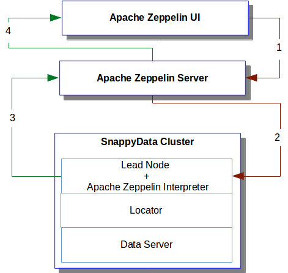
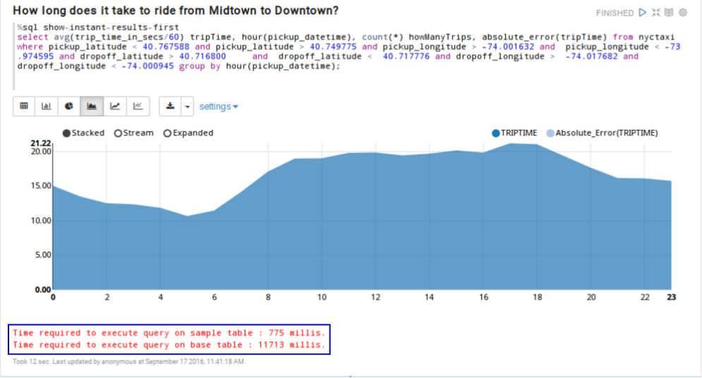
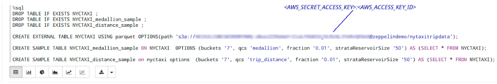
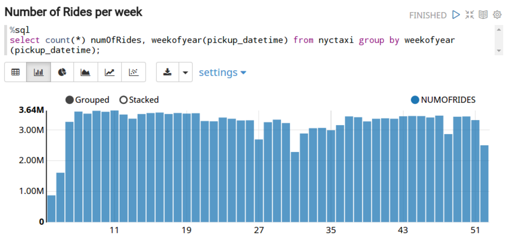
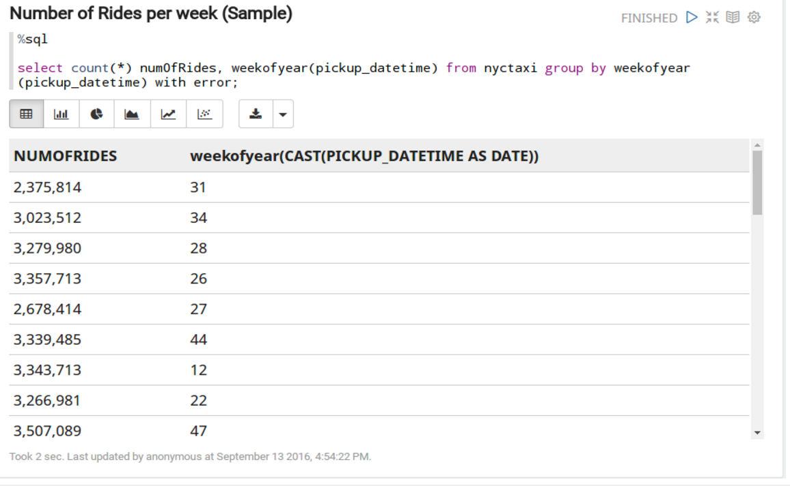
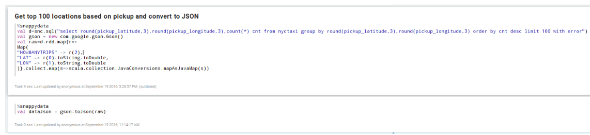
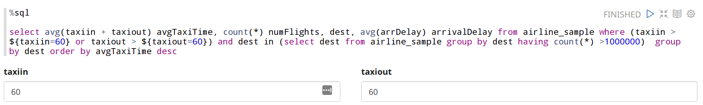

# Setting Up SnappyData Cloud Cluster

To set up the SnappyData Cloud Cluster follow these easy steps that can get you started quickly:

* **Deploying SnappyData Cloud Cluster**

	* [Deploying SnappyData Cloud Cluster using SnappyData CloudBuilder](#DeployingClusterCloudFormation)

	* [Deploying SnappyData Cloud Cluster on AWS using scripts](#DeployingClusterScript)

* [Using Apache Zeppelin](#LoggingZeppelin)	

	* [Using Predefined Notebook](#predefinednotebook)

	* [Creating your own Notebook](#Creatingnotebook)

* [Loading Data from AWS S3](#dataAWSS3)

* [Monitoring SnappyData Cloud Cluster](#Monitoring)

This section discusses the steps required for setting up and deploying SnappyData Cloud Cluster on AWS using the SnappyData CloudBuilder and using a script.

## Prerequisites
Before you begin:

* Ensure that you have an existing AWS account with required permissions to launch EC2 resources with CloudFormation

* Sign into the AWS console using your AWS account-specific URL. This ensures that the account-specific URL is stored as a cookie in the browser, which then redirects you to the appropriate AWS URL for subsequent logins.

* Create an EC2 Key Pair in the region where you want to launch the SnappyData Cloud cluster

<a id="DeployingClusterCloudFormation"></a>
## Deploying SnappyData Cloud Cluster with SnappyData CloudBuilder
SnappyData uses the AWS CloudFormation feature to automatically install, configure and start a SnappyData Cloud cluster. In this release, the configuration supports launching the cluster on a single EC2 instance.

It is recommended that you select an instance type with higher processing power and more memory for this cluster, as it would be running four processes (locator, lead, a data server and an Apache Zeppelin server) on it.

This method is recommended as the fastest way to deploy SnappyData. All you need is an existing AWS account and login credentials to get started! 

### Step 1: Launch [SnappyData CloudBuilder](http://www.snappydata.io/cloudbuilder)

### Step 2: Define your Cluster
#### Community Edition users

1. **Pick your version**</br> Select the **Community** option. </br>
	

2. **Pick your Instance**</br>Select an instance based on the capacity that you require.</br>
	

3. **Enter your email**: Provide your email address. </br>
	

4. Click **Generate**. 

5. The next page is displayed where you can [Select the Region and Launch your Cluster](#region).

#### Enterprise Edition users
1. **Pick your version**</br> Select the **Enterprise** option.

	

2. **Make Locators & Leads Highly Available?**</br>

	* **Select HA/Non-HA for the [Locators](../best_practices/ha_considerations.md)** 

	* **Select HA/Non-HA for the [Leads](../best_practices/ha_considerations.md)** </br> Currently, Amazon Elastic Block Storage (EBS) is provided.

	

3. [Pick total Memory & Disk](../best_practices/memory_management.md) (GB): </br>
 
	* **Memory**: Click and drag the bar to select the required memory.

	* **Disk (3x Memory Recommended)**: Click and drag the bar to select the required disk size.

	

4. **Recommended Cluster**: Select an instance based on the required capacity.

	* **Add servers to support high availability?**: Select this option to add servers to support high availability.

	* **Do your workloads have high query volumes?**: Select this option if your workloads have high query volumes.

	Click the **Edit Nodes** option to modify the number of nodes.

	

5. Enter your email address and select the **Agree to terms of service** check-box. </br>

	

6. Click **Generate**. 

7. The next page is displayed where you can [Select the Region and Launch your Cluster](#region).

<a id="region"></a>
### Step 3: Select the Region and Launch your Cluster
1. On this page, select the AWS region, and then click **Launch Cluster** to launch your single-node cluster.

    !!! Note

		* The region you select must match the EC2 Key Pair you created.

		* If you are not already logged into AWS, you are redirected to the AWS sign-in page. 	
	
    

2. On the **Select Template** page, the URL for the Amazon S3 template is pre-populated. Click **Next** to continue.   <br>

	

3. On the **Specify Details** page:

	* **Stack name**: You can change the stack name.</br>

	!!! Note 
    	The stack name must contain only letters, numbers, dashes and should start with an alpha character.
    
    * **KeyPairName**: Enter a name of an existing EC2 KeyPair. This enables SSH access to the cluster. Refer to the Amazon documentation for more information on [generating your own EC2 Key Pair](http://docs.aws.amazon.com/AWSEC2/latest/UserGuide/ec2-key-pairs.html).

    * **VPCID**: From the drop-down list, select *default* Virtual Private Cloud (VPC) ID of your selected region. Your instances are launched within this VPC.</br> Click **Next** to continue.
    
    

4. Specify the tags (key-value pairs) for resources in your stack or leave the field empty and click **Next**.

5. On the **Review** page, verify the details and click **Create** to create a stack.

	!!! Note
    	This operation may take a few minutes to complete.

6. The next page lists the existing stacks. Click **Refresh** to view the updated list and the status of the stack creation.
When the cluster has started, the status of the stack changes to **CREATE_COMPLETE**. <br>

<a id="Stack"></a>

7. Click on the **Outputs** tab, to view the links (URL) required for launching Apache Zeppelin, which provides web-based notebooks for data exploration. <br>
	

	!!! Note
    	If the status of the stack displays **ROLLBACK_IN_PROGRESS** or **DELETE_COMPLETE**, the stack creation may have failed. Some common problems that might have caused the failure are:

		* **Insufficient Permissions**: Verify that you have the required permissions for creating a stack (and other AWS resources) on AWS.

		* **Invalid Keypair**: Verify that the EC2 key pair exists in the region you selected in the SnappyData CloudBuilder creation steps.

		* **Limit Exceeded**: Verify that you have not exceeded your resource limit. For example, if you exceed the allocated limit of Amazon EC2 instances, the resource creation fails and an error is reported.*

!!! Warning
	To stop incurring charges for the instance, you can either terminate the instance or delete the stack. You cannot connect to or restart an instance after you have terminated it.

For more information, refer to the [Apache Zeppelin](#LoggingZeppelin) section or refer to the [Apache Zeppelin documentation](http://zeppelin.apache.org/).

<a id="DeployingClusterScript"></a>
## Deploying SnappyData Cloud Cluster on AWS using Scripts

SnappyData provides a script (`snappy-ec2`) that allows you to launch and manage SnappyData clusters on Amazon Elastic Compute Cloud (EC2).

The scripts are available on GitHub in the [snappy-cloud-tools repository](https://github.com/SnappyDataInc/snappy-cloud-tools/tree/master/aws/ec2) and also on the [Release page](https://github.com/SnappyDataInc/snappy-cloud-tools/releases). The package is available in compressed files (**snappydata-ec2-`<version>`.tar.gz**). Extract the contents to a location on your computer.

For more information on setting up the cluster using the EC2 script, refer to [Using SnappyData EC2 scripts](../install/setting_up_cluster_on_amazon_web_services.md#EC2).

<a id="dataAWSS3"></a>
## Loading Data from AWS S3
SnappyData provides you with predefined buckets which contain datasets. When data is loaded, the table reads from the files available at the specified external location (AWS S3). 


!!! Note

    * 	The Amazon S3 buckets and files are private by default. Ensure that you set the permissions required to make the data publicly accessible. Please refer to the [documentation provided by Amazon S3](http://docs.aws.amazon.com/AmazonS3/latest/dev/UsingBucket.html) for detailed information on creating a bucket, adding files and setting required permissions.

	* 	You can also find AWS related information on the AWS homepage, from the **Account** > **Security Credentials** > **Access Credentials** option.

	* 	Information related to the Bucket Name and Folder Location can be found on the AWS S3 site.

	* 	If the Secret Access Key contains a slash, it causes the Spark job to fail. When you create the Secret Access Key, ensure that it only contains alpha-numeric characters. 

	* 	When reading or writing CSV/Parquet to and from S3, the *ConnectionPoolTimeoutException* error may be reported. To avoid this error, in the Spark context, set the value of the `fs.s3a.connection.maximum` property to a number greater than the possible number of partitions. </br> For example, `snc.sparkContext.hadoopConfiguration.set("fs.s3a.connection.maximum", "1000")`

	* 	To access data from AWS S3, copy the **aws-java-sdk-`<version_number>`** and **hadoop-aws-`<version_number>`** files (available in the Maven repository), to the **jars** directory (snappydata-`<version_number>`-bin/jars) in the SnappyData home directory. 


To define a table that references the data in AWS S3, create a paragraph in the following format:

```pre
%sql
DROP TABLE IF EXISTS <table_name> ;
CREATE EXTERNAL TABLE <table_name> USING parquet OPTIONS(path 's3a://<AWS_ACCESS_KEY_ID>:<AWS_SECRET_ACCESS_KEY>@<bucket_Name>/<folder_name>');
```

The values are:

**Property** | **Description/Value**
---------------|-----------------------------
`<table_name>` |The name of the table
`<AWS_SECRET_ACCESS_KEY>:<AWS_ACCESS_KEY_ID> `| Security credentials used to authenticate and authorize calls that you make to AWS. 
`<bucket_Name> `| The name of the bucket where the folder is located. Default value: zeppelindemo 
`<folder_name>` | The folder name where the data is stored. Default value: nytaxifaredata 

<a id="LoggingZeppelin"></a>
## Using Apache Zeppelin

Apache Zeppelin provides web-based notebooks for data exploration. A notebook consists of one or more paragraphs, and each paragraph consists of a section each for code and results.
Launch Apache Zeppelin from the web browser by accessing the host and port associated with your Apache Zeppelin server. For example, http://`<zeppelin_host>`:`<port_number>`. The welcome page which lists existing notebooks is displayed.  
SnappyData provides predefined notebooks which are displayed on the home page after you have logged into Apache Zeppelin. For more information, see [Using Predefined Notebooks](#predefinednotebook).

Refer to the [Apache Zeppelin documentation](http://zeppelin.apache.org/), for more information.

### Functioning of the SnappyData Interpreter and SnappyData Cluster

 1. When you execute a paragraph in the Apache Zeppelin UI, the query is sent to the Apache Zeppelin Server.
 
 2. The query is then received by the SnappyData Interpreter which is running on the Lead node in the cluster.

 3. When the query has completed execution, the results are sent from the SnappyData Interpreter (which is running on the Lead node) to the Apache Zeppelin server.

 4. Finally, the results are displayed in the Zeppelin UI. 

Connecting the SnappyData Interpreter to the SnappyData cluster is represented in the below figure.



## Using the Interpreter
SnappyData Interpreter group consists of the interpreters `%snappydata.spark` and `%snappydata.sql`.
To use an interpreter, add the associated interpreter directive with the format, `%<Interpreter_name>` at the beginning of a paragraph in your note. In a paragraph, use one of the interpreters, and then enter required commands.

!!! Note
    	*	The SnappyData Interpreter provides a basic auto-completion functionality. Press (Ctrl+.) on the keyboard to view a list of suggestions.

        * 	It is recommended that you use the SQL interpreter to run queries on the SnappyData cluster, as an out of memory error may be reported with running the Scala interpreter. 

        * 	Each paragraph has its own SnappyData context. When you set a property on one paragraph, the property is applicable only to that paragraph and not to other paragraphs in the notebook.


## SQL Interpreter
The `%snappydata.sql` code specifies the default SQL interpreter. This interpreter is used to execute SQL queries on SnappyData cluster.

### Multi-Line Statements
Multi-line statements ,as well as multiple statements on the same line, are also supported as long as they are separated by a semicolon. However, only the result of the last query is displayed.

SnappyData provides a list of connection-specific SQL properties that can be applied to the paragraph that is executed. 

In the following example, `spark.sql.shuffle.partitions` allows you to specify the number of partitions to be used for this query:

```pre
%sql
set spark.sql.shuffle.partitions=6; 
select medallion,avg(trip_distance) as avgTripDist from nyctaxi group by medallion order by medallion desc limit 100 with error
```
### SnappyData Directives in Apache Zeppelin
You can execute approximate queries on SnappyData cluster by using the `%sql show-instant-results-first` directive. 
In this case, the query is first executed on the sample table and the approximate result is displayed, after which the query is run on the base table. Once the query is complete, the approximate result is replaced with the actual result.

In the following example, you can see that the query is first executed on the sample table, and the time required to execute the query is displayed. 
At the same time, the query is executed on the base table, and the total time required to execute the query on the base table is displayed.
```pre
%sql show-instant-results-first
select avg(trip_time_in_secs/60) tripTime, hour(pickup_datetime), count(*) howManyTrips, absolute_error(tripTime) from nyctaxi where pickup_latitude < 40.767588 and pickup_latitude > 40.749775 and pickup_longitude > -74.001632 and  pickup_longitude < -73.974595 and dropoff_latitude > 40.716800 and  dropoff_latitude <  40.717776 and dropoff_longitude >  -74.017682 and dropoff_longitude < -74.000945 group by hour(pickup_datetime);
```


!!! Note
	This directive works only for the SQL interpreter and an error may be displayed for the Scala interpreter.

## Scala Interpreter
The `%snappydata.spark` code specifies the default Scala interpreter. This interpreter is used to write Scala code in the paragraph.
SnappyContext is injected in this interpreter and can be accessed using variable **snc**.

<a id="predefinednotebook"></a>

## Using Predefined Notebooks

SnappyData provides predefined notebooks which contains definitions that are stored in a single file. </br>
The overview notebook provides a brief introduction to the SnappyData product features. It also provides  additional predefined notebooks, Quickstart, Performance, NYC TAXI Analytics and Airline Data Analytics.

When you launch Apache Zeppelin in the browser, the welcome page displays the existing notebooks. Open a notebook and run any of the paragraphs to analyze data and view the result.

<a id="Creatingnotebook"></a>

## Creating Notebooks - Try it Yourself!

1. Log on to Apache Zeppelin, create a notebook and insert a new paragraph.

2. [Bind the interpreter by setting the default interpreter](../howto/use_apache_zeppelin_with_snappydata.md#additional-settings). Use `%snappydata.spark` for SnappyData interpreter or use `%snappydata.sql` for SQL interpreter.

3. Download a data set you want to use and create tables as mentioned below.

### Examples of Queries and Results
This section provides you with examples you can use in a paragraph.

* In this example, you can create tables using an external dataset from AWS S3.



* In this example, you can execute a query on a base table using the SQL interpreter. It returns the number of rides per week. 



* In this example, you can execute a query on a sample table using the SQL interpreter. It returns the number of rides per week



* In this example, you are processing data using the SnappyData Scala interpreter.


* Apache Zeppelin allows you to dynamically create input fields. To create a text input field, use `${fieldname}`.
In this example, the input forms are, ` ${taxiin=60} or taxiout > ${taxiout=60}`


<a id="Monitoring"></a>
## Monitoring the SnappyData Cloud Cluster

You can monitor the SnappyData cluster using SnappyData Pulse, which enables you to observe and record the performance and the activities on the SnappyData cluster. 

It also displays useful information about SnappyData that includes a list of scheduler stages and tasks, summary of tables and memory usage etc. For more information, see [SnappyData Pulse](../monitoring/monitoring.md).

### Accessing the Console
To access the SnappyData Pulse UI from the Apache Zeppelin notebook: 

1. Click on the **SnappyData Pulse UI** link provided in the paragraph.
	

2. Once you have logged in, you can start monitoring the SnappyData cluster.

