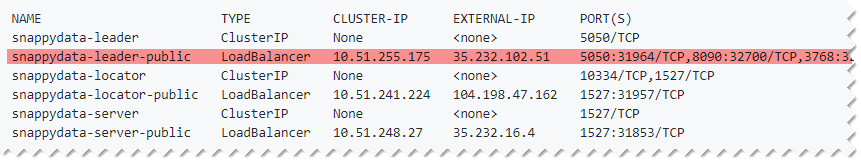
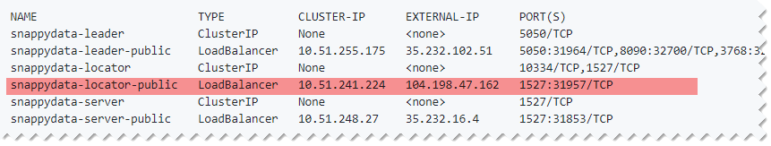

# Setting up Cluster on Kubernetes
Kubernetes is an open source project designed for container orchestration. TIBCO ComputeDB can be deployed on Kubernetes.

The following sections are included in this topic:

*	[Prerequisites](#prerequisites)

*	[Getting Access to Kubernetes cluster](#pksaccess)

*	[Deploying SnappyData Chart on Kubernetes](#deploykubernetes)

*	[Setting up PKS Environment for Kubernetes](#pkskubernetes)

*	[Interacting with TIBCO ComputeDB Cluster on Kubernetes](#interactkubernetes)

*	[List of Configuration Parameters for SnappyData Chart](#chartparameters)

*	[Kubernetes Obects Used in SnappyData Chart](#kubernetesobjects)

*	[Accesing Logs and Configuring Log Level](#accesslogs)


<a id= prerequisites> </a>
## Prerequisites

The following prerequisites must be met to deploy TIBCO ComputeDB on Kubernetes:

*	**Kubernetes cluster**</br> A running Kubernetes cluster of version 1.9 or higher. TIBCO ComputeDB has been tested on Google Container Engine(GKE) as well as on Pivotal Container Service (PKS). If Kubernetes cluster is not available, you can set it up as mentioned [here](#pksaccess).

*	**Helm tool**</br> Helm tool must be deployed in the Kubernetes environment. Helm comprises of two parts, that is a client and a Tiller (Server portion of Helm) inside the kube-system namespace. Tiller runs inside the Kubernetes cluster and manages the deployment of charts or packages. You can follow the instructions [here](https://docs.pivotal.io/runtimes/pks/1-1/configure-tiller-helm.html) to deploy Helm in your Kubernetes enviroment.

*	**Docker image**</br> Helm charts use the Docker images to launch the container on Kubernetes. [You can refer to these steps](quickstart/getting_started_with_docker_image.md#build-your-docker) to build your Docker image for TIBCO ComputeDB, provided you have its tarball with you. TIBCO does not provide a Docker image for TIBCO ComputeDB.

<a id= pksaccess> </a>
## Getting Access to Kubernetes Cluster

If you would like to deploy Kubernetes on-premises, you can use any of the following options:

### Option 1 - PKS
- PKS on vSphere: Follow these [instructions](https://docs.pivotal.io/runtimes/pks/1-0/vsphere.html) 
- PKS on GCP: Follow these [instructions](https://docs.pivotal.io/runtimes/pks/1-0/gcp.html)
- Create a Kubernetes cluster using PKS CLI : After PKS is setup you will need to create a Kubernetes cluster as described [here](https://docs.pivotal.io/runtimes/pks/1-0/using.html)

### Option 2 - Google Cloud Platform (GCP)
- Login to your Google account and go to the [Cloud console](https://console.cloud.google.com/) to launch a GKE cluster.

**Steps to perform after Kubernetes cluster is available: **

- If using PKS, you must install the PKS command line tool. See instructions [here](https://docs.pivotal.io/runtimes/pks/1-0/installing-pks-cli.html).
- Install `kubectl` on your local development machine and configure access to the kubernetes/PKS cluster. See instructions for `kubectl` [here](https://kubernetes.io/docs/tasks/tools/install-kubectl/). 
- If you are using Google cloud, you will find instructions for setting up Google Cloud SDK ('gcloud') along with `kubectl` [here](https://kubernetes.io/docs/tasks/tools/install-kubectl/).

<a id= deploykubernetes> </a>
## Deploying TIBCO ComputeDB on Kubernetes 

**SnappyData Helm** chart is used to deploy TIBCO ComputeDB on Kubernetes.  It uses Kubernetes [statefulsets](https://kubernetes.io/docs/concepts/workloads/controllers/statefulset/) to launch the locator, lead, and server members. 

**To deploy TIBCO ComputeDB on Kubernetes:**

1.	Clone the **spark-on-k8s** repository and change to **charts** directory.</br>
`git clone https://github.com/SnappyDataInc/spark-on-k8s`</br>
`cd spark-on-k8s/charts`

3.	Optionally, you can edit the **snappydata > values.yaml**  file to change the default configurations in the TIBCO ComputeDB chart. Configurations can be specified in the respective attributes for locators, leaders, and servers in this file. Refer [List of Configuration Parameters for TIBCO ComputeDB Chart](#chartparameters)

4.	Install the **snappydata** chart using the following command:</br>
`helm install --name snappydata --namespace snappy ./snappydata/`

	The above command installs the **SnappyData** chart in a namespace called *snappy* and displays the Kubernetes objects (service, statefulsets etc.) created by the chart on the console.</br>
    By default, **SnappyData Helm** chart deploys a TIBCO ComputeDB cluster which consists of one locator, one lead, two servers and services to access TIBCO ComputeDB endpoints.

You can monitor the Kubernetes UI dashboard to check the status of the components as it takes few minutes for all the servers to be online. To access the Kubernetes UI refer to the instructions [here](https://kubernetes.io/docs/tasks/access-application-cluster/web-ui-dashboard/#accessing-the-dashboard-ui). 

**SnappyData chart** dynamically provisions volumes for servers, locators, and leads. These volumes and the data in it are retained even after the chart deployment is deleted.

<a id= interactkubernetes> </a>
## Interacting with TIBCO ComputeDB Cluster on Kubernetes

You can interact with the TIBCO ComputeDB cluster on Kuberenetes in the same manner as you interact with a TIBCO ComputeDB cluster that runs locally or on-premise. All you require is the host IP address of the locator and the lead with their respective ports numbers.

To find the IP addresses and port numbers of the TIBCO ComputeDB processes, use command `kubectl get svc --namespace=snappy`. 
In the [output](#output), three services namely **snappydata-leader-public**, **snappydata-locator-public** and 
**snappydata-server-public**  of type **LoadBalancer** are seen which expose the endpoints for locator, lead, and server respectively. These services have external IP addresses assigned and therefore can be accessed from outside Kubernetes. The remaining services that do not have external IP addresses are those that are created for internal use.

**snappydata-leader-public** service exposes port **5050** for TIBCO ComputeDB Monitoring Console and port **8090** to accept [Snappy jobs](#jobkubernetes).</br>
**snappydata-locator-public** service exposes port **1527** to accept [JDBC/ODBC connections](#jdbckubernetes).

You can do the following on the TIBCO ComputeDB cluster that is deployed on Kubernetes:

- [Access TIBCO ComputeDB Monitoring Console](#accesskubernetes)

- [Connect TIBCO ComputeDB using JDBC Driver](#jdbckubernetes)

- [Execute Queries](#querykubernetes)

- [Submit a Snappy Job](#jobkubernetes)

- [Stop TIBCO ComputeDB Cluster on Kubernetes](#deletehelm)

<a id= accesskubernetes> </a>
### Accessing TIBCO ComputeDB Monitoring Console

The dashboards on the TIBCO ComputeDB Monitoring Console can be accessed using **snappydata-leader-public** service. To view the dashboard, type the URL in the web browser in the format: [externalIp:5050]().
Replace *externalip* with the external IP address of the **snappydata-leader-public **service.

**To access TIBCO ComputeDB Monitoring Console in Kubernetes:**

1. Check the TIBCO ComputeDB services running in the Kubernetes cluster.</br>
`kubectl get svc --namespace=snappy`</br> The output displays the external IP address of the **snappydata-leader-public** service as shown in the following image: 

3. Type [externalIp:5050]() in the browser. Here you must replace *externalip* with the external IP address of the **leader-public** service.</br> For example, 35.232.102.51:5050.

<a id= jdbckubernetes> </a>
### Connecting TIBCO ComputeDB Using JDBC Driver

For Kubernetes deployments, JDBC clients can connect to TIBCO ComputeDB cluster using the JDBC URL that is derived from the **snappydata-locator-public** service.

**To connect to TIBCO ComputeDB using JDBC driver in Kubernetes:**

1.	Check the TIBCO ComputeDB services running in Kubernetes cluster.</br>
`kubectl get svc --namespace=snappy`</br>
The output displays the external IP address  of the *snappydata-locator-public* service and the port number for external connections as shown in the following image:

2.	Use the external IP address and port of the **snappydata-locator-public** services to connect to TIBCO ComputeDB cluster using JDBC connections. For example, based on the above output, the JDBC URL to be used will be [jdbc:snappydata://104.198.47.162:1527/]()

You can refer to the [documentation](http://snappydatainc.github.io/snappydata/howto/connect_using_jdbc_driver/) for an example of JDBC program and for instructions on how to obtain JDBC driver using Maven/SBT co-ordinates.

<a id= querykubernetes> </a>
### Executing Queries Using Snappy Shell

You  can use Snappy shell to connect to TIBCO ComputeDB and execute your queries. You can simply connect to one of the pods in the cluster and use the Snappy Shell. Alternatively, you can download the TIBCO ComputeDB distribution from TIBCO eDelivery releases. Snappy shell need not run within the Kubernetes cluster.

**To execute queries in Kubernetes deployment:**

1.	Check the TIBCO ComputeDB services running in the Kubernetes cluster.</br>
`kubectl get svc --namespace=snappy`</br>
The output displays the external IP address of the **snappydata-locator-public** services  and the port number for external connections as shown in the following image:

2.	Launch Snappy Shell and then create tables and execute queries. </br>Following is an example of executing queries using Snappy Shell.

```
# Connect to Snappy Shell
 bin/snappy
 snappy> connect client '104.198.47.162:1527';

# Create tables and execute queries
 snappy> create table t1(col1 int, col2 int) using column;
 snappy> insert into t1 values(1, 1);
 1 row inserted/updated/deleted 
```

<a id= jobkubernetes> </a>
### Submitting a TIBCO ComputeDB Job

Refer to the How Tos section in the product documentation to understand how to submit Snappy jobs.
However, for submitting a Snappy job in Kubernetes deployment, you need to use the **snappydata-leader-public** service that exposes port **8090** to run the jobs.

**To submit a Snappy job in Kubernetes deployment:**

1.	Check the TIBCO ComputeDB services running in Kubernetes cluster.</br>
`kubectl get svc --namespace=snappy`</br>
The output displays the external IP address of **snappydata-leader-public** service which must be noted. 

3.	Change to TIBCO ComputeDB product directory.</br>
`cd $SNAPPY_HOME`

3.	Submit the job using the external IP of the **snappydata-leader-public** service and the port number **8090** in the **--lead** option.</br> Following is an example of submitting a Snappy Job:

```
bin/snappy-job.sh submit
--app-name CreatePartitionedRowTable
  --class org.apache.spark.examples.snappydata.CreatePartitionedRowTable
  --app-jar examples/jars/quickstart.jar
  --lead 35.232.102.51:8090
```

## Stopping the TIBCO ComputeDB Cluster on Kubernetes

To stop the TIBCO ComputeDB cluster on Kubernetes, you must delete the **SnappyData Helm** chart using the `helm delete` command.

```
$ helm delete --purge snappydata
```
The dynamically provisioned volumes and the data in it is retained, even if the chart deployment is deleted.

!!!Note
	If the chart is deployed again with the same chart name and if the volume exists, then the existing volume is used instead of provisioning a new volume.


<a id= chartparameters> </a>
## List of Configuration Parameters for SnappyData Chart

You can modify the **values.yaml**  file to configure the SnappyData chart. The following table lists the configuration parameters available for this chart:

| Parameter| Description | Default |
| ---------| ------------| --------|
| `image` |  Docker repo from which the TIBCO ComputeDB Docker image is pulled.    |  `snappydatainc/snappydata`   |
| `imageTag` |  Tag of the TIBCO ComputeDB Docker image that is pulled. |   |
| `imagePullPolicy` | Pull policy for the image.  | `IfNotPresent` |
| `locators.conf` | List of the configuration options that is passed to the locators. | |
| `locators.resources` | Resource configuration for the locator Pods. User can configure CPU/memory requests and limit the usage. | `locators.requests.memory` is set to `1024Mi`. |
| `locators.persistence.storageClass` | Storage class that is used while dynamically provisioning a volume. | Default value is not defined so `default` storage class for the cluster is chosen.  |
| `locators.persistence.accessMode` | [Access mode](https://kubernetes.io/docs/concepts/storage/persistent-volumes/#access-modes) that is used for the dynamically provisioned volume. | `ReadWriteOnce` |
| `locators.persistence.size` | Size of the dynamically provisioned volume. | `10Gi` |
| `servers.replicaCount` | Number of servers that are started in a TIBCO ComputeDB cluster. | `2` |
| `servers.conf` | List of the configuration options that are passed to the servers. | |
| `servers.resources` | Resource configuration for the server Pods. You can configure CPU/memory requests and limit the usage. | `servers.requests.memory` is set to `4096Mi` |
| `servers.persistence.storageClass` | Storage class that is used while dynamically provisioning a volume. | Default value is not defined so `default` storage class for the cluster will be chosen.  |
| `servers.persistence.accessMode` | [Access mode](https://kubernetes.io/docs/concepts/storage/persistent-volumes/#access-modes) for the dynamically provisioned volume. | `ReadWriteOnce` |
| `servers.persistence.size` | Size of the dynamically provisioned volume. | `10Gi` |
| `leaders.conf` | List of configuration options that can be passed to the leaders. | |
| `leaders.resources` | Resource configuration for the server pods. You can configure CPU/memory requests and limits the usage. | `leaders.requests.memory` is set to `4096Mi` |
| `leaders.persistence.storageClass` | Storage class that is used while dynamically provisioning a volume. | Default value is not defined so `default` storage class for the cluster will be chosen.  |
| `leaders.persistence.accessMode` | [Access mode](https://kubernetes.io/docs/concepts/storage/persistent-volumes/#access-modes) for the dynamically provisioned volume. | `ReadWriteOnce` |
| `leaders.persistence.size` | Size of the dynamically provisioned volume. | `10Gi` |


The following sample shows the configuration used to start four servers each with a heap size of 2048 MB:

```
servers:
  replicaCount: 4
  ## config options for servers
  conf: "-heap-size=2048m"
```

You can specify TIBCO ComputeDB configuration parameters in the **servers.conf**, **locators.conf**, and **leaders.conf** attributes for servers, locators, and leaders respectively.

<a id= kubernetesobjects> </a>
## Kubernetes Obects Used in SnappyData Chart

This section provides details about the following Kubernetes objects that are used in SnappyData Chart:

*	[Statefulsets for Servers, Leaders, and Locators](#statefulsets)

*	[Services that Expose External Endpoints](#services)

*	[Persistent Volumes](#persistentvolumes)

<a id= statefulsets> </a>
### Statefulsets for Servers, Leaders, and Locators

[Kubernetes statefulsets](https://kubernetes.io/docs/concepts/workloads/controllers/statefulset/) are used to manage stateful applications. Statefulsets provide many benefits such as stable and unique network identifiers, stable persistent storage, ordered deployment and scaling, graceful deletion, and rolling updates.
SnappyData Helm chart deploys statefulsets for servers, leaders, and locators. By default the chart deploys two data servers, one locator, and one leader. Upon deletion of the Helm deployment, each pod gracefully terminates the SnappyData process that is running on it.

<a id= services> </a>
### Services that Expose External Endpoints

SnappyData Helm chart creates services to allow you to make JDBC connections, execute Spark jobs, and access
TIBCO ComputeDB Monitoring Console etc.  Services of the type LoadBalancer have external IP address assigned and can be used to connect from outside of Kubernetes cluster.
To check the service created for TIBCO ComputeDB deployment, use command `kubectl get svc --namespace=snappy`. The following output is displayed:

<a id= output> </a>
```pre
NAME                        TYPE           CLUSTER-IP      EXTERNAL-IP      PORT(S)                                        AGE
snappydata-leader           ClusterIP      None            <none>           5050/TCP                                       5m
snappydata-leader-public    LoadBalancer   10.51.255.175   35.232.102.51    5050:31964/TCP,8090:32700/TCP,3768:32575/TCP   5m
snappydata-locator          ClusterIP      None            <none>           10334/TCP,1527/TCP                             5m
snappydata-locator-public   LoadBalancer   10.51.241.224   104.198.47.162   1527:31957/TCP                                 5m
snappydata-server           ClusterIP      None            <none>           1527/TCP                                       5m
snappydata-server-public    LoadBalancer   10.51.248.27    35.232.16.4      1527:31853/TCP                                 5m

```
In the above output, three services namely **snappydata-leader-public**, **snappydata-locator-public** and 
**snappydata-server-public**  of type **LoadBalancer** are created. These services have external IP addresses assigned and therefore can be accessed from outside Kubernetes. The remaining services that do not have external IP addresses are those that are created for internal use.
 
**snappydata-leader-public** service exposes port **5050** for TIBCO ComputeDB Monitoring Console and port **8090** to accept Snappy jobs.
**snappydata-locator-public** service exposes port **1527** to accept JDBC connections.

<a id= persistentvolumes> </a>
### Persistent Volumes

A pod in a TIBCO ComputeDB deployment has a persistent volume mounted on it. This volume is dynamically provisioned and is used
to store data directory for TIBCO ComputeDB. On each pod, the persistent volume is mounted on path `/opt/snappydata/work`. These volumes and the data in it is retained even if the chart deployment is deleted.

<a id= accesslogs> </a>
## Accessing Logs

You can access the logs when the [TIBCO ComputeDB cluster is running](#running) as well as when the [TIBCO ComputeDB cluster is not running](#notrunning). 

<a id= running> </a>
### Accessing Logs When TIBCO ComputeDB Cluster is Running

When a TIBCO ComputeDB cluster is running, you can open a session for a pod using `kubectl` command and then view the logs.
The following example shows how to access logs of **snappydata-server-0**:

```
# Connect to snappydata-server-0 pod and open a shell.
$ kubectl exec -it snappydata-server-0 --namespace snappy -- /bin/bash

# Switch to TIBCO ComputeDB work directory and view the logs.
$ cd /opt/snappydata/work
$ ls 
```
<a id= notrunning> </a>
### Accessing Logs When TIBCO ComputeDB Cluster is not Running

When TIBCO ComputeDB cluster is not running, you can access the volumes used in TIBCO ComputeDB with a utility script `snappy-debug-pod.sh` located in the **utils** directory of [Spark on k8s](https://github.com/SnappyDataInc/spark-on-k8s/tree/master/utils) repository.
This script launches a pod in the Kubernetes cluster with persistent volumes, specified via `--pvc` option, mounted on it and then returns a shell prompt. Volumes are mounted on the path starting with **/data0 (volume1 on /data0 and so on)**.

<!-- The following example shows, how to access the logs when the TIBCO ComputeDB Cluster is not running: -->
In the following example, the names of the persistent volume claims used by the cluster are retrieved and passed to the `snappy-debug-pod.sh` script to be mounted on the pod.

```
# Get the names of persistent volume claims used by TIBCO ComputeDB cluster installed in a namespace
# called *snappy*. The PVCs used by TIBCO ComputeDB are prefixed with 'snappy-disk-claim-'.

$ kubectl get  pvc --namespace snappy
NAME                                     STATUS    VOLUME                                     CAPACITY   ACCESS MODES   STORAGECLASS   AGE
snappy-disk-claim-snappydata-leader-0    Bound     pvc-17cf9834-68c3-11e8-ab38-42010a8001a3   10Gi       RWO            standard       50d
snappy-disk-claim-snappydata-locator-0   Bound     pvc-17d75411-68c3-11e8-ab38-42010a8001a3   10Gi       RWO            standard       50d
snappy-disk-claim-snappydata-server-0    Bound     pvc-17de4f1a-68c3-11e8-ab38-42010a8001a3   10Gi       RWO            standard       50d
snappy-disk-claim-snappydata-server-1    Bound     pvc-226d778d-68c3-11e8-ab38-42010a8001a3   10Gi       RWO            standard       50d

# To view logs for server-0 and server-1, use PVCs 'snappy-disk-claim-snappydata-server-0' and snappy-disk-claim-snappydata-server-1'

$ ./utils/snappy-debug-pod.sh --pvc snappy-disk-claim-snappydata-server-0,snappy-disk-claim-snappydata-server-1 --namespace snappy
Volume for snappy-disk-claim-snappydata-server-0 will be mounted on /data0
Volume for snappy-disk-claim-snappydata-server-1 will be mounted on /data1
Launching the POD
If you don't see a command prompt, try pressing enter.
bash-4.1# 
```

In the above example, the second command opens a session with bash prompt for the pod on which the volumes corresponding to the mentioned PVCs are mounted on paths such as **/data0**, **/data1** and so on.

You can then examine the logs in these mounted paths. For example:

```
bash-4.1# ls /data1
lost+found  members.txt  snappydata-server-1
bash-4.1# ls /data0
lost+found  members.txt  snappydata-server-0
bash-4.1# ls /data0/snappydata-server-0/
bash-4.1# ls /data0/snappydata-server-0/*.*log
```

<a id= loglevel> </a>
## Configuring the Log Level
You can provide a **log4j.properties** file while installing the SnappyData Helm chart. A template file **log4j.properties.template** is provided in the `charts/snappydata/conf/` directory. This template file can be renamed and used to configure log level as shown in the following example:

```
$ cd charts/snappydata/conf/
# copy the template file and edit it to configure log level
$ cp log4j.properties.template log4j.properties
```

When SnappyData chart is installed, the **log4.properties** file  will be used to configure the log level.

<a id= deletehelm> </a>

