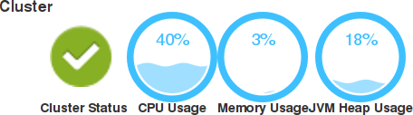
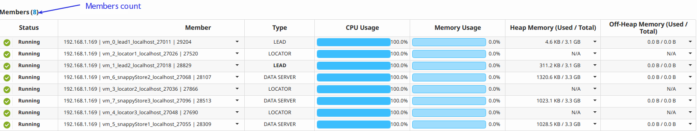
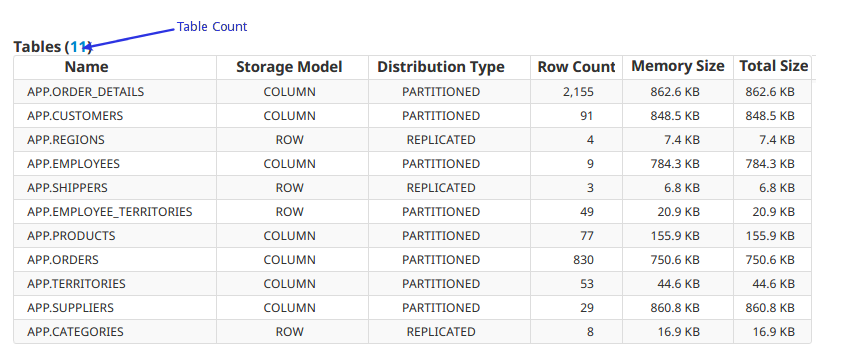
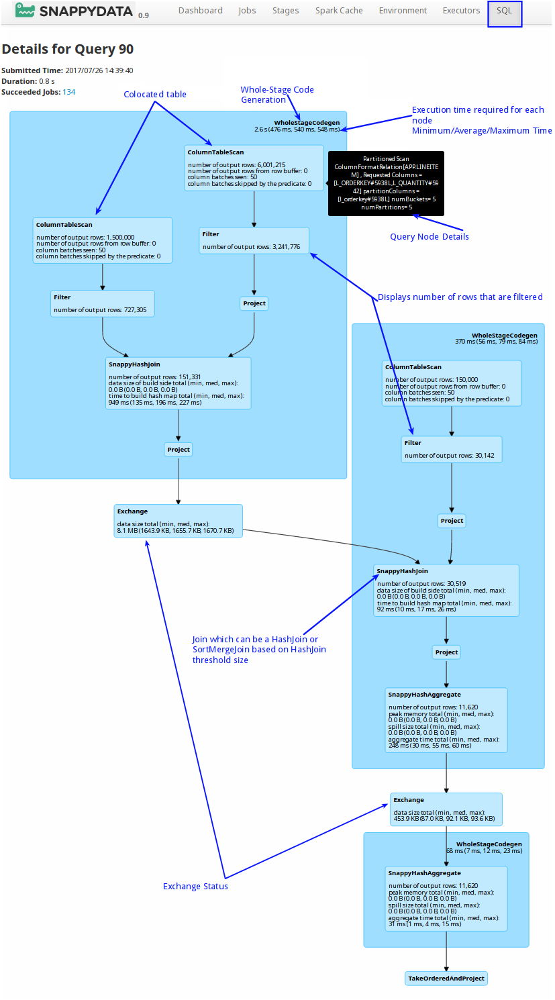
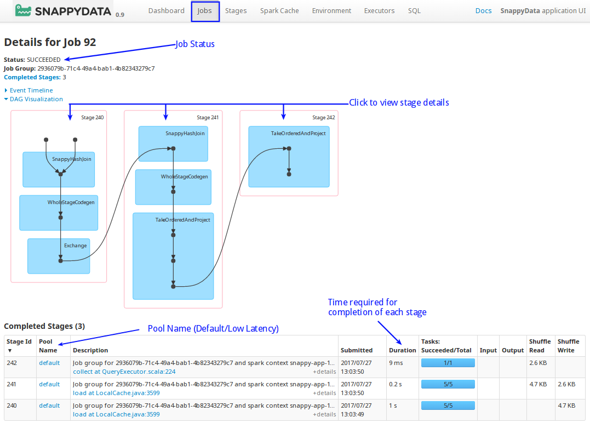
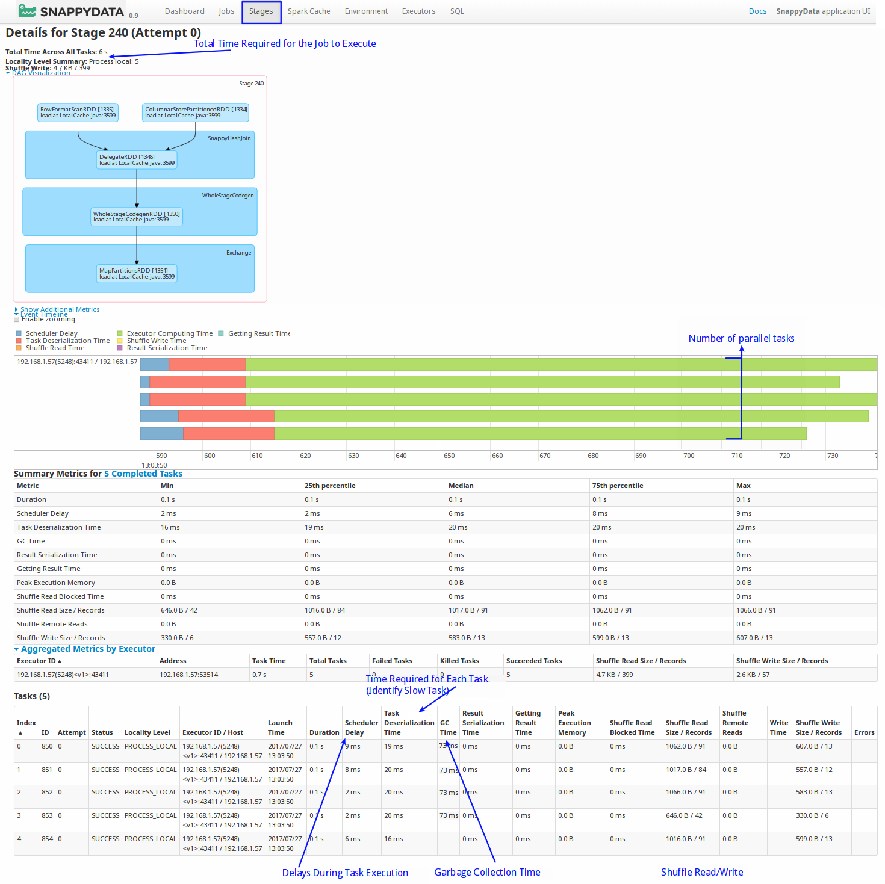

# SnappyData Pulse

SnappyData Pulse is a monitoring system that gives you a high-level overview of the status and performance of the cluster. It provides a simple widget based view, which helps you easily navigate and monitor your cluster. 

To access the SnappyData Pulse, start your cluster and open http:`<leadhost>`:5050/dashboard/ in your web browser.  
`<leadhost>` is the hostname or IP of the lead node in your cluster.

The top-right side of the page displays the date and time when the Dashboard was last updated. Click on the product version number to view details like the build number, source revision, underlying spark version, etc.

!!! Note:
	- When using Smart Connector with upstream Spark, the **Dashboard** and **Member Details** sections are not displayed. Only the **SQL**, **Jobs** and **Stages** related information is displayed.

The following topics are covered in this section:

* [Dashboard](#dashboard)

* [Member Details View](#member-details)

* [SQL Page](#sql)

* [Jobs Page](#jobs)

* [Stages Page](#stages)

## The Dashboard

The Dashboard offers the following capabilities and benefits:

* [Cluster Statistics](#cluster)

* [Member Statistics](#member)

* [Table Statistics](#table)

* [External Table Statistics](#external-table)

### Cluster Statistics

* **Cluster Status** 
	Displays the current status of the cluster. 
    
    | Status | Description |
	|--------|--------|
	|**Normal**|All nodes in the cluster are running|
    |**Warning**|Some nodes in the cluster are stopped or unavailable|

* **CPU Usage**  
   Displays the average CPU utilization of all the nodes present in the cluster.

* **Memory Usage** 
   Displays the collective usage of on-heap and off-heap memory by all nodes in the cluster.

* **JVM Heap Usage** 
   Displays the collective JVM Heap usage by all nodes in the cluster.

### Member Statistics

* **Members Count** 
   Displays the total number of members (leads, locators and data servers) that exist in the cluster. The tooltip displays the count for each member type.

* **Members Status** 
   Displays the status of the members, which can be either Running or Stopped.

| Status | Description |
|--------|--------|
||Member is running|
||Member has stopped or is unavailable|

* **Description** 
  	A brief description of the member is displayed in **Member** column. You can view the detailed description for the member by clicking on the arrow next to the member name. 
  	You can view details of the member by clicking on it. The description provides details of the member host, working directory, and process ID.

* **Type** 
   Displays the type of member, which can be lead, locator or data server. The active lead is displayed in bold.

* **CPU Usage** 
   The CPU utilized by the member's host.

* **Memory Usage** 
   Members collective Heap and Off-Heap Memory utilization along with Total Memory.

* **Heap Memory** 
   Displays the total available heap memory and used heap memory.  
   You can view the detailed distribution of the member's heap storage, heap execution memory, their utilization along with JVM Heap utilization by clicking on the arrow next to the member name.

* **Off-Heap Memory Usage** 
   Displays the members total off-heap memory and used off-heap memory.  You can also view the member's off-heap storage and off-heap execution memory and utilization by clicking on the arrow next to the member name.

### Table Statistics

* **Tables Count** 
   Displays the total number of data tables present in the cluster. The tooltip displays the count for the row and column tables.

* **Name** 
  Displays the name of the data table.

* **Storage Model** 
   Displays the data storage model of the data table. Possible models are ROW and COLUMN.

* **Distribution Type** 
   Displays the data distribution type for the table. Possible values are PARTITION, PARTITION_PERSISTENT, PARTITION_REDUNDANT, PARTITION_OVERFLOW, REPLICATE, REPLICATE_PERSISTENT, REPLICATE_OVERFLOW etc.

* **Row Count** 
   Displays the row count, which is the number of records present in the data table.

* **Memory Size** 
   Displays the heap memory used by data table to store its data/records.

* **Total Size** 
   Displays the collective physical memory and disk overflow space used by the data table to store its data/records.
<!--
 **BUCKETS** 
   Displays the total number of buckets in the data table.
-->

### External Table Statistics

* **Tables Count** 
	Displays the total number of external tables present in the cluster. The tooltip displays the total number of external tables.

* **Name** 
	Displays the name of the external table.

* **Provider** 
	Displays the datastores provide used when creating the external table. For example, Parquet, CSV, JDBC etc.

* **Source** 
	For Parquet and CSV format, the path of the data file used to create the external table is displayed. For JDBC, the name of the client driver is displayed.

## Member Details View

The Member Details View offers the following capabilities and benefits:

* [Member Statistics](#memberstats)

* [Member Logs](#memberlogs)

The top-right side of the page displays the last updated date and time for the member.

### Member Statistics

* **Member Name/ID**  Displays the name or ID of the member. 
	
* **Type**  Displays the type of member, which can be LEAD, LOCATOR or DATA SERVER.
	
* **Process ID**  Displays the process ID of the member. 

* **Heap Memory**  Displays the total available heap memory, used heap memory, their distribution into heap storage, heap execution memory and their utilization.

* **Off-Heap Memory Usage** 
   Displays the members total off-heap memory, used off-heap memory, their distribution into off-heap storage and off-heap execution memory, and their utilization.
	
* **Member Status**  Displays the current status of the member which can be either Running or Stopped.
   
    | Status | Description |
	|--------|--------|
	||Member is running|
    ||Member has been stopped or is unavailable|

* **CPU Usage**  The CPU utilized by the member's host.

* **Memory Usage**  Members collective Heap and Off-Heap Memory utilization along with total memory.

* **Memory JVM Usage**  Members total JVM Heap and its utilization.

### Member Logs

* **Log File Location** Displays the absolute path of the member's primary log file on a host where the current member process is running. 
	
* **Log Details** Displays details of the loaded logs like Loaded Bytes, Start and End Indexes of Loaded Bytes and Total Bytes of logs content.

* **Logs** Displays the actual log entries from the log files.   It also displays two clickable buttons to load more log entries from log files.    
	*  **Load New**: Loads latest log entries from the log file (if generated) after logs were last loaded/updated.      
	*  **Load More**: Loads older log entries from log files, if available.

## SQL Page

* **Colocated**: When colocated tables are joined on the partitioning columns, the join happens locally on the node where data is present, without the need of shuffling the data. This improves the performance of the query significantly instead of broadcasting the data across all the data partitions.

* **Whole-Stage Code Generation**: A whole stage code generation node compiles a sub-tree of plans that support code generation together into a single Java function, which helps improve execution performance.

* **Per node execution timing**: Displays the time required for the execution of each node. If there are too many rows that are not getting filtered or exchanged.

* **Pool Name**: Default/Low Latency. Applications can explicitly configure the use of this pool using a SQL command `set snappydata.scheduler.pool=lowlatency`. 

* **Query Node Details**: Move the mouse over a component to view its details.

* **Filter**: Displays the number of rows that are filtered for each node. 

* **Joins**: If HashJoin puts pressure on memory, you can change the HashJoin size to use SortMergeJoin to avoid on-heap memory pressure.

## Jobs Page

* **Status**: Displays the status of the job. 

* **Stages**: Click on the stage to view its details. The table displays the time taken for completion of each stage. 

!!! Tip:
	You can cancel a long running job, using the **Kill** option.  

## Stages Page

* On this page, you can view the total time required for all the tasks in a job to complete.

* You can view if any tasks have taken a long time to complete. This may occur in case of uneven data distribution. 

* Scheduler Delay indicates the waiting period for the task. Delays can  be caused if there are too many concurrent jobs.

* Shuffle reads and writes: Shuffles are written to disk and take a lot of time to write and read. This can be avoided by using colocated and replicated tables. You can use high-performance SSD drives for temporary storage (spark.local.dir) to improve shuffle time.  

* Number of parallel tasks: Due to concurrency, multiple queries may take cores and a particular query may take longer. To fix this, you can create a new scheduler and [assign appropriate cores to it](../best_practices/setup_cluster.md).

* GC time: Occasionally, on-heap object creation can slow down a query because of garbage collection. In these cases, it is recommended that you increase the on-heap memory (especially when you have row tables).
