# TIBCO ComputeDB Monitoring Console

TIBCO ComputeDB Monitoring Console is a dashboard that provides a real-time view into cluster members, member logs, resource usage, running Jobs, SQL queries along with performance data. This simple widget based view allows you to navigate easily, visualize, and monitor your cluster. You can monitor the overall status of the cluster as well as the status of each member in the cluster.
All the usage details are automatically refreshed after every five seconds.

!!! Note
	TIBCO ComputeDB Monitoring Console is not yet tested and supported on Internet Explorer.

To access TIBCO ComputeDB Monitoring Console, start your cluster and open [http:`<leadhost>`:5050/dashboard/](http:`<leadhost>`:5050/dashboard/) in the web browser.

!!!Note
	`<leadhost>` is the hostname or IP of the lead node in your cluster which is provided in the **conf/leads** file.

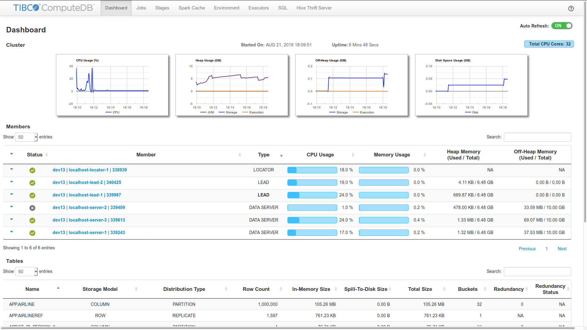

The following topics are covered in this section:

* [Dashboard](#dashboard)

* [Member Details](#memberdetails)

* [Jobs](#jobs)

* [Stages](#stages)

* [Spark Cache](#spark_cache)

* [Environment](#environment)

* [Executors](#executors)
* [Structured Streaming](#structuredstream)

* [SQL](#sql)

!!! Note
	When connecting to a TIBCO ComputeDB cluster using Smart Connector, the information related to **SQL**, **Jobs**, and **Stages** are NOT displayed, as the Jobs and queries are primarily executed in your client Spark cluster. You can find this information on the Spark UI console of your client cluster. Read more about Smart Connector Mode [here](../affinity_modes/connector_mode.md).
    
On re-starting a TIBCO ComputeDB cluster, the TIBCO ComputeDB Monitoring Console loses the information about SQL queries, Spark jobs and stages. Therefore, you must turn on the [Spark History server](#historyserver) to enable historical analysis of past queries and their associated jobs, stages, and tasks.

On the top-right side of the TIBCO ComputeDB Monitoring Console page, you can click the help icon to view the details of TIBCO ComputeDB.

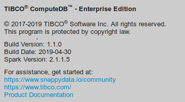

## Dashboard
The Dashboard page graphically presents various cluster-level statistics that can be used to monitor the current health status of a cluster. The statistics on the dashboard page can be set to update automatically after every five seconds.  If you want to turn off the auto-refresh, use the **Auto Refresh** switch that is provided on the upper-right corner.

The **Dashboard** page displays the following sections:

* [Cluster](#cluster)

* [Members](#member) 

* [Tables](#table)

* [External Tables](#external-table)

You can use the search and sort functionalities in any of the sections, except for the **Cluster** section. Sorting is enabled to sort items in an ascending and descending order. Further, you can also set the number of items that must be listed in each of these sections.

### Cluster
In the **Cluster** section, you can view the following graphs which are automatically refreshed:

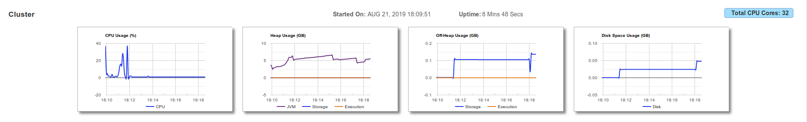

On the Dashboard page, the **Cluster** section displays the date and time when the cluster was launched. It also displays the cluster's up-time since cluster was launched.

You can view the total number of physical CPU cores present in your cluster on the top-right side of the page.
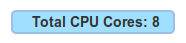

|Graphs|Description|
|--------|--------|
|**CPU Usage**|Graphically presents the trend of CPU utilization by all the nodes in the cluster for the last 15	 minutes. The utilization is represented in percentage value.|
|**Heap Usage**|Graphically presents the collective utilization of Heap Memory by all the nodes in the cluster. This  graph displays three trend lines which corresponds to the utilization of Heap Memory for the following:  <ul><li>Storage</li><li>Execution</li><li>JVM</li></ul> |
|**Off-Heap Usage**|Graphically presents the collective utilization of Off-Heap Memory by all the nodes in the cluster. This  graph displays two trend lines which corresponds to the utilization of Off-Heap Memory for the following:   <ul><li>Storage</li><li>Execution</li></ul> |
|**Disk Space**|Graphically presents the collective utilization of disk space memory by all the nodes in the cluster.|

### Members
In the **Members** section,  you can view, in a tabular format, the details of each locator, data server, and lead member within a cluster. The details are automatically refreshed after every five seconds.
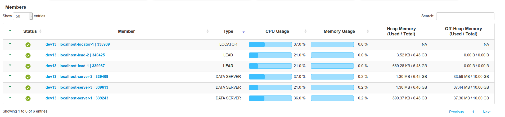

This table provides member details in the following columns:s

| Column | Description |
|--------|--------
|  **Status**     |  Displays the status of the members, which can be either [Running or Stopped](#statusofmembers).    |
|   **Member**       |   Displays a brief description of the member. Click the link in the column to view the [Member Details](#memberdetails) where the usage trends and statistics of the members are shown along with the [Member Logs](#memberlogs). Click the drop-down arrow to find information such as the IP address of the host, the current working directory, and the Process ID number.  |
|     **Type**   |     Displays the type of the member. The type can be LEAD, LOCATOR, or DATA SERVER. The name of the active lead member is displayed in bold letters. |
|     **CPU Usage**        |      Displays the CPU utilized by the member's host.  |
|     **Memory Usage**       |      Displays the collective Heap and Off-Heap memory utilization of a cluster member. |
|  **Heap Memory**       | Displays the member's utilized Heap memory versus total Heap memory. Click the down arrow in this column to view the detailed distribution of the member's Heap Memory for storage, execution, and JVM. |
|    **Off-Heap Memory**     |     Displays the member's used Off-Heap memory and total Off-Heap memory. Click the down arrow in this column to view the detailed distribution of the member's Off-Heap memory for storage and execution.  |

| Status | Description |
|--------|--------|
||Member is running.|
||Member has stopped or is unavailable.|

### Tables
The **Tables** section lists all the tables in the cluster along with their corresponding statistical details. All these details are automatically refreshed after every five seconds.

The following columns are displayed in this section:

| Column | Description |
|--------|--------|
|  **Name**      |     Displays the name of the data table.   |
|   **Storage Model**     |    Displays the data storage model of the data table. Possible models are **ROW** and **COLUMN**.    |
|   **Distribution Type**     |      Displays the data distribution type for the table. Possible values are: <ul><li>PARTITION</li><li>REPLICATE</li> </ul> |
|   **Row Count**     |   Displays the row count, which is the number of records present in the data table.|
|**Memory Size**    |    Displays the heap memory used by data table to store its data. If less than **Total Size** then the data is overflowing to disk.   |
|     **Total Size**   |     Displays the collective physical memory and disk overflow space used by the data table to store its data.   |
|      **Buckets**  |  Displays the total number of buckets in the data table. If a number displayed in red here, it indicates that some of the buckets are offline.|
|      **Redundancy**  |  Displays the number of redundant copies.   Redundancy value **0** indicates that redundant copies are not configured.  Redundancy value **1** indicates that one redundant copy is configured.  Redundancy value **NA** indicates that redundancy is not applicable.|
|      **Redundancy Status**  |  Displays whether redundancy criteria is satisfied or broken.  Redundancy status **Satisfied** indicates that all the configured redundant copies are available.   Redundancy status **Broken** indicates that some of the redundant copies are not available.   Redundancy status **NA** indicates that redundancy is not applicable.|

### External Tables
The **External Tables** section lists all the external tables present in the cluster along with their various statistical details. The displayed details are automatically refreshed after every five seconds.

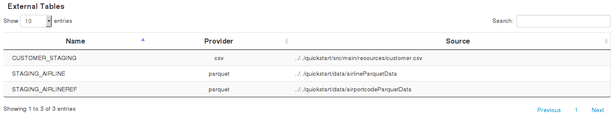

The following columns are displayed in this section:

| Column | Description |
|--------|--------|
|     **Name**   |   Displays the name of the external table.     |
|      **Provider**  |  Displays the data store provider that is used when the external table was created. For example, Parquet, CSV, JDBC, etc.      |
|  **Source**      |For Parquet and CSV format, the path of the data file used to create the external table is displayed. For JDBC, the name of the client driver is displayed.   |

## Member Details
Console
The **Member Details** view shows the usage trend and [statistics](#memberstat) of a specific cluster member. To check the **Member** **Details** view,  go to the [Members](#member) section and click the link in the **Member** column. Here you can also view the [Member Logs](#memberlogs) generhistoryserverated for a cluster member.
The usage trends and the statistics of a specific member are auto updated periodically after every five seconds. If you want to turn off the auto-refresh, use the **Auto Refresh** switch that is provided on the upper-right corner. You can view, on demand, the latest logs by clicking on the **Load New** button provided at the bottom of the logs. You can also click the **Load More** button to view the older logs.

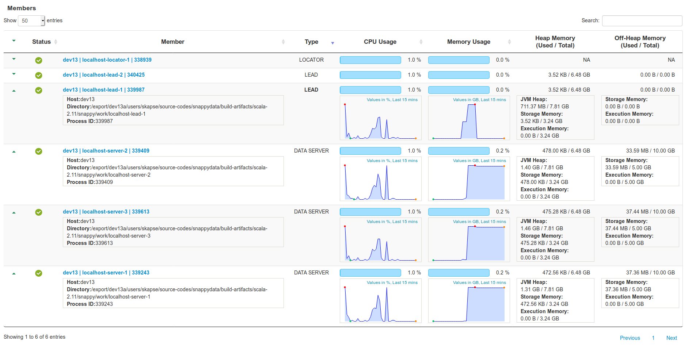

### Member Statistics
The following member specific statistics are displayed:

|Item|Description|
|--------|--------|
|**Member Name/ID**|Displays the name or ID of the member.|
|**Type**|Displays the type of member, which can be LEAD, LOCATOR or DATA SERVER.|
|**Process ID**|Displays the process ID of the member.|
|**Status**|Displays the status of the member. This can be either **Running** or **Unavailable**|
|**Heap Memory**|Displays the total available heap memory, used heap memory, their distribution into heap storage, heap execution memory and their utilization.|
|**Off-Heap Memory Usage**|Displays the members total off-heap memory, used off-heap memory, their distribution into off-heap storage and off-heap execution memory, and their utilization.|

The usage trends of the member are represented in the following graphs:

|Graphs|Description|
|--------|--------|
|**CPU Usage**|Graphically presents the trend of CPU utilization by the member host for the last 15 minutes. The utilization is represented in percentage value.|
|**Heap Usage**|Graphically presents the utilization of Heap Memory by the member host. This  graph displays three trend lines which corresponds to the utilization of Heap Memory for the following:  <ul><li>Storage</li><li>Execution</li><li>JVM</li></ul> |
|**Off-Heap Usage**|Graphically presents the utilization of Off-Heap Memory by the member host. This  graph displays two trend lines which corresponds to the utilization of Off-Heap Memory for the following:   <ul><li>Storage</li><li>Execution</li></ul>|
|**Disk Space**|Graphically presents the utilization of disk space memory by the member host.|

### Member Logs

In the Member Details page, you can view the logs generated for a single member in the cluster.

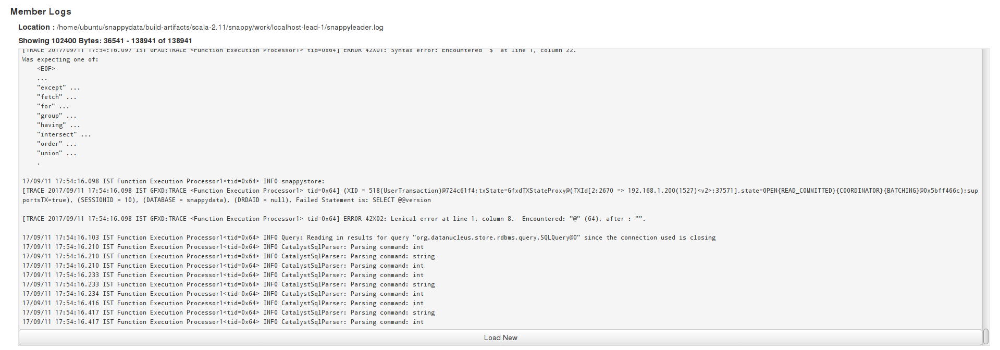

The following details are included:

| Item | Description |
|--------|--------|
|   **Log File Location**     | Displays the absolute path of the member's primary log file, which is on the host where the current member's processes are running.    |
|     **Log Details **  |     Displays details of the loaded logs such as  Loaded Bytes, Start and End Indexes of Loaded Bytes, and Total Bytes of logs content.   |
|  **Logs**      | Displays the actual log entries from the log files.   It also displays the following buttons:   <ul><li>**Load New** - Loads the latest log entries from the log file, if generated, after logs were last loaded or updated.</li><li>**Load More** - Loads older log entries from log files, if available.</li></ul>  |

## Jobs
The **Jobs** page lists all the Spark jobs. Each Spark action is translated as a Spark job. A job encapsulates the whole execution of an API or SQL. For example, `dataSet.count()` triggers a job.

[comment]: <> (Need a brief introduction here.)

* **Status**: Displays the status of the job.

* **Stages**: Click on the stage to view its details. The table displays the time taken for the completion of each stage. 

!!! Tip
	You can cancel a long running job, using the **Kill** option.

## Stages
The **Stages** page displays the stage details of a Spark Job. Each Spark job is segregated into one or more stages. Each stage is an execution boundary where data exchange between nodes is required.

On this page, you can view the total time required for all the tasks in a job to complete. You can also view if any of the tasks got delayed for completion. This may occur in case of uneven data distribution.

* **Scheduler Delay** indicates the waiting period for the task. Delays can be caused if there are too many concurrent jobs.

* **Shuffle reads and writes**: Shuffles are written to disk and can take a lot of time to write and read. This can be avoided by using colocated and replicated tables. You can use high-performance SSD drives for temporary storage (spark.local.dir) to improve shuffle time.

* **Number of parallel tasks**: Due to concurrency, multiple queries may take cores and a specific query can take longer. To fix this, you can create a new scheduler and [assign appropriate cores to it](../best_practices/setup_cluster.md).

* **GC time**: Occasionally, on-heap object creation can slow down a query because of garbage collection. In these cases, it is recommended that you increase the on-heap memory, especially when you have row tables.

## Spark Cache

Spark Cache is the inbuilt storage mechanism of Spark. When you do a `dataSet.cache()`, it uses this storage to store the dataset's data in a columnar format. This storage can be configured to be one of the following:

- MEMORY_ONLY,
- MEMORY_AND_DISK,
- MEMORY_ONLY_SER,
- MEMORY_AND_DISK_SER,
- DISK_ONLY,
- MEMORY_ONLY_2,
- MEMORY_AND_DISK_2

For more details, see [RDD Persistence section](https://spark.apache.org/docs/latest/rdd-programming-guide.html).

## Environment
The Environment page provides detailed configurations for Spark environment including JVM, SparkContext, and SparkSession.

## Executors
Executors are the entities that perform the tasks within a Spark job. Each Spark job is divided into multiple stages which can have one or more tasks depending on the number of partitions to be processed. All these tasks are scheduled on executor nodes which actually run them.

## Structured Streaming

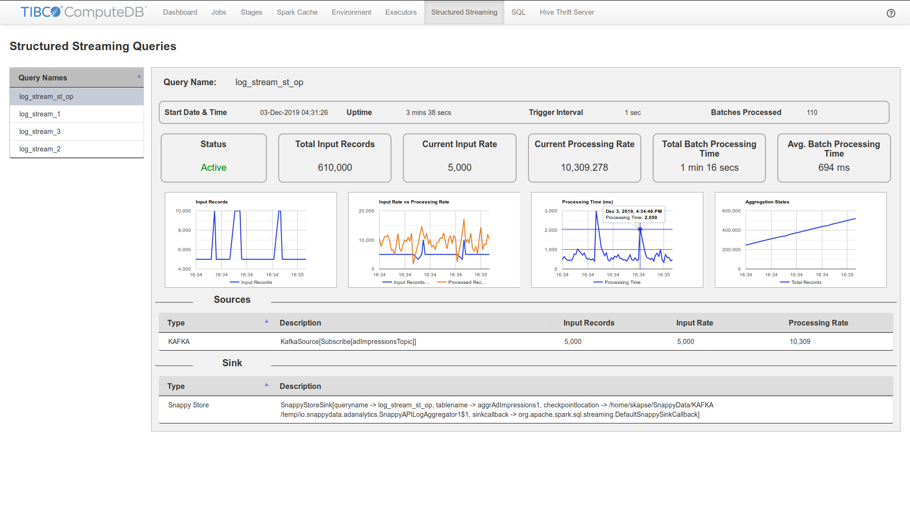

**Structured Streaming** tab provides a real-time view into all the running structured streaming queries in the cluster. You can navigate, visualize, and monitor all the structured streaming queries from a single location. Further, you can also track various statistics of these queries as listed [here](#querystats). All these statistics are automatically refreshed after every five seconds.

!!!Attention
	*	The **Structured Streaming** tab is available in the Embedded mode as well as in the Smart Connector mode. However, in the Smart Connector mode, this tab is visible only if you use the Snappy-Spark distribution. In case you use the upstream or stock spark distribution, then the **Structured Streaming** tab will not be visible. 
	*	Only those streaming queries that are started using SnappySession will be available for monitoring on the UI. Queries that are started using SparkSession won't be available for monitoring on the UI.

You can view the **Structured Streaming** tab only for the monitoring console of the corresponding cluster. For example, if you submit a streaming query on the embedded cluster using snappy-job, then the **Structured Streaming** tab is available on the monitoring console of the embedded cluster. If you submit a streaming query as a Smart Connector job, on a separate spark cluster, then the **Structured Streaming** tab is available on the monitoring console of the Spark cluster where the Smart Connector job is submitted.

The following details are shown on the **Structured Streaming** tab:

### Query Statistics Information

| Item  | Description |
|--------|--------|
|  **Query Names**    | A list of the active and inactive streaming queries in the cluster, which also acts as the query navigation panel. You can select a query and monitor the status of that query. The relevant statistics of the query  are displayed on right side.   You can configure the maximum number of queries to be displayed on the UI by using the property  **spark.sql.streaming.uiRunningQueriesDisplayLimit**. The default value is **20**. When the maximum limit is reached, then the newly created streaming queries gets added only after replacing the oldest inactive query. If there are no inactive queries present in the existing query list then the newly created streaming queries are not displayed. Click the list header to sort the list.|
| **Query Name**|A unique name given to structured streaming query. Queries are distinguished based on the query ID that is generated by Spark internally. Therefore, if multiple streaming queries have different query IDs but the same name, then all the queries get listed under the same name. To avoid this, you must ensure to maintain unique query names.|
|**Start Date & Time**|Calendar date and clock time when the structured streaming query was started or restarted.|
|**Uptime**| Total time that has passed since the streaming has started.|
|**Trigger** **Interval**| Time interval on which successive batch is expected to start it’s execution. Each event is fired on this interval but each event may or may not have batches to process.|
|**Batches Processed**| Total number of batches processed since streaming query has been started.|  
|**Status**| Status can be **Active** or **Inactive**.  *	**Active**: Query is running   *	**Inactive**: Query has stopped or failed|
|**Total Input Records**| Total count of records received from the sources and processed since the streaming query has been started.|
|**Current Input Rate**| Number of input records per second in a batch, which has been received in the current event trigger. This value is the number of records received between the start time of previous event and start time of current event and divided by the number of seconds between these two events.|
|**Current Processing Rate**|Average input records processed per second. This value is number of input records processed per second between the start time and the end time of the current event.|
|**Total Batch Processing Time**| Total time taken to process all the batches received from the start time of the streaming query until now.|
|**Avg. Batch Processing Time**| Average processing time per batch. This value is the total batch processing time, which is divided by the number of batches processed since the streaming query has started.|

### Structured Streaming Queries Sources

| Item  | Description |
|--------|--------|
|**Type** | Source Type can be one of the following:  * FileStream  * Kafka  * Memory  * Socket  * JDBC (only available with enterprise version) |
|**Description** |Description is a string representation of the source object. In general, it is a concise but informative representation.  For example: **KafkaSource[Subscribe[adImpressionTopic]] ** |
|**Input Records** | Number of input records received in current trigger event. |
|**Input Rate** | Input records per second for current trigger. |
|**Processing Rate** | Records processed per second for current trigger. |

### Structured Streaming Queries Sink

| Item  | Description |
|--------|--------|
|**Type** | Any of the following sink type for the structured streaming queries:   * Snappy Store  * File Stream   * Foreach  * Kafka  |
|**Description** | Description is a string representation of the sink object. In general, it is a concise but informative representation. For example: `SnappyStoreSink[queryname -> log_stream, tablename -> aggrAdImpressions, checkpointlocation ->/home/xyz/tmp/io.snappydata.adanalytics.SnappyAPILogAggreg ator1$, sinkcallback -> org.apache.spark.sql.streaming.DefaultSnappySinkCallback]`

### Graphical Charts

The **Structured Streaming** tab presents four types of graphical charts. All these charts display historical trends or behavior of respective parameters for a given number of data points or sample size. You can customize the data points sample size by setting the configuration parameter **spark.sql.streaming.uiTrendsMaxSampleSize**. The default value is **60** data points, which indicates that all the graphical charts display data of the last 60 events.

#### Input Records

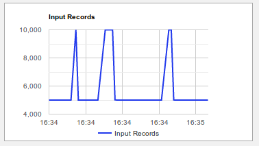
This line chart displays the number of input records received for each of the batches in the last n trigger events.

#### Input Rate Vs. Processing Rate

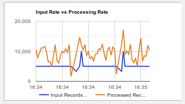

This line chart displays the behavior of two parameters, for the last **n** triggers, in two curve lines. **n** refers to value configured for **spark.sql.streaming.uiTrendsMaxSampleSize**, which defaults to **60**. One line represents the input rate that is the number of input records per second in the given triggers. The other line represents the processing rate, which is the number of records processed per second in the given triggers. Processing rate should ideally remain higher than Input rate. If it is below the input rate, then that indicates that the streaming query is falling behind the input data and you may need to add more resources to the cluster to keep up the processing speed.

#### Processing Time (in Miiliseconds)

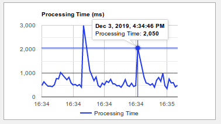

This line chart displays the time taken to process all the input records received in each of the batches for the last n triggers. This chart also displays the processing threshold line, which is the expected maximum time limit in milliseconds for processing a batch. This chart allows you to supervise whether the processing is happening within the time limit specified for Event Trigger Interval. 
In case the trend line for the Processing Time trend line is continuously below the Processing Threshold, then that indicates that there are enough resources to handle the streaming query operations. However, if the Processing Time trend line is often above the Processing Threshold, then that indicates that resources are insufficient to handle the streaming query operations, and you must add resources to manage the streaming input load. The Processing Threshold line will be always at zero if the trigger interval is not specified while defining the query.

#### Aggregation State

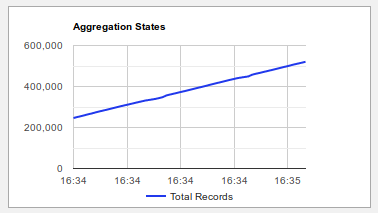

This line chart is displayed only if the streaming query is using one or more aggregate functions.

## SQL
The SQL section shows all the queries and their corresponding details along with their execution plans and stagewise breakups.

| Item  | Description |
|--------|--------|
|  **Colocated**    | When colocated tables are joined on the partitioning columns, the join happens locally on the node where data is present, without the need of shuffling the data. This improves the performance of the query significantly instead of broadcasting the data across all the data partitions.   |
|**Whole-Stage Code Generation** |  A whole stage code generation node compiles a sub-tree of plans that support code generation together into a single Java function, which helps improve execution performance.      |
|    **Per node execution timing**    |   Displays the time required for the execution of each node. If there are too many rows that are not getting filtered or exchanged.     |
|   **Pool Name**     | Default/Low Latency. Applications can explicitly configure the use of this pool using a SQL command `set snappydata.scheduler.pool=lowlatency`.       |
|**Query Node Details**|   Hover over a component to view its details.     |
|     **Filter**   |   Displays the number of rows that are filtered for each node.      |
|    **Joins**    |   If HashJoin puts pressure on memory, you can change the HashJoin size to use SortMergeJoin to avoid on-heap memory pressure.      |

## Hive Thrift Server

## Spark History Server
The Spark History server is a Spark UI extension. It is a web application that lets you analyze the running as well as completed SQL queries and the associated Spark jobs. The metadata collected in the form of event logs by the Spark History server can be shipped from a TIBCO ComputeDB cluster to another TIBCO ComputeDB cluster for further analysis.

The first step in tuning query performance in TIBCO ComputeDB is to understand the query physical plan that is available through the SQL tab on the TIBCO ComputeDB Monitoring console. The detailed execution plan requires one to understand the jobs and tasks associated with the query. This is available in the Jobs/Tasks tab. However, if the TIBCO ComputeDB Monitoring console is not accessible to the investigator, it becomes a difficult exercise. To overcome this, TIBCO recommends to turn on the History server for production applications.

To turn on the History server, do the following:

1.	Ensure to provide a shared disk that can be accessed from all the TIBCO ComputeDB nodes. If you do not have the NFS access, use HDFS. Provide the necessary permissions to access a shared folder when you start TIBCO ComputeDB.
2.	Enable event logging for the Spark jobs. For example, specify the following properties in **conf/lead**:

            -spark.eventLog.enabled=true -spark.eventLog.dir=hdfs://namenode/shared/spark-logs

3.	Additionally, set the following property in **conf/spark-defaults.conf** file (it defaults to **/tmp/spark-event**s):

			spark.history.fs.logDirectory      hdfs://namenode/shared/spark-logs

    If this property is not set and the directory **/tmp/spark-events** does not exist, Spark History server fails to start.

5. By default, the history server loads only 1000 most recent events (SQL, Jobs, Stages). Older events will not be visible. To retain more number of events, set additional properties using **SPARK_HISTORY_OPTS**, and also increase the heap-size of the history server as follows in the file **conf/SPARK_ENV.sh**.

             SPARK_HISTORY_OPTS="-Dspark.history.fs.numReplayThreads=16 -Dspark.ui.retainedJobs=10000 -Dspark.ui.retainedStages=20000 -Dspark.sql.ui.retainedExecutions=10000"
             SPARK_DAEMON_MEMORY=12g
     	
    !!!Note 
    	When you retain a high number of events, it increases the disk space requirement. Therefore, ensure that the disk store, where the events are stored, has adequate disk space.

4.	Start the History server.

			./sbin/start-history-server.sh

	This creates a web interface at *http://<server-url>:18080* by default, listing incomplete and completed instances of SQL queries and the associated Spark jobs and tasks.
    For more details about History server, refer to [Configuring History Server](https://spark.apache.org/docs/latest/monitoring.html#environment-variables).
