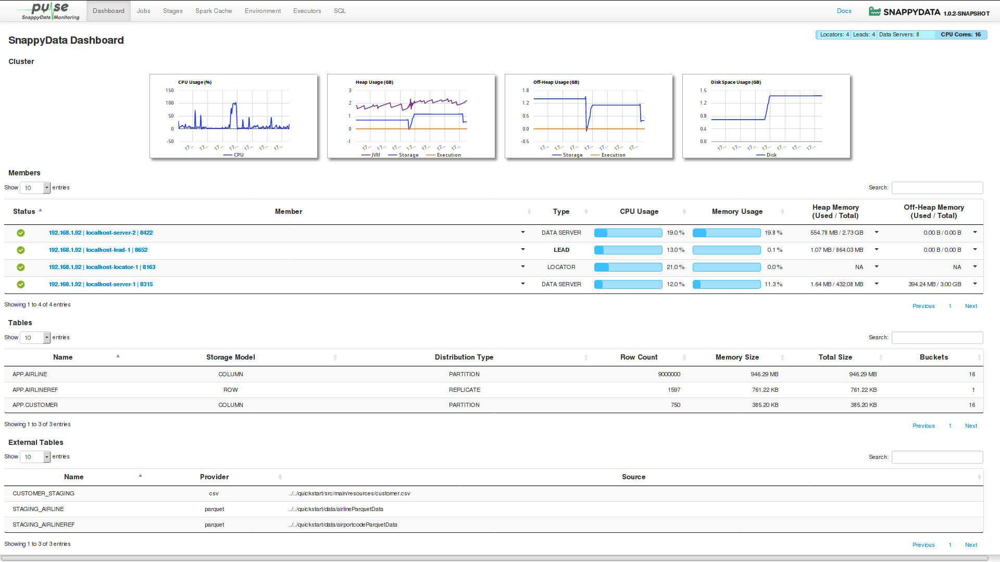
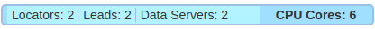

# SnappyData Pulse

SnappyData Pulse is a monitoring system that gives a high-level overview of the status and performance of the cluster.  Pulse provides a simple widget based view, which allows you to easily navigate, visualize, and monitor your cluster. You can monitor the overall status of the cluster as well as of each member in the cluster. 
All the usage details are automatically refreshed after every 5 seconds, thus you can supervise the live status of your cluster.

To access SnappyData Pulse, start your cluster and open [http:`<leadhost>`:5050/dashboard/](http:`<leadhost>`:5050/dashboard/) in your web browser.

!!!Note
	`<leadhost>` is the hostname or IP of the lead node in your cluster.

!!! Note
	
	When using Smart Connector with upstream Spark, the **Dashboard** and **Member Details** sections are not displayed. Only the **SQL**, **Jobs** and **Stages** related information is displayed.

The following topics are covered in this section:

* [Dashboard](#dashboard)

* [Jobs](#jobs)

* [Stages](#stages)

* [Spark Cache](#spark_cache)

* [Environment](#environment)

* [Executors](#executors)

* [SQL](#sql)

!!! Note
	When using Smart Connector with upstream Spark, the **Dashboard** section is not displayed. Only the **SQL**, **Jobs** and **Stages** related information is displayed.

On the top-right side of the SnappyData Pulse page, you can view the version details of SnappyData Snapshot. When you click this, the name and version of the product, the build details, the source revision details and the version number of the underlying spark are displayed.

You can also view the total number of CPU cores allocated to your cluster on the top-right side of the page.

Click this and the number of cores allocated to each member is displayed.

## Dashboard
The Dashboard page graphically presents various cluster level statistics that can be used to monitor the current health status of a cluster. The statistics on the dashboard page are automatically updated after every 5 seconds.

The **Dashboard** page displays the following sections:

* [Cluster](#cluster)

* [Members](#member)

* [Tables](#table)

* [External Tables](#external-table)

You can use the search and sort functionalities in any of the sections, except for the **Cluster** section.  Sorting is enabled to sort items in an ascending and descending order. Further you can also set the number of items that must be listed in each of these sections.

### Cluster
In the **Cluster** section, you can view the following graphs which are automatically refreshed:

|Graphs|Description|
|--------|--------|
|**CPU Usage**|Graphically presents the trend of CPU utilization by all the nodes in the cluster for the last 15	 minutes. The utilization is represented in percentage value.|
|**Heap Usage**|Graphically presents the collective utilization of Heap Memory by all the nodes in the cluster. This  graph displays three trend lines which corresponds to the utilization of Heap Memory for the following:  * Storage   * Execution  * JVM    |
|**Off-Heap Usage**|Graphically presents the collective utilization of Off-Heap Memory by all the nodes in the cluster. This  graph displays two trend lines which corresponds to the utilization of Off-Heap Memory for the following:   * Storage   * Execution|
|**Disk Space**|Graphically presents the collective utilization of disk space memory by all the nodes in the cluster.|

### Members
In the **Members** section,  you can view, in a tabular format, the details of each locator, server, and lead member within a cluster. The details are automatically refreshed after every 5 seconds.

This table provides member details in the following columns:

| Column | Description |
|--------|--------
|  **Status**     |  Displays the status of the members, which can be either [Running or Stopped](#statusofmembers).    |
|   **Member**       |   Displays a brief description of the member. Click the link in the column to view detailed description of the members along with the [Member Logs](#memberlogs). In this description, you can find information such as the IP address of the host, the current working directory, and the Process ID number.  |
|     **Type**   |     Displays the type of the member. The type can be lead, locator, or data server. The name of the active lead member is displayed in bold letters. |
|     **CPU Usage**        |      Displays the CPU utilized by the member's host.  |
|     **Memory Usage**       |      Displays the collective Heap and Off-Heap memory utilization of a cluster member. |
|  **Heap Memory**       | Displays the member's utilized Heap memory versus total Heap memory. Click the down arrow in this column to view the detailed distribution of the member's Heap Memory for storage, execution, and JVM. |
|    **Off-Heap Memory**     |     Displays the member's used Off-Heap memory and total Off-Heap memory. Click the down arrow in this column to view the detailed distribution of the member's Off-Heap memory for storage and execution.  |
|    **Disk Space**     |     Displays the collective usage of Disk Memory used by all nodes in the cluster.  |

| Status | Description |
|--------|--------|
||Member is running.|
||Member has stopped or is unavailable.|

#### Member Logs

The **Member Logs ** display the logs generated by a member node. The following details are included:

| Item | Description |
|--------|--------|
|   **Log File Location**     |    Displays the absolute path of the member's primary log file, which is on the host where the current member's processes are running.    |
|     **Log Details **  |     Displays details of the loaded logs such as  Loaded Bytes, Start and End Indexes of Loaded Bytes, and Total Bytes of logs content.   |
|  **Logs**      | Displays the actual log entries from the log files.   It also displays the following buttons:   * **Load New** -  Loads the latest log entries from the log file (if generated) after logs were last loaded/updated.        * **Load More** - Loads older log entries from log files, if available.  |

### Tables
The **Tables** section lists all the tables in the cluster along with their corresponding statistical details. All these details are automatically refreshed after every 5 seconds.

The following columns are displayed in this section:

| Column | Description |
|--------|--------|
|  **Name**      |     Displays the name of the data table.   |
|   **Storage Model**     |    Displays the data storage model of the data table. Possible models are **ROW** and **COLUMN**.    |
|   **Distribution Type**     |      Displays the data distribution type for the table. Possible values are:  * PARTITION   * PARTITION_PERSISTENT  * PARTITION_REDUNDANT  * PARTITION_OVERFLOW  * REPLICATE  * REPLICATE_PERSISTENT  * REPLICATE_OVERFLOW  | 
|   **Row Count**     |   Displays the row count, which is the number of records present in the data table.|
|**Memory Size**    |    Displays the heap memory used by data table to store its data.    |
|     **Total Size**   |     Displays the collective physical memory and disk overflow space used by the data table to store its data.   |
|      **Buckets**  |  Displays the total number of buckets in the data table.|

### External Tables
The **External Tables** section lists all the external tables present in the cluster along with their various statistical details. The displayed details are automatically refreshed after each 5 seconds.

The following columns are displayed in this section:

| Column | Description |
|--------|--------|
|     **Name**   |   Displays the name of the external table.     |
|      **Provider**  |  Displays the datastores provider that is used when the external table was created. For example, Parquet, CSV, JDBC etc.      |
|  **Source**      |For Parquet and CSV format, the path of the data file used to create the external table is displayed. For JDBC, the name of the client driver is displayed.   |

## SQL
The SQL page provides information about the submitted queries.

| Item  | Description |
|--------|--------|
|  **Colocated**         |     When colocated tables are joined on the partitioning columns, the join happens locally on the node where data is present, without the need of shuffling the data. This improves the performance of the query significantly instead of broadcasting the data across all the data partitions.   |
|**Whole-Stage Code Generation** |  A whole stage code generation node compiles a sub-tree of plans that support code generation together into a single Java function, which helps improve execution performance.      |
|    **Per node execution timing**    |   Displays the time required for the execution of each node. If there are too many rows that are not getting filtered or exchanged.     |
|   **Pool Name**     | Default/Low Latency. Applications can explicitly configure the use of this pool using a SQL command `set snappydata.scheduler.pool=lowlatency`.       |
|**Query Node Details**|   Hover over a component to view its details.     |
|     **Filter**   |   Displays the number of rows that are filtered for each node.      |
|    **Joins**    |   If HashJoin puts pressure on memory, you can change the HashJoin size to use SortMergeJoin to avoid on-heap memory pressure.      |

## Spark Cache

Spark Cache is the inbuilt storage mechanism of Spark. When you do a `dataSet.cache()`, it uses this storage to store the dataset's data in a columnar format. This storage can be configured to be one of the following:

- MEMORY_ONLY,
- MEMORY_AND_DISK,
- MEMORY_ONLY_SER,
- MEMORY_AND_DISK_SER,
- DISK_ONLY,
- MEMORY_ONLY_2,
- MEMORY_AND_DISK_2

For more details, see [RDD Persistence section](https://spark.apache.org/docs/latest/rdd-programming-guide.html).

## Environment
The Environment page provides detailed configurations for Spark environment including JVM, SparkContext and SparkSession.

## Executors
Executors are the entities that performs the tasks within a Spark job. Each Spark job is divided into multiple stages which can have one or more tasks depending on the number of partitions to be processed. All these tasks are scheduled on executor nodes which actually run them.

## Jobs
The **Jobs** page lists all the Spark jobs. Each Spark action is translated as a Spark job. A job encapsulates the whole execution of an API or SQL. For example, `dataSet.count()` triggers a job.

[comment]: <> (Need a brief introduction here.)

* **Status**: Displays the status of the job.

* **Stages**: Click on the stage to view its details. The table displays the time taken for completion of each stage. 

!!! Tip
	You can cancel a long running job, using the **Kill** option.  

## Stages
The **Stages** page displays the stage details of a Spark Job. Each Spark job is segregated into one or more stages. Each stage is an execution boundary where data exchange between nodes is required.

On this page, you can view the total time required for all the tasks in a job to complete. You can also view if any of the tasks got delayed for completion. This may occur in case of uneven data distribution.

* **Scheduler Delay** indicates the waiting period for the task. Delays can  be caused if there are too many concurrent jobs.

* **Shuffle reads and writes**: Shuffles are written to disk and can take a lot of time to write and read. This can be avoided by using colocated and replicated tables. You can use high-performance SSD drives for temporary storage (spark.local.dir) to improve shuffle time.

* **Number of parallel tasks**: Due to concurrency, multiple queries may take cores and a specific query can take longer. To fix this, you can create a new scheduler and [assign appropriate cores to it](../best_practices/setup_cluster.md).

* **GC time**: Occasionally, on-heap object creation can slow down a query because of garbage collection. In these cases, it is recommended that you increase the on-heap memory (especially when you have row tables).
