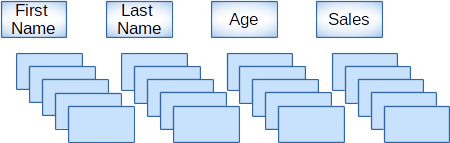

# Tables in SnappyData
## Row and Column Tables
Column tables organize and manage data in memory in a compressed columnar form such that, modern day CPUs can traverse and run computations like a sum or an average really fast (as the values are available in contiguous memory). Column table follows the Spark DataSource access model.



Row tables, unlike column tables, are laid out one row at a time in contiguous memory. Rows are typically accessed using keys and its location is determined by a hash function and hence is fast for point lookups or updates.


Create table DDL for Row and Column tables allows tables to be partitioned on primary keys, custom partitioned, replicated, carry indexes in memory, persist to disk, overflow to disk, be replicated for HA, etc.

### DDL and DML Syntax for Tables
```pre
CREATE TABLE [IF NOT EXISTS] table_name 
    ( column-definition	[ , column-definition  ] * )	
    USING [row | column]
    OPTIONS (
    COLOCATE_WITH 'table-name',  // Default none
    PARTITION_BY 'column-name', // If not specified, replicated table for row tables, and partitioned internally for column tables.
    BUCKETS  'num-partitions', // Default 128. Must be an integer.
    REDUNDANCY        'num-of-copies' , // Must be an integer
    EVICTION_BY 'LRUMEMSIZE integer-constant | LRUCOUNT interger-constant | LRUHEAPPERCENT',
    PERSISTENCE  'ASYNCHRONOUS | ASYNC | SYNCHRONOUS | SYNC | NONE’,
    DISKSTORE 'DISKSTORE_NAME', //empty string maps to default diskstore
    OVERFLOW 'true | false', // specifies the action to be executed upon eviction event, 'false' allowed only when EVCITON_BY is not set.
    EXPIRE 'time_to_live_in_seconds',
    COLUMN_BATCH_SIZE 'column-batch-size-in-bytes', // Must be an integer. Only for column table.
	KEY_COLUMNS  'column_name,..', // Only for column table if putInto support is required
    COLUMN_MAX_DELTA_ROWS 'number-of-rows-in-each-bucket', // Must be an integer > 0 and < 2GB. Only for column table.
	)
	[AS select_statement];

DROP TABLE [IF EXISTS] table_name;
```

Refer to the [Best Practices](../best_practices/design_schema.md) section for more information on partitioning and colocating data and [CREATE TABLE](../reference/sql_reference/create-table.md) for information on creating a row/column table.</br>
DDL extensions are required to [configure a table](../reference/sql_reference/create-table.md#ddl) based on user requirements. 

You can also define complex types (Map, Array and StructType) as columns for column tables. 

```pre
snappy.sql("CREATE TABLE tableName (
col1 INT , 
col2 Array<Decimal>, 
col3 Map<Timestamp, Struct<x: Int, y: String, z: Decimal(10,5)>>, 
col6 Struct<a: Int, b: String, c: Decimal(10,5)>
) USING column options(BUCKETS '8')" )
```

To access the complex data from JDBC you can see [JDBCWithComplexTypes](https://github.com/SnappyDataInc/snappydata/blob/master/examples/src/main/scala/org/apache/spark/examples/snappydata/JDBCWithComplexTypes.scala) for examples.

!!! Note 
	Clauses like PRIMARY KEY, NOT NULL etc. are not supported for column definition.

### Spark API for Managing Tables

**Get a reference to [SnappySession](http://snappydatainc.github.io/snappydata/apidocs/#org.apache.spark.sql.SnappySession):**

    val snappy: SnappySession = new SnappySession(spark.sparkContext)

Create a SnappyStore table using Spark APIs

```pre
    val props = Map('BUCKETS','5') //This map should contain required DDL extensions, see next section
    case class Data(col1: Int, col2: Int, col3: Int)
    val data = Seq(Seq(1, 2, 3), Seq(7, 8, 9), Seq(9, 2, 3), Seq(4, 2, 3), Seq(5, 6, 7))
    val rdd = sparkContext.parallelize(data, data.length).map(s => new Data(s(0), s(1), s(2)))
    val dataDF = snappy.createDataFrame(rdd)
    snappy.createTable("column_table", "column", dataDF.schema, props)
    //or create a row format table
    snappy.createTable("row_table", "row", dataDF.schema, props)
```
**Drop a SnappyStore table using Spark APIs**:

    snappy.dropTable(tableName, ifExists = true)
    

### Restrictions on Column Tables

* Column tables cannot specify any primary key, unique key constraints

* Index on column table is not supported

* Option EXPIRE is not applicable for column tables

* Option EVICTION_BY with value LRUCOUNT is not applicable for column tables

* READ_COMMITTED and REPEATABLE_READ isolation levels are not supported for column tables.


### DML Operations on Tables

```pre
INSERT OVERWRITE TABLE tablename1 select_statement1 FROM from_statement;
INSERT INTO TABLE tablename1 select_statement1 FROM from_statement;
INSERT INTO TABLE tablename1 VALUES (value1, value2 ..) ;
UPDATE tablename SET column = value [, column = value ...] [WHERE expression]
PUT INTO tableName (column, ...) VALUES (value, ...)
DELETE FROM tablename1 [WHERE expression]
TRUNCATE TABLE tablename1;
```

### API Extensions Provided in SnappyContext
Several APIs have been added in [SnappySession](http://snappydatainc.github.io/snappydata/apidocs/#org.apache.spark.sql.SnappySession) to manipulate data stored in row and column format. Apart from SQL, these APIs can be used to manipulate tables.

```pre
//  Applicable for both row and column tables
def insert(tableName: String, rows: Row*): Int .

// Only for row tables
def put(tableName: String, rows: Row*): Int
def update(tableName: String, filterExpr: String, newColumnValues: Row, 
           updateColumns: String*): Int
def delete(tableName: String, filterExpr: String): Int
```

**Usage SnappySession.insert()**: Insert one or more [[org.apache.spark.sql.Row]] into an existing table

```pre
val data = Seq(Seq(1, 2, 3), Seq(7, 8, 9), Seq(9, 2, 3), Seq(4, 2, 3),
               Seq(5, 6, 7), Seq(1,100,200))
data.map { r =>
  snappy.insert("tableName", Row.fromSeq(r))
}
```

**Usage SnappySession.put()**: Upsert one or more [[org.apache.spark.sql.Row]] into an existing table

```pre
val data = Seq(Seq(1, 2, 3), Seq(7, 8, 9), Seq(9, 2, 3), Seq(4, 2, 3),
               Seq(5, 6, 7), Seq(1,100,200))
data.map { r =>
  snappy.put(tableName, Row.fromSeq(r))
}
```

Usage SnappySession.update(): Update all rows in table that match passed filter expression

```pre
snappy.update(tableName, "ITEMREF = 3" , Row(99) , "ITEMREF" )
```


**Usage SnappySession.delete()**: Delete all rows in table that match passed filter expression

```pre
snappy.delete(tableName, "ITEMREF = 3")
```

### Row Buffers for Column Tables

Generally, the column table is used for analytical purpose. To this end, most of the operations (read or write) on it are bulk operations. Taking advantage of this fact the rows are compressed column wise and stored.

In SnappyData, the column table consists of two components, delta row buffer and column store. SnappyData tries to support individual insert of a single row, as it is stored in a delta row buffer which is write optimized and highly available.

Once the size of buffer reaches the COLUMN_BATCH_SIZE set by the user, the delta row buffer is compressed column wise and stored in the column store.
Any query on column table also takes into account the row cached buffer. By doing this, it ensures that the query does not miss any data.

### SQL Reference to the Syntax

Refer to the [SQL Reference Guide](../sql_reference.md) for information on the syntax.

