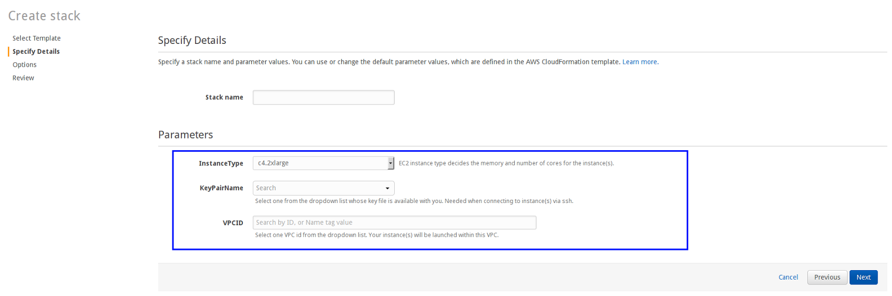

# Getting Started on Amazon Web Services (AWS)

You can quickly create a single host TIBCO ComputeDB cluster (that is, a lead node, a data node and a locator) in a single Amazon Elastic Compute Cloud (EC2) instance through the AWS CloudFormation.

## Prerequisites

Before you begin:

* Ensure that you have an existing AWS account with the permissions required to launch the EC2 resources from CloudFormation

* Sign into the AWS console using your AWS account-specific URL. This ensures that the account-specific URL is stored as a cookie in the browser, which then redirects you to the appropriate AWS URL for subsequent logins.

*  Create an EC2 Key Pair in the region where you want to launch the TIBCO ComputeDB Cloud cluster.

### Launching the cluster from AWS EC2
[Launch the cluster from EC2](https://console.aws.amazon.com/cloudformation/home#/stacks/new?templateURL=https://zeppelindemo.s3.amazonaws.com/quickstart/snappydata-quickstart.json) and follow the instructions below.

1. The AWS Login Screen is displayed. Enter your AWS login credentials. 
 
2. The **Select Template page** is displayed. The URL for the template (JSON format) is pre-populated. Click **Next** to continue. 

    !!! Note
        You are placed in your default region. You can either continue in the selected region or change it in the console. 

 

3. On the **Specify Details** page, you can: 
    * Provide the stack name: Enter a name for the stack. This is a mandatory field, and must contain only letters, numbers, dashes and should start with an alpha character.

	* Select Instance Type: By default, the c4.2xlarge instance (with 8 CPU core and 15 GB RAM) is selected. This is the recommended instance size for running this quick start.

    * Select KeyPairName: Select a key pair from the list of key pairs available to you. This is a mandatory field.

    * Search VPCID: Select the virtual private cloud (VPC) ID from the drop-down list. Your instance(s) are launched within this VPC. This is a mandatory field.  

4. Click **Next**.  

5. On the **Options** page, click **Next** to continue using the provided default values. 

6. On the **Review** page, verify the details and click **Create** to create a stack.  

7. The next page lists the existing stacks. Click **Refresh** to view the updated list. Select the stack to view its status.
When the cluster has started, the status of the stack changes to **CREATE_COMPLETE**. This process may take 4-5 minutes to complete. 

    !!! Note
	    If the status of the stack displays as **ROLLBACK_IN_PROGRESS** or **DELETE_COMPLETE**, the stack creation may have failed. Some common causes of the failure are:

	    * **Insufficient Permissions**: Verify that you have the required permissions for creating a stack (and other AWS resources) on AWS.

	    * **Invalid Keypair**: Verify that the EC2 key pair exists in the region you selected in the <!--iSight Cloud-->TIBCO ComputeDB CloudBuilder creation steps.

	    * **Limit Exceeded**: Verify that you have not exceeded your resource limit. For example, if you exceed the allocated limit of Amazon EC2 instances, the resource creation fails and an error is reported.

9. Your cluster is now running. You can explore it using Apache Zeppelin, which provides web-based notebooks for data exploration. The Apache Zeppelin server has been started on the instance for you. Simply follow its link (URL) from the **Outputs** tab. 
	

For more information, refer to the [Apache Zeppelin](../isight/quick_start_steps.md#LoggingZeppelin) section or refer to the [Apache Zeppelin documentation](http://zeppelin.apache.org/).

!!! Note

    * Multi-node cluster set up on AWS via CloudFormation will be supported in future releases. However, users can set it up using the [EC2 scripts](../install/setting_up_cluster_on_amazon_web_services.md#EC2).

    * To stop incurring charges for the instance, it is recommended that you either terminate the instance or delete the stack when not in use.  However, you cannot connect to or restart an instance after you have terminated it.
