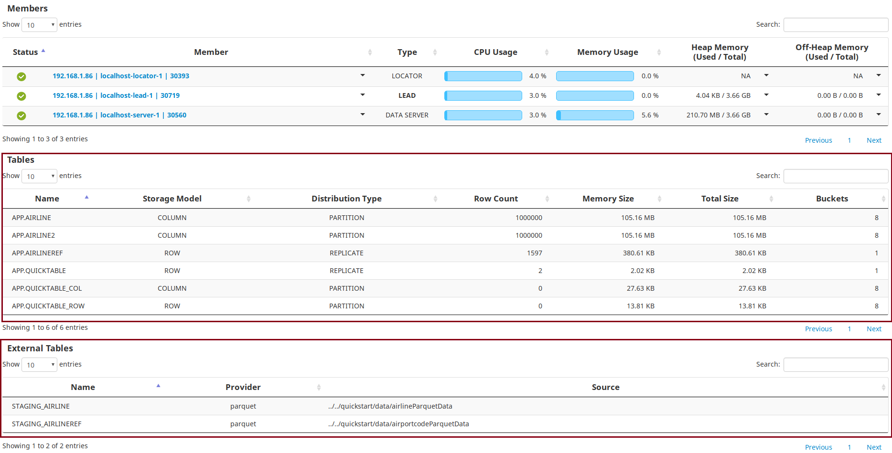
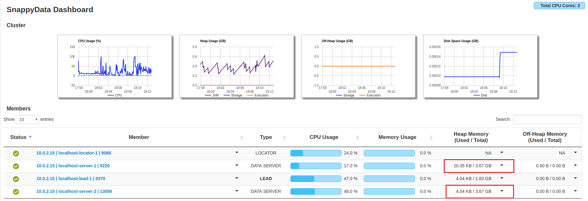
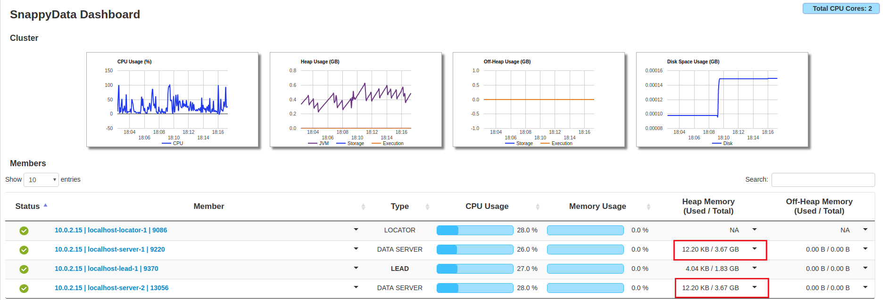

# Create TIBCO ComputeDB Cluster
 
In this section, you will get a quick tour to start a TIBCO ComputeDB cluster and try out the basic features and functionalities. The following items are covered in this guide:

*	[Start TIBCO ComputeDB Cluster](#st_snappy_cluster)

*	[Check TIBCO ComputeDB Cluster Status](#stats_cluster)

*	[Connect/Disconnect Snappy Shell](#connectsnappyshell)

*	[Create Tables](#create_tab)

*	[Create Tables and Import Data Using quickstart Scripts](#quickstartscript)

*	[Create a Column Table using an External Table](#createcoltabwithext)

*	[Run Queries](#runqry)

*	[Submit Snappy Jobs](#submitsnapjobs)

*	[Add Servers to Cluster](#addservercluster)

*	[Rebalance Data on Servers](#rebalancedataonserver)

*	[Stop Cluster](#stop_snappy_cluster)


<a id= st_snappy_cluster> </a>
## Start TIBCO ComputeDB Cluster

Navigate to the TIBCO ComputeDB product root directory to start the cluster. Run the `./sbin/snappy-start-all.sh` script to start the TIBCO ComputeDB cluster on your single machine using default settings. This starts a lead node, a locator, and a data server.  The Hive Thrift server also starts by default. 

```pre
$./sbin/snappy-start-all.sh

```pre
Logs generated in /home/cbhatt/TIB_compute_1.1.1_linux/work/localhost-locator-1/snappylocator.log
SnappyData Locator pid: 10813 status: running
  Distributed system now has 1 members.
  Started Thrift locator (Compact Protocol) on: localhost/127.0.0.1[1527]
Logs generated in /home/cbhatt/TIB_compute_1.1.1_linux/work/localhost-server-1/snappyserver.log
SnappyData Server pid: 11018 status: running
  Distributed system now has 2 members.
  Started Thrift server (Compact Protocol) on: localhost/127.0.0.1[1528]
Logs generated in /home/cbhatt/TIB_compute_1.1.1_linux/work/localhost-lead-1/snappyleader.log
SnappyData Leader pid: 11213 status: running
  Distributed system now has 3 members.
  Starting hive thrift server (session=snappy)
  Starting job server on: 0.0.0.0[8090]

```


You can connect to [Snappy SQL shell](#connectsnappyshell) and run the `select id, kind, netservers from sys.members;` query to view the cluster members.

		./bin/snappy
		connect client '127.0.0.1:1527';
        select id, kind, netservers from sys.members;
             
        ID                                                                                                         |KIND                  |NETSERVERS
        -------------------------------------------------------------------------------------------------------------------------------------------------------------------------------------------------------------------
        127.0.0.1(3688)<v1>:32604                                                                                  |datastore(normal)     |localhost/127.0.0.1[1528]
        127.0.0.1(3842)<v2>:25366                                                                                  |accessor(normal)      |                         
        127.0.0.1(3431:locator)<ec><v0>:41406                                                                      |locator(normal)       |localhost/127.0.0.1[1527] 

In the output, the details of the cluster members are displayed. Here in the KIND column, the member corresponding to **accessor** is the lead node.  In a cluster, you can connect as a client to any member by specifying localhost with the unique port number of the member (the one specified in the NETSERVERS column corresponding to each member). However, connecting to the locator provides basic load balancing by routing the connection request to an available server member.

<a id= stats_cluster> </a>
## Check TIBCO ComputeDB Cluster Status

You can check the status of a running cluster using the following command:


```pre
$ ./sbin/snappy-status-all.sh
SnappyData Locator pid: 9748 status: running
SnappyData Server pid: 9887 status: running
SnappyData Leader pid: 10468 status: running
```

Connect to  [Snappy Shell](#connectsnappyshell) to perform various SQL operations.


Alternatively, you can access the [TIBCO ComputeDB Monitoring Console](/monitoring/monitoring.md) monitoring tool by entering  [http:// `<leadhost>`:5050/dashboard/]() in the web browser. For example,  http://localhost:5050/dashboard/. </br>` <leadhost>` is the hostname or IP of the lead node in your cluster which is provided in the conf/leads file. On the dashboards of TIBCO ComputeDB Monitoring Console, after starting a cluster, you can check the status of each of the cluster member.

<a id= connectsnappyshell> </a>
## Connect/Disconnect to Snappy Shell
After starting the TIBCO ComputeDB cluster, run these commands together to start the Snappy shell:
			
```pre
./bin/snappy
connect client '127.0.0.1:1527';
```
Type **exit;** or press **CTRL + C** to disconnect the Snappy Shell.

<a id= create_tab> </a>
## Create Tables
Create a simple table and insert a few rows. By default, if no options are provided, row replicated table is formed. However, you can create tables using the row or column option.  
	
    # Create a table named quicktable. A replicated row table is formed without/empty options by default.
	CREATE TABLE quicktable (id int generated always as identity, item char(25));
	            
    # Create column table. A column table is created which is partitioned by default.
    CREATE TABLE  quicktable_col (id int, item varchar(25)) using column options(); 
                      
    # Create partitioned Row table using the partition by options. A partitioned row table is created with partitioning scheme on the 'id' column. 
    CREATE TABLE quicktable_row (id int generated always as identity, item char(25)) using row options(partition_by 'id');
			
    # Insert one row into the table.
    INSERT into quicktable values (default, 'widget');
		
	# Insert one more row into the table.
    INSERT into quicktable values (default, 'gadget');
			
    # View the contents of the table.
	select * from quicktable;
	ID         |ITEM                     
	-------------------------------------
	2          |gadget                
	1          |widget                   

	2 rows selected
		
    # TIBCO ComputeDB replicates the row tables that are created by default onto the data store members. 
    # You can validate this using the following query:

	select tablename, datapolicy from sys.systables where tablename='QUICKTABLE';
	
    #The following output is displayed:
    
    TABLENAME                                                                                                                       |DATAPOLICY              
	---------------------------------------------------------------------------------------------------------------------------------------------------------
	QUICKTABLE                                                                                                                      |PERSISTENT_REPLICATE    

<a id= quickstartscript> </a>
## Create Tables and Import Data Using quickstart Scripts
TIBCO ComputeDB contains various quickstart scripts that can be used to run some basic functionalities. </br>For example, you can run the **create_and_load_column_table.sql** script. This script first drops the table if it exists and then  creates an external table named STAGING AIRLINE to load the formatted data from a parquet file. Then a column table is created with only the specified columns from this external table. </br>Connect to Snappy shell before running these scripts. These script files must be run from within the **quickstart** directory if you are providing the relative path as shown:
			
            ./bin/snappy
			connect client '127.0.0.1:1527';
    		RUN 'quickstart/scripts/create_and_load_column_table.sql';
            
            # Use the following command to view the details of the external table. 
			describe staging_airline;
            
            # The following output is displayed:
			COLUMN_NAME         |TYPE_NAME|DECIMAL_DIGITS|NUM_PREC_RADIX|COLUMN_SIZE|COLUMN_DEF|CHAR_OCTET_LENGTH|IS_NULLABLE
			-----------------------------------------------------------------------------------------------------------------
            Year                |INTEGER  |0             |10            |10         |NULL      |NULL             |YES        
            Month               |INTEGER  |0             |10            |10         |NULL      |NULL             |YES        
            DayOfMonth          |INTEGER  |0             |10            |10         |NULL      |NULL             |YES        
            DayOfWeek           |INTEGER  |0             |10            |10         |NULL      |NULL             |YES        
            DepTime             |INTEGER  |0             |10            |10         |NULL      |NULL             |YES        
            CRSDepTime          |INTEGER  |0             |10            |10         |NULL      |NULL             |YES        
            ArrTime             |INTEGER  |0             |10            |10         |NULL      |NULL             |YES        
            CRSArrTime          |INTEGER  |0             |10            |10         |NULL      |NULL             |YES        
            UniqueCarrier       |VARCHAR  |NULL          |NULL          |32672      |NULL      |65344            |YES        
            FlightNum           |INTEGER  |0             |10            |10         |NULL      |NULL             |YES        
            TailNum             |VARCHAR  |NULL          |NULL          |32672      |NULL      |65344            |YES        
            ActualElapsedTime   |INTEGER  |0             |10            |10         |NULL      |NULL             |YES        
            CRSElapsedTime      |INTEGER  |0             |10            |10         |NULL      |NULL             |YES        
            AirTime             |INTEGER  |0             |10            |10         |NULL      |NULL             |YES        
            ArrDelay            |INTEGER  |0             |10            |10         |NULL      |NULL             |YES        
            DepDelay            |INTEGER  |0             |10            |10         |NULL      |NULL             |YES        
            Origin              |VARCHAR  |NULL          |NULL          |32672      |NULL      |65344            |YES        
            Dest                |VARCHAR  |NULL          |NULL          |32672      |NULL      |65344            |YES        
            Distance            |INTEGER  |0             |10            |10         |NULL      |NULL             |YES        
            TaxiIn              |INTEGER  |0             |10            |10         |NULL      |NULL             |YES        
            TaxiOut             |INTEGER  |0             |10            |10         |NULL      |NULL             |YES        
            Cancelled           |INTEGER  |0             |10            |10         |NULL      |NULL             |YES        
            CancellationCode    |VARCHAR  |NULL          |NULL          |32672      |NULL      |65344            |YES        
            Diverted            |INTEGER  |0             |10            |10         |NULL      |NULL             |YES        
            CarrierDelay        |INTEGER  |0             |10            |10         |NULL      |NULL             |YES        
            WeatherDelay        |INTEGER  |0             |10            |10         |NULL      |NULL             |YES        
            NASDelay            |INTEGER  |0             |10            |10         |NULL      |NULL             |YES        
            SecurityDelay       |INTEGER  |0             |10            |10         |NULL      |NULL             |YES        
            LateAircraftDelay   |INTEGER  |0             |10            |10         |NULL      |NULL             |YES        
            ArrDelaySlot        |INTEGER  |0             |10            |10         |NULL      |NULL             |YES        
			
            # Use the following command to check the number of records in the staging_airline external table:

			select count(*) from staging_airline;
			count(1)            
			--------------------
			1000000             

			1 row selected

You can also try the following:

*	**Create and load a row table:**

		RUN './quickstart/scripts/create_and_load_row_table.sql';

*	**View the status of the system:**

		RUN './quickstart/scripts/status_queries.sql';

<a id= createcoltabwithext> </a>
## Create a Column Table Using an External Table 
Similarly as the quickstart scripts, you can try to create an external table named staging_airline to load the formatted data from a airlineParquetData file with inferSchema option as true. Later, you can create a column table named airline and pull data from the external table into this table. After pulling in the data, you can check the number of records in the table.

		CREATE EXTERNAL TABLE STAGING_AIRLINE USING parquet OPTIONS(path '../../quickstart/data/airlineParquetData', inferSchema 'true');
    
    		CREATE TABLE AIRLINE2 USING column AS (SELECT * FROM STAGING_AIRLINE);
            
			describe airline2;
        COLUMN_NAME         |TYPE_NAME|DECIMAL_DIGITS|NUM_PREC_RADIX|COLUMN_SIZE|COLUMN_DEF|CHAR_OCTET_LENGTH|IS_NULLABLE
        -----------------------------------------------------------------------------------------------------------------
        YEAR                |INTEGER  |0             |10            |10         |NULL      |NULL             |YES        
        MONTH               |INTEGER  |0             |10            |10         |NULL      |NULL             |YES        
        DAYOFMONTH          |INTEGER  |0             |10            |10         |NULL      |NULL             |YES        
        DAYOFWEEK           |INTEGER  |0             |10            |10         |NULL      |NULL             |YES        
        DEPTIME             |INTEGER  |0             |10            |10         |NULL      |NULL             |YES        
        CRSDEPTIME          |INTEGER  |0             |10            |10         |NULL      |NULL             |YES        
        ARRTIME             |INTEGER  |0             |10            |10         |NULL      |NULL             |YES        
        CRSARRTIME          |INTEGER  |0             |10            |10         |NULL      |NULL             |YES        
        UNIQUECARRIER       |VARCHAR  |NULL          |NULL          |32672      |NULL      |65344            |YES        
        FLIGHTNUM           |INTEGER  |0             |10            |10         |NULL      |NULL             |YES        
        TAILNUM             |VARCHAR  |NULL          |NULL          |32672      |NULL      |65344            |YES        
        ACTUALELAPSEDTIME   |INTEGER  |0             |10            |10         |NULL      |NULL             |YES        
        CRSELAPSEDTIME      |INTEGER  |0             |10            |10         |NULL      |NULL             |YES        
        AIRTIME             |INTEGER  |0             |10            |10         |NULL      |NULL             |YES        
        ARRDELAY            |INTEGER  |0             |10            |10         |NULL      |NULL             |YES        
        DEPDELAY            |INTEGER  |0             |10            |10         |NULL      |NULL             |YES        
        ORIGIN              |VARCHAR  |NULL          |NULL          |32672      |NULL      |65344            |YES        
        DEST                |VARCHAR  |NULL          |NULL          |32672      |NULL      |65344            |YES        
        DISTANCE            |INTEGER  |0             |10            |10         |NULL      |NULL             |YES        
        TAXIIN              |INTEGER  |0             |10            |10         |NULL      |NULL             |YES        
        TAXIOUT             |INTEGER  |0             |10            |10         |NULL      |NULL             |YES        
        CANCELLED           |INTEGER  |0             |10            |10         |NULL      |NULL             |YES        
        CANCELLATIONCODE    |VARCHAR  |NULL          |NULL          |32672      |NULL      |65344            |YES        
        DIVERTED            |INTEGER  |0             |10            |10         |NULL      |NULL             |YES        
        CARRIERDELAY        |INTEGER  |0             |10            |10         |NULL      |NULL             |YES        
        WEATHERDELAY        |INTEGER  |0             |10            |10         |NULL      |NULL             |YES        
        NASDELAY            |INTEGER  |0             |10            |10         |NULL      |NULL             |YES        
        SECURITYDELAY       |INTEGER  |0             |10            |10         |NULL      |NULL             |YES        
        LATEAIRCRAFTDELAY   |INTEGER  |0             |10            |10         |NULL      |NULL             |YES        
        ARRDELAYSLOT        |INTEGER  |0             |10            |10         |NULL      |NULL             |YES        

        30 rows selected
        
        select count(*)
        > ;
        count(1)            
        --------------------
        1                   

        1 row selected

After running these queries, you can check the table details on the dashboards of TIBCO ComputeDB Monitoring Console. The details of the newly created tables are displayed in the **Tables** section.



<a id= runqry> </a>
## Run Queries

You can try a couple of analytical queries as shown:

*	**Query to find the average arrival delay.**
 
```
select avg(arrdelay) from airline;

avg(ARRDELAY)         
----------------------
6.735443              

1 row selected

```
*	**Query for avg arrival delay of a specific airline.**

```
select max(arrdelay) from airline where DEST = '';

max(ARRDELAY)
-------------
NULL         

1 row selected

```
<a id= submitsnapjobs> </a>
## Submit Snappy Jobs
There are samples jobs available for reference. You can import the examples into a separate independent gradle project and submit the jobs to the cluster or run within an IDE. Refer to the instructions [here][https://github.com/SnappyDataInc/snappydata/blob/master/examples/README.md].

<a id= addservercluster> </a>
## Add Servers into Cluster

You can add more than one server to a cluster. To add a new server, do the following:

1.	Go to TIBCO ComputeDB home directory.</br>`cd <TIBCO ComputeDB_install_dir>`
2.	Create a configuration file named **servers** in the conf folder in the the TIBCO ComputeDB home directory. To do so, you can copy the existing template files **servers.template** and rename it to **servers** as shown:</br>`cp -f conf/servers.template conf/servers`
3. Open this file using a vi editor and add a hostname entry of the additional server, after the entry of the primary server, and save the file. </br>For example, suppose there is an entry **localhost** in this file for the primary server. You can add an entry **localhost** below this entry for the additional server. The **servers** file should contain the hostnames of the nodes (one per line) where you intend to start the member.
4. From the TIBCO ComputeDB home directory, start the cluster again using the `./sbin/snappy-start-all.sh` command. The new server gets started. Ignore the error messages of the other nodes that are already running. You can check  details of the newly added member from the TIBCO ComputeDB Monitoring Console. 

<a id= rebalancedataonserver> </a>
## Rebalancing Data on Servers

Further, you can distribute the data among the servers in the cluster. This ensures that each server carries almost equal data.
To balance the data equally on the servers, do the following:

1.	Go to TIBCO ComputeDB home directory.</br>`cd <TIBCO ComputeDB_install_dir>`
2.	[Connect to Snappy Shell](#connectsnappyshell) and obtain the jdbc client connection.
3.	Run the rebalance command.</br> `call sys.rebalance_all_buckets();`
4.	On TIBCO ComputeDB Monitoring Console, check the Heap Memory Used/Total column for the servers. You will notice that before rebalancing the data, there was an unequal distribution of the memory usage and after running the rebalance command, the data is distributed equally among both the servers.

	**Before Rebalance**
    
    
    
    **After Rebalance**
    
	

<a id= stop_snappy_cluster> </a>
## Stop the Cluster
You can stop the cluster using the `./sbin/snappy-stop-all.sh` command:

```pre
./sbin/snappy-stop-all.sh
The SnappyData Leader has stopped.
The SnappyData Server has stopped.
The SnappyData Locator has stopped.
```
For more details, refer to [Stopping the Cluster](/howto/stop_snappy_cluster.md)
