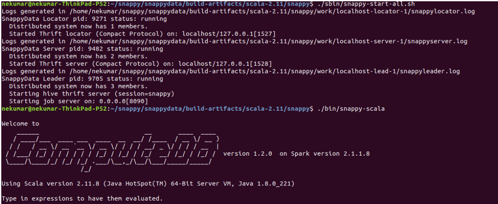
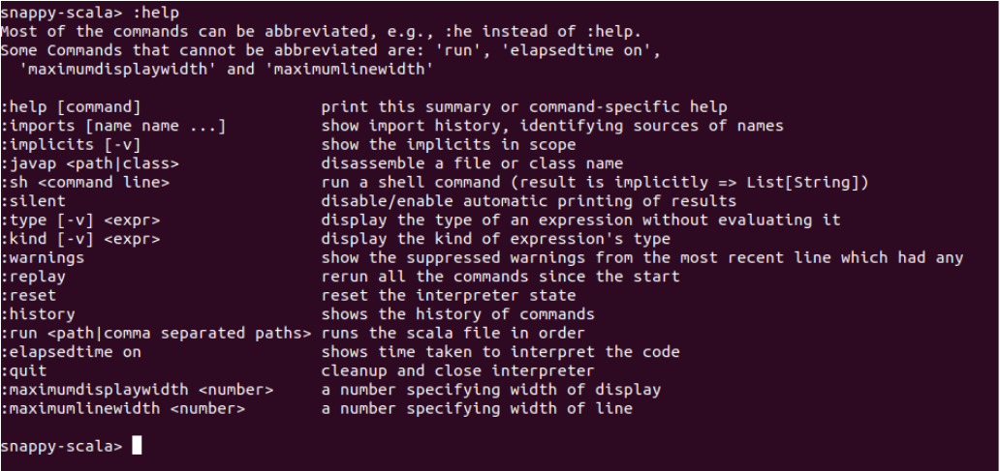

# snappy-scala CLI

The snappy-scala CLI is introduced as an experimental feature in the TIBCO ComputeDB 1.2.0 release. This is similar to the Spark shell in its capabilities. The [Spark documentation](https://spark.apache.org/docs/2.1.1/quick-start.html) defines the Spark shell as follows: 

***Spark’s shell provides a simple way to learn the API, as well as a powerful tool to analyze data interactively. It is available in either Scala (which runs on the Java VM and is thus a good way to use existing Java libraries) or Python.***

A developer who is learning the Spark APIs of SparkContext, SparkSession, RDD, DataSet, DataSources, ML, etc. , can use the following utilities:

*	**Spark shell** to quickly bring up an interactive shell and start learning and experimenting with the APIs. 
*	**PySpark**, provided by spark, for interactive Python where you can interactively learn the Python APIs that are provided by Spark.

Spark shell is a spark application that is built on Scala’s REPL (Read-Evaluate-Print loop). It accepts Scala code as input, executes the instructions as per the code, and returns the output of those instructions. After this utility is invoked, the spark driver comes into life, in which a SparkContext, a SparkSession, and a REPL object are initialized, and an interactive shell is provided to the users on the driver VM itself for interactive learning.
The high cost, in terms of time and efforts, for each change warranting code compilation and then adding into a jar can be entirely avoided by using the Spark shell. A developer who wants to develop a Spark job can start by writing the code in a Spark shell and improve the job in interactive iterations. After the developer is satisfied with the quality of the code, it can be converted into a Spark Job.

The idea of snappy-scala CLI is similar to that of Spark shell with few differences. With the snappy-scala CLI, you can interactively learn all the Spark APIs, the additional TIBCO ComputeDB APIs and also have the same experience of a Scala REPL or a Spark shell REPL app. You can still use the Spark shell and connect to a TIBCO ComputeDB cluster in Smart Connector mode, but you will require a separate Spark cluster for that. Moreover, that will be a different experience wherein the TIBCO ComputeDB cluster is used mostly as a DataSource by the Spark application.

snappy-scala CLI is built on top of the [exec scala](/reference/sql_reference/exec-scala.md) feature and the already existing snappy CLI utility, which connects to the TIBCO ComputeDB cluster using the JDBC driver. snappy-scala CLI is not a true scala interpreter but mimics a scala or a Spark shell type of interpreter. Each line of the code is shipped to the Lead node of the TIBCO ComputeDB cluster. The code is interpreted there, and the result of the interpretation is then brought back to the snappy-scala CLI. It is displayed in the same fashion as that of a Scala REPL.

Although the experience of the snappy-scala CLI is similar to that of a Scala or a Spark shell, yet a couple of important features are either missing or are thinly supported. This is because it is currently an experimental feature. The following are a couple of notable differences between the Spark shell and snappy-scala CLI:

* The auto completion feature, which is rich in a true Scala or Scala based interpreter. It is almost as rich as an IDE, where it can prompt possible completions, method signature, word completion, syntaxes, etc.  
* Support for the list of commands which can be executed on the shell.

The following image shows a simple TIBCO ComputeDB cluster, which is started, and then the snappy-scala is launched to connect.



### Command-line options

```
$ ./bin/snappy-scala -h

Usage:

snappy-scala [OPTIONS]

OPTIONS and Default values

   -c LOCATOR_OR_SERVER_ENDPOINT  (default value is localhost:1527)

   -u USERNAME                    (default value is APP)

   -p PASSWORD                    (default value is APP)

   -r SCALA_FILE_PATHS            (comma separated paths if multiple)

   -h, --help                     (prints script usage)

```

The following options are only available currently:

| Options | Description |
|--------|--------|
|     **-c**    |   The endpoint of the server host port to which the tool connects. If the option is not specified, then the CLI attempts to connect to **localhost:1527** endpoint.     |
|    **-u **   | The user who wants to start the shell. If the user is trying to connect to a secured TIBCO ComputeDB cluster, then this user will be authenticated by the server. |
|    **-p**    |  Password of the user.  |
|    ** -r **  |    A list of files that can be passed as an argument. The file should contain valid Scala code, which is interpreted line by line by the tool. If there are more than one file to be passed, then the list must be comma-separated.    |
| **-h  **      | prints the usage of the script.|


### Securing the Usage of snappy-scala CLI

This is the same as [securing the usage of **exec scala**](/programming_guide/scala_interpreter.md#secureexscala). In a secured system, by default, only the DB owner has the permission to secure the usage and can grant this privilege to other users as well. Apart from running the Scala code, the CLI also takes predefined commands. Each of these commands has a specific purpose. All these commands start with a colon **:**. With the help of this, the interpreter differentiates between the code and command.

On the snappy-scala prompt, type **:help** for the list of supported commands. The following image shows the  list of the available commands that are displayed when you type **:help** command:



All the commands are listed with their corresponding description when **:help** is typed on the snappy-scala prompt. This is mostly a subset of what Spark shell provides. Some of the missing ones are **:paste**, **:edit**, **:load** etc. There are few commands which are specific to snappy-scala such as **:maximumdisplaywidth**, **:elapsedtime on** etc. The following table lists the commands that are supported by snappy-scala:

| Commands | Description |
|--------|--------|
|   **:help**     |    Prints the list of all the available commands along with the corresponding descriptions.    |
|**  :implicits **     |   The imported implicits in the session so far.     |
| ** :javap**      |    Decompiles a java class.     |
|** :sh **      |   Runs a shell command.     |
|  ** :silent **    |     The CLI becomes silent and does not print the output after each execution.   |
|   **:type**     |  Prints the type of the Symbol, which is passed in the argument. For example, if **x** is an Int then **:type x** prints **INT** |
|   **:kind **     |   Prints the kind of the expression type. |
|   **:warnings**     |   Prints any warning in the session.     |
|  ** :replay **    |  Re-runs all the code from the beginning of the session or from the last point of **:reset**. Commands are not replayed. The difference with Spark shell on this command is that with snappy-scala, the replay can be done only once, and the buffer containing the commands is then emptied. In case the command is replayed again without running any code, then a message **Nothing to replay** is displayed.      |
|    **:reset **   |    It resets all the state in the interpreter. All types, symbols, imports, etc. created in the session will be lost.    |
|**:history **     |  Prints the Scala code that was run in the session.      |
|**:run **| Passes a path to the Scala file as an argument to this command. The scala code in the file is executed one by one by the snappy-scala CLI.|

The following are additional commands provided in the snappy-scala CLI over the Spark shell commands.

| Command| Description |
|--------|--------|
|   **:elapsedtime on **    |Displays the elapsed time of each and every line of code or command which is executed on the interpreter.  |
| **:quit**|  The session is closed, and you can exit the CLI program.|
|**:maximumdisplaywidth <number>**   | Sets the largest display width of the CLI output to the specified value. Usually, this command is used to increase the default value to display long lines that come in the output. |
|** :maximumlinewidth <number>** |Same as above. This command sets the largest display width for each line output from the interpreter to the specified value. |