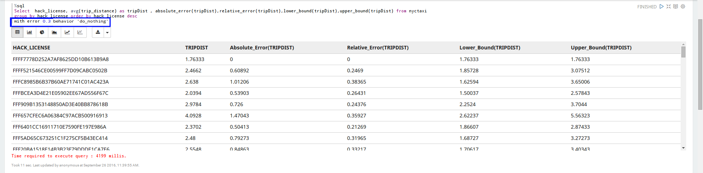
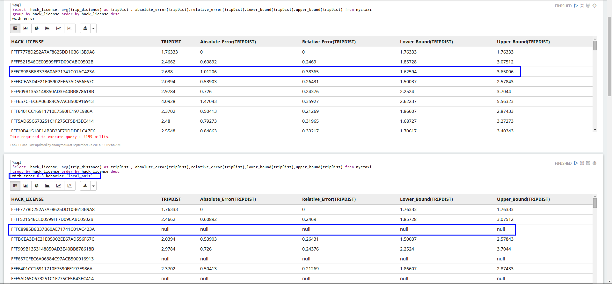
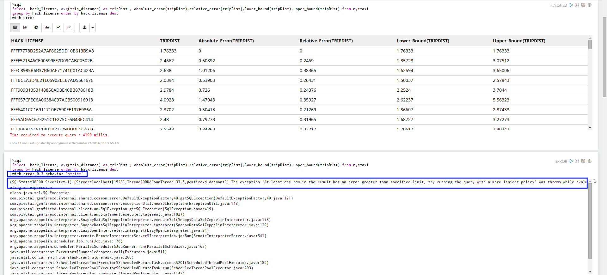
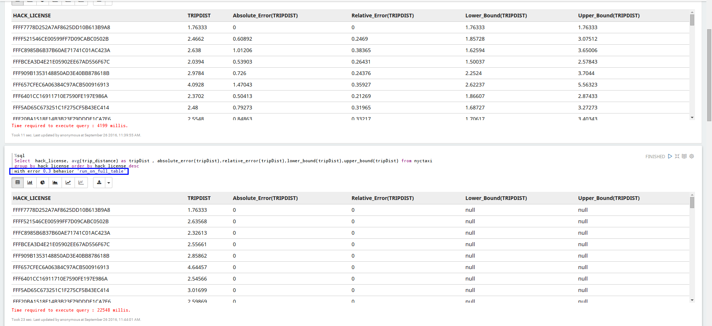

# High-level Accuracy Contracts (HAC)

TIBCO ComputeDB combines state-of-the-art approximate query processing techniques and a variety of data synopses to ensure interactive analytics over both, streaming and stored data. Using high-level accuracy contracts (HAC), TIBCO ComputeDB offers end users intuitive means for expressing their accuracy requirements, without overwhelming them with statistical concepts.

When an error constraint is not met, the action to be taken is defined in the behavior clause. 

## Behavior Clause
Approximate Query Processing (AQP) has HAC support using the following behavior clause. 

### `<do_nothing>`
The AQP engine returns the estimate as is. 



### `<local_omit>`
For aggregates that do not satisfy the error criteria, the value is replaced by a special value like "null". 



### `<strict>`
If any of the aggregate column in any of the rows do not meet the HAC requirement, the system throws an exception. 


### `<run_on_full_table>`
If any of the single output row exceeds the specified error, then the full query is re-executed on the base table.



### `<partial_run_on_base_table>`
If the error is more than what is specified in the query, for any of the output rows (that is sub-groups for a group by query), the query is re-executed on the base table for those sub-groups.  This result is then merged (without any duplicates) with the result derived from the sample table. 


In the following example, any one of the above behavior clause can be applied. 

```pre
SELECT sum(ArrDelay) ArrivalDelay, Month_ from airline group by Month_ order by Month_  with error <fraction> [CONFIDENCE <fraction>] [BEHAVIOR <behavior>]
```

## Error Functions
In addition to this, TIBCO ComputeDB supports error functions that can be specified in the query projection. These error functions are supported for the SUM, AVG and COUNT aggregates in the projection. 

The following four methods are available to be used in query projection when running approximate queries:

* **absolute_error(column alias)**: Indicates absolute error present in the estimate (approx answer) calculated using error estimation method (ClosedForm or Bootstrap) 

* **relative_error(column alias)**: Indicates ratio of absolute error to estimate.

* **lower_bound(column alias)**: Lower value of an estimate interval for a given confidence.

* **upper_bound(column alias)**: Upper value of an estimate interval for a given confidence.

Confidence is the probability that the value of a parameter falls within a specified range of values.

For example:

```pre
SELECT avg(ArrDelay) as AvgArr ,absolute_error(AvgArr),relative_error(AvgArr),lower_bound(AvgArr), upper_bound(AvgArr),
UniqueCarrier FROM airline GROUP BY UniqueCarrier order by UniqueCarrier WITH ERROR 0.12 confidence 0.9
```
* The `absolute_error` and `relative_error` function values returns 0 if query is executed on the base table. 
* `lower_bound` and `upper_bound` values returns null if query is executed on the base table. 
* The values are seen in case behavior is set to `<run_on_full_table>` or`<partial_run_on_base_table>`

In addition to using SQL syntax in the queries, you can use data frame API as well. 
For example, if you have a data frame for the airline table, then the below query can equivalently also be written as :

```pre
select AVG(ArrDelay) arrivalDelay, relative_error(arrivalDelay), absolute_error(arrivalDelay), Year_ from airline group by Year_ order by Year_ with error 0.10 confidence 0.95
```

```pre
snc.table(basetable).groupBy("Year_").agg( avg("ArrDelay").alias("arrivalDelay), relative_error("arrivalDelay"), absolute_error("arrivalDelay"), col("Year_")).withError(0.10, .95).sort(col("Year_").asc) 
```

## Reserved Keywords
Keywords are predefined reserved words that have special meanings and cannot be used in a paragraph. Keyword `sample_` is reserved for TIBCO ComputeDB.

If the aggregate function is aliased in the query as `sample_<any string>`, then what you get is true answers on the sample table, and not the estimates of the base table.

`select count() rowCount, count() as sample_count from airline with error 0.1`

rowCount returns estimate of a number of rows in airline table.
sample_count returns a number of rows (true answer) in sample table of airline table.

