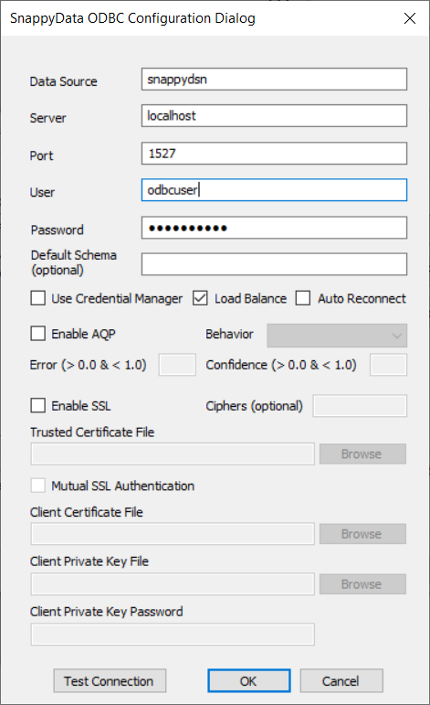

# Setting Up TIBCO ComputeDB ODBC Driver

!!! Note
	* This is currently tested and supported only on Windows 10 (32-bit and 64-bit systems).

    * [Download and Install Visual C++ Redistributable for Visual Studio 2013](https://www.microsoft.com/en-in/download/details.aspx?id=40784) 

## Step 1: Install the TIBCO ComputeDB ODBC Driver

1. [Download the TIBCO ComputeDB 1.2.0 Enterprise Edition](install.md#download-snappydata).

2. Click **ODBC INSTALLERS** to download the **TIB_compute-odbc_1.2.0_win.zip** file.

3. Follow [steps 1 and 2](howto/connect_using_odbc_driver.md) to install the TIBCO ComputeDB ODBC driver.

## Step 2: Create TIBCO ComputeDB DSN from ODBC Data Sources 64-bit/32-bit

To create TIBCO ComputeDB DSN from ODBC Data Sources:

1. Open the **ODBC Data Source Administrator** window:

	a. On the **Start** page, type ODBC Data Sources, and select **Set up ODBC data sources** from the list or select **ODBC Data Sources** in the **Administrative Tools**.

	b.  Based on your Windows installation, open ODBC Data Sources (64-bit) or ODBC Data Sources (32-bit).

2. In the **ODBC Data Source Administrator** window, select either the **User DSN** or **System DSN** tab. 

3. Click **Add** to view the list of installed ODBC drivers on your machine.

4. From the list of drivers, select **TIBCO ComputeDB ODBC Driver** and click **Finish**.

5. The **TIBCO ComputeDB ODBC Configuration** dialog is displayed.  Enter the following details to create a DSN:

	| Item  | Description |
	|--------|--------|
	|   **Data Source Name**     |  Name of the Data Source. For example, *snappydsn*.       |
	|     **Server (Hostname or IP)**   |      IP address of the data server which is running in the TIBCO ComputeDB cluster.|
	|  **Port**      |  Port number of the server. By default, it is **1528** for the first data server in the cluster, if all the nodes in the cluster are started on the same machine.      |
	|   **Login ID**     | The login ID required to connect to the server. For example, _app_       |
	|    **Password**     |  The password required to connect to the server. For example, _app_      |
	|  **AQP**      |   Checks the AQP checkbox for aqp queries:  **Error**: Maximum relative error tolerable in the approximate value calculation. It should be a fractional value not exceeding 1.  **Confidence**: Confidence with which the error bounds are calculated for the approximate value. It should be a fractional value not exceeding 1.  **Behavior**: The action to be taken if the error computed goes outside the error tolerance limit.   |
	|    [**Enable SSL**](#enabssl)    | If you are connecting to a TIBCO ComputeDB cluster that has Secure Sockets Layer (SSL) enabled, you can configure the driver for connecting.        |
    
    

	
!!!Note
	ODBC driver cannot connect to the locator and must connect directly to one of the servers. Therefore, in cases where you start a cluster with multiple nodes on different machines and if the server and locator are collocated on a specific machine, then the port number of the server would be higher than that of the locator port which will be 1528. In case the locator is not collocated with the server on a machine then the server port will be 1527.   Ensure that you provide the IP Address/Host Name and Port number of the data server. If you provide the details of the locator, the connection fails. 

### Enabling SSL
The following instructions describe how to configure SSL in a DSN:

1.	Select the **Enable SSL** checkbox.
2.	To allow authentication using self-signed trusted certificates, specify the full path of the PEM file containing the self trusted certificate. For a self-signed trusted certificate, a common host name should match.
3.	To configure two-way SSL verification, select the Two Way SSL checkbox and then do the following:
	*	In the **Trusted Certificate file** field, specify the full path of the PEM file containing the CA-certificate.
	*	In the **Client Certificate File** field, specify the full path of the PEM file containing the client's certificate.
	*	In the **Client Private Key File** field, specify the full path of the file containing the client's private key.
	*	In the **Client Private key password **field, provide the private key password.
	*	Enter the **ciphers** that you want to use. This is an optional input. If left empty then default ciphers are `"ALL:!ADH:!LOW:!EXP:!MD5:@STRENGTH"`
	
For information about connecting Tableau using TIBCO ComputeDB ODBC Driver, refer to [Connect Tableau using ODBC Driver](./howto/tableauconnect.md#odbcdritab)
