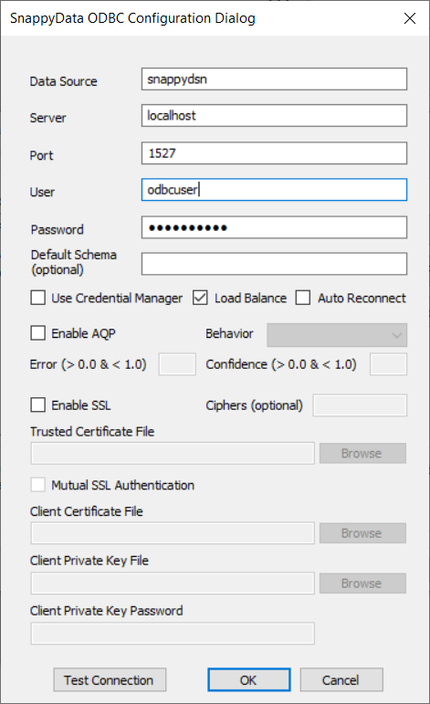

# Setting Up SnappyData ODBC Driver

!!! Note
	* This is currently tested and supported only on Windows 10 (32-bit and 64-bit systems) but binaries for only Windows 10 64-bit are provided.

    * [Download and Install Visual C++ Redistributable for Visual Studio 2015 and above](https://aka.ms/vs/16/release/vc_redist.x64.exe)

## Step 1: Install the SnappyData ODBC Driver

1. [Download the SnappyData 1.3.1 Community Edition](install/index.md#download-snappydata).

2. Download the **snappydata-odbc_1.3.0_win64.zip** file.

3. Follow [steps 1 and 2 in the howto](howto/connect_using_odbc_driver.md) to install the SnappyData ODBC driver.

## Step 2: Create SnappyData DSN from ODBC Data Sources 64-bit/32-bit

To create SnappyData DSN from ODBC Data Sources:

1. Open the **ODBC Data Source Administrator** window:

    a. On the **Start** page, type ODBC Data Sources, and select **Set up ODBC data sources** from the list or select **ODBC Data Sources** in the **Administrative Tools**.

    b.  Based on your Windows installation, open ODBC Data Sources (64-bit) or ODBC Data Sources (32-bit).

2. In the **ODBC Data Source Administrator** window, select either the **User DSN** or **System DSN** tab.

3. Click **Add** to view the list of installed ODBC drivers on your machine.

4. From the list of drivers, select **SnappyData** and click **Finish**.

5. The **SnappyData ODBC Configuration** dialog is displayed.  Enter the following details to create a DSN:

    | Item  | Description |
    |-------|-------------|
    | **Data Source**    | Name of the Data Source. For example, *snappydsn*. |
    | **Server**         | Host name or IP address of the data server which is running in the SnappyData cluster. |
    | **Port**           | Port number of the server. By default, it is **1527** for the first locator in the cluster. |
    | **User**           | The user name required to connect to the server. For example, _app_ |
    | **Password**       | The password required to connect to the server. For example, _app_ |
    | **Default Schema** | Optional argument to change the default schema set on the connection. By default it is the user name. |
    | **Use Credential Manager** | Use the credential manager to get the password securely. If enabled, the password field contains the key of the Generic Windows Credentials in the Windows Credential Manager to be looked up. |
    | **Load Balance**   | Obtain a connection to some server in the cluster in a load balanced way. When this is enabled, the host/port provided should be that of a locator. Conversely this option *must* be enabled if the provided host/port are that of a locator. |
    | **Auto Reconnect** | When this option is enabled, connections to the SnappyData cluster will attempt to reconnect on the next operation if an operation fails due to TCP connection failing for some reason (network or anything else). |
    | **AQP**            | Check the AQP checkbox for aqp queries:  **Error**: Maximum relative error tolerable in the approximate value calculation. It should be a fractional value not exceeding 1.  **Confidence**: Confidence with which the error bounds are calculated for the approximate value. It should be a fractional value not exceeding 1.  **Behavior**: The action to be taken if the error computed goes outside the error tolerance limit. |
    | [**Enable SSL**](#enabssl) | If you are connecting to a SnappyData cluster that has Secure Sockets Layer (SSL) enabled, you can configure the driver for connecting. |

    

### Enabling SSL
The following instructions describe how to configure SSL in a DSN:

1.	Select the **Enable SSL** checkbox.
2.	To allow authentication using self-signed trusted certificates, specify the full path of the PEM file containing the self trusted certificate. For a self-signed trusted certificate, a common host name should match.
3.	To configure two-way SSL verification, select the Two Way SSL checkbox and then do the following:
	*	In the **Trusted Certificate file** field, specify the full path of the PEM file containing the CA-certificate.
	*	In the **Client Certificate File** field, specify the full path of the PEM file containing the client's certificate.
	*	In the **Client Private Key File** field, specify the full path of the file containing the client's private key.
	*	In the **Client Private key password **field, provide the private key password.
	*	Enter the **ciphers** that you want to use. This is an optional input. If left empty then default ciphers are `"ALL:!ADH:!LOW:!EXP:!MD5:@STRENGTH"`

For information about connecting Tableau using SnappyData ODBC Driver, refer to [Connect Tableau using ODBC Driver](./howto/tableauconnect.md#odbcdritab)
