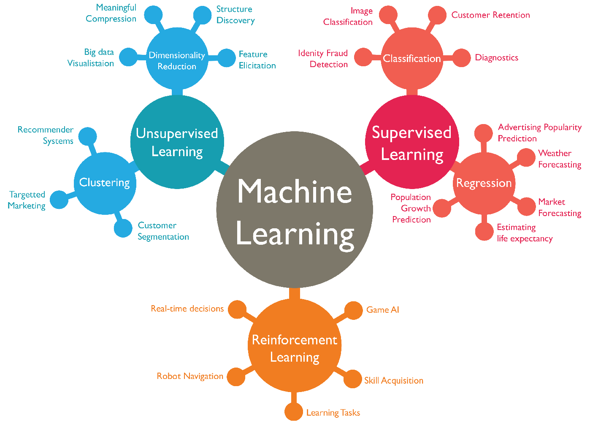

# 10 Companies Using Machine Learning in Cool Ways 

If science-fiction movies have taught us anything, it’s that the future is a bleak and terrifying dystopia ruled by murderous sentient robots.

Fortunately, only one of these things is true – but that could soon change, [as the doomsayers are so fond of telling us](https://www.recode.net/2017/7/25/16026184/mark-zuckerberg-artificial-intelligence-elon-musk-ai-argument-twitter).

Artificial intelligence and machine learning are among the most significant technological developments in recent history. Few fields promise to “disrupt” (to borrow a favored term) life as we know it quite like machine learning, but many of the applications of machine learning technology go unseen.

Want to see some real examples of machine learning in action? Here are 10 companies that are using the power of machine learning in new and exciting ways (plus a glimpse into the future of machine learning).

## Basic Table

| Company | Feature |
|--------|--------|
|  Yelp      |    Image Curation at Scale    |
|    Pinterest    |     Improved Content Discovery   |
|       Facebook |       Chatbot Army |
|    Twitter    |    Curated Timelines     |
|    Google    |     Neural Networks and ‘Machines That Dream’   |
|        Edgecase|       Improving Ecommerce Conversion Rates |
|      Baidu  |       The Future of Voice Search |
|    HubSpot    |       Smarter Sales |
|     IBM   |    Better Healthcare    |
|   Salesforce     |   Intelligent CRMs     |

## Big table

| Store Type | Storage Engine |Fault-tolerant?|Description |
|--------|--------|--------|--------|
|   Persistent KeyValueStore<K, V>     |RocksDB        |Yes (enabled by default)|The recommended store type for most use cases: <ul><li>Stores its data on local disk.</li><li>Storage capacity: managed local state can be larger than the memory (heap space) of an application instance, but must fit into the available local disk space.</li><li>RocksDB settings can be fine-tuned
|   Persistent KeyValueStore<K, V>     |RocksDB        |Yes (enabled by default)|The recommended store type for most use cases  
|   Persistent KeyValueStore<K, V>     |RocksDB        |Yes (enabled by default)|The recommended store type for most use cases|
|   Persistent KeyValueStore<K, V>     |RocksDB        |Yes (enabled by default)  |The recommended store type for most use cases|
|   Persistent KeyValueStore<K, V>     |RocksDB        |Yes (enabled by default)|The recommended store type for most use cases|
|   Persistent KeyValueStore<K, V>     |RocksDB        |Yes (enabled by default)|The recommended store type for most use cases|
|   Persistent KeyValueStore<K, V>     |RocksDB        |Yes (enabled by default)|The recommended store type for most use cases|
|   Persistent KeyValueStore<K, V>     |RocksDB        |Yes (enabled by default)|The recommended store type for most use cases|

To add a line break within a table, use:

| Properties | Description |
|--------|--------|
|-Text|Text.  This property must be set in the *conf/servers* and *conf/leads* file.|

OR to add unordered list

| Properties | Description |
|--------|--------|
|-snappydata.flushReservoirThreshold|TO ADD BULLETS, write your text and add bullet points in the following format.   * Bullet Text  * Bullet Text   * Bullet.  |

OR to add ordered list

| Properties | Description |
|--------|--------|
|-snappydata.flushReservoirThreshold|To add numbers, write your text and add numbering in the following format.   * Bullet Text  * Bullet Text   * Bullet.   1. Text    2. Text    3. Text .|
