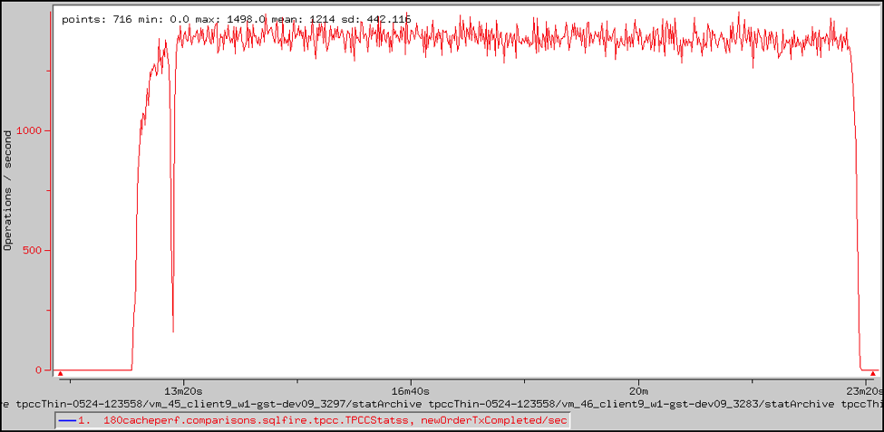

# <a id= getstart> </a>Getting Started in 5 Minutes or less

Welcome to the Getting Started section!
In this section, multiple options are provided for getting started with SnappyData.

## Before you begin

You must first download and extract the SnappyData product distribution, navigate to the SnappyData product root directory and start the cluster.

Depending on your preference you can try any of the following options:

-     [Getting started with your Spark distribution](../quickstart/getting_started_with_your_spark_distribution/)
-     [Getting started by installing SnappyData On-Premise](../quickstart/getting_started_with_your_spark_distribution/)
-     [Getting started with Docker image](../quickstart/getting_started_with_docker_image/)

This section contains instructions and examples using which, you can try out SnappyData in 5 minutes or less.

-     [Using Spark Scala APIs](../quickstart/using_spark_scala_apis/)
-     [SnappyData performance: 16x-20x faster than Apache Spark](../quickstart/performance_apache_spark/)
-     [Using SQL](../quickstart/using_sql/)

!!! note
Support for Microsoft Azure will be provided in future releases.

# Heading 1
## Heading 2
### Heading 3
<heading2>HEADING that I do not want included in the TOC </heading2>


[Hyperlink](https://docs.google.com/document/d/14CTfEQOtWrXyjTEVdnGaDfkIX0FiGdhBzznblMesMuQ/edit#)


* Unordered list
	- unordered list 1

1 Ordered list

2 ordered list

			a second level
            
            b second level
           

[Link to another md file](procedures.md)

[lgeogy@snappydata.io](mailto:lgeogy@sn
appydata.io)

[Bookmark](#getstart)

**bold**

*italics*

This is how you insert `Inline Code`

This is how you insert block code:

````
Block codeBlock codeBlock codeBlock codeBlock codeBlock codeBlock codeBlock codeBlock code
Block codeBlock codeBlock codeBlock codeBlock codeBlock codeBlock codeBlock codeBlock code
````
```pre
Block codeBlock codeBlock codeBlock codeBlock codeBlock codeBlock codeBlock codeBlock code
Block codeBlock codeBlock codeBlock codeBlock codeBlock codeBlock codeBlock codeBlock code
```
<ent>This feature is available only in the Enterprise version of SnappyData. </ent>

!!! note
This is used for note, info, tip, warning etc.

# Troubleshooting
<error> **Error Message:** 
</error> 
<error-text> This is error message
</error-text>
<diagnosis> **Diagnosis:**</br>
Here you specify the diagnosis.
</diagnosis>
<action> **Solution:** </br>
Here the solution
</action>

##Basic Table

| Company | Feature |
|--------|--------|
|  Yelp      |    Image Curation at Scale    |
|    Pinterest    |     Improved Content Discovery   |
|       Facebook |       Chatbot Army |
|    Twitter    |    Curated Timelines     |
|    Google    |     Neural Networks and ‘Machines That Dream’   |
|        Edgecase|       Improving Ecommerce Conversion Rates |
|      Baidu  |       The Future of Voice Search |
|    HubSpot    |       Smarter Sales |
|     IBM   |    Better Healthcare    |
|   Salesforce     |   Intelligent CRMs     |

