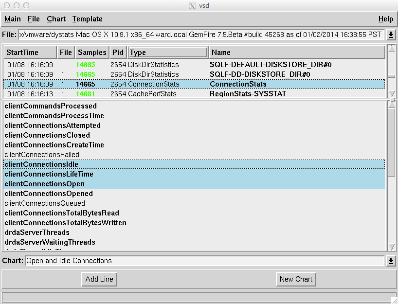

# Client Connections

TIBCO ComputeDB provides several statistics to help you determine the frequency and duration of client connections to the distributed system.

The following tables describe some commonly-used connection statistics. Examine the VSD output for information about additional connection statistics.

|                 |                                                                                 |
|-----------------|---------------------------------------------------------------------------------|
| **Type**        | `ConnectionStats`                            |
| **Name**        | `ConnectionStats`                            |
| **Statistic**   | `clientConnectionsIdle`                      |
| **Description** | The number of client connections that were idle at the statistic sampling time. |

|                 |                                                                                                                          |
|-----------------|--------------------------------------------------------------------------------------------------------------------------|
| **Type**        | `ConnectionStats`                                                                     |
| **Name**        | `ConnectionStats`                                                                     |
| **Statistic**   | `clientConnectionsOpen`                                                               |
| **Description** | The total number of client connections that were open (both active and idle connections) at the statistic sampling time. |

|                 |                                                                                                         |
|-----------------|---------------------------------------------------------------------------------------------------------|
| **Type**        | `ConnectionStats`                                                    |
| **Name**        | `ConnectionStats`                                                    |
| **Statistic**   | `clientConnectionsOpened, peerConnectionsOpened`                     |
| **Description** | The total number of client connections that were successfully opened up to the statistic sampling time. |

|                 |                                                                                                        |
|-----------------|--------------------------------------------------------------------------------------------------------|
| **Type**        | `ConnectionStats`                                                   |
| **Name**        | `ConnectionStats`                                                   |
| **Statistic**   | `clientConnectionsFailed, peerConnectionsFailed`                    |
| **Description** | The total number of unsuccessful connection attempts that were made up to the statistic sampling time. |

## Example: Selecting Connection Statistics

This figure illustrates how to select the connection statistics for graphing.

