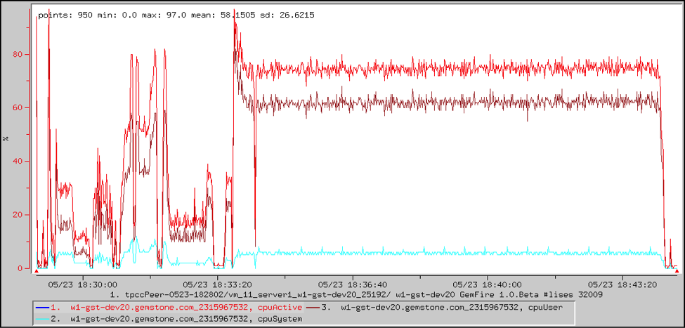

# CPU Usage

TIBCO ComputeDB provides host and JVM statistics for examining system load.

An example follows the table.

|                 |                                                        |
|-----------------|--------------------------------------------------------|
| **Type**        | `LinuxSystemStats`  |
| **Name**        | `<hostname> ` |
| **Statistic**   | `cpus`              |
| **Description** | Number of CPUs on this host.                           |

|                 |                                                                                                                                                              |
|-----------------|--------------------------------------------------------------------------------------------------------------------------------------------------------------|
| **Type**        | `LinuxSystemStats`                                                                                                        |
| **Name**        | `<hostname> `                                                                                                       |
| **Statistic**   | `cpuActive, cpuSystem, cpuUser `                                                                                          |
| **Description** | Percentage of the total available time that has been used in a non-idle state, in system (kernel) code and in user code. This is aggregated across all CPUs. |

|                 |                                                                                                    |
|-----------------|----------------------------------------------------------------------------------------------------|
| **Type**        | `LinuxSystemStats`                                              |
| **Name**        | `<hostname> `                                             |
| **Statistic**   | `loadAverage1, loadAverage5, loadAverage15 `                    |
| **Description** | Average number of threads in the run queue or waiting for disk I/O over the last 1, 5, 15 minutes. |

|                 |                                                         |
|-----------------|---------------------------------------------------------|
| **Type**        | `VMStats`            |
| **Name**        | `vmStats`            |
| **Statistic**   | `processCpuTime`     |
| **Description** | CPU time, measured in nanoseconds, used by the process. |

## Example: CPU Usage by System and User

This VSD chart shows the CPU usage in a fabric server, and breaks it down into system and user. The majority of the time is spent in user code. The first few minutes correspond to loading various tables. The rest is the main workload, during which many clients are executing transactions.

