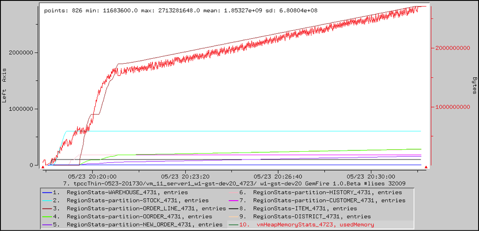
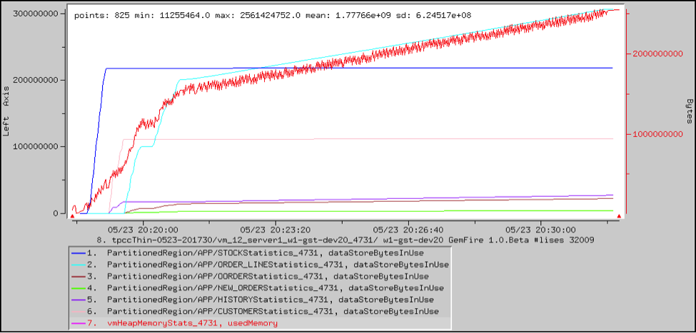

#  Memory Usage

TIBCO ComputeDB provides statistics for system memory, JVM heap, garbage collection, and table sizes.

You can use these statistics to analyze your application's memory usage. An example follows the table.

|                 |                                                                                                         |
|-----------------|---------------------------------------------------------------------------------------------------------|
| **Type**        | `CachePerfStats`                                                     |
| **Name**        | `RegionStats-<table> and RegsionStats-partition-<table>` |
| **Statistic**   | `entries`                                                            |
| **Description** | Number of rows in the replicated or partitioned table.                                                  |

|                 |                                                                                               |
|-----------------|-----------------------------------------------------------------------------------------------|
| **Type**        | `PartitionedRegionStats`                                   |
| **Name**        | `PartitionedRegion/<schema>/<table>Statistics` |
| **Statistic**   | `dataStoreEntryCount and dataStoreBytesInUse`              |
| **Description** | Number of rows/bytes in a partitioned table, including redundant copies.                      |

|                 |                                                               |
|-----------------|---------------------------------------------------------------|
| **Type**        | `VMMemoryUsageStats`       |
| **Name**        | `vmHeapMemoryStats`        |
| **Statistic**   | `usedMemory and maxMemory` |
| **Description** | Used heap and maximum heap, in bytes.                         |

|                 |                                                                                                      |
|-----------------|------------------------------------------------------------------------------------------------------|
| **Type**        | `VMMemoryUsageStats`                                              |
| **Name**        | `OffHeapMemoryStats`                                              |
| **Statistic**   | `usedMemory, maxMemory, freeMemory`                               |
| **Description** | Used off-heap memory, maximum (amount allocated) off-heap memory, and free off-heap memory in bytes. |

|                 |                                                                                |
|-----------------|--------------------------------------------------------------------------------|
| **Type**        | `VMMemoryPoolStats`                         |
| **Name**        | `ParSurvivorSpace, ParEdenSpace, CMSOldGen` |
| **Statistic**   | `currentUsedMemory`                         |
| **Description** | Estimated used memory, in bytes, for each heap memory pool.                    |

|                 |                                                                               |
|-----------------|-------------------------------------------------------------------------------|
| **Type**        | `VMGCStats`                                |
| **Name**        | `ParNew, ConcurrentMarkSweep`              |
| **Statistic**   | `collectionTime`                           |
| **Description** | Approximate elapsed time that this garbage collector spent doing collections. |

|                 |                                                                                                                                                                               |
|-----------------|-------------------------------------------------------------------------------------------------------------------------------------------------------------------------------|
| **Type**        | `LinuxSystemStats`                                                                                                                         |
| **Name**        | `<hostname>`                                                                                                                         |
| **Statistic**   | `pagesSwappedIn, pagesSwappedOut`                                                                                                          |
| **Description** | Number of pages that have been brought into memory from disk or flushed out of memory to disk by the operating system. These paging operations seriously degrade performance. |

## Example: Heap Usage

This VSD chart shows the heap usage in a fabric server plotted against the entry counts in each of the replicated and partitioned tables used in an application. This suggests that heap is growing over time due to an increase in the number of rows in the ORDER\_LINE table. Several associated tables are growing in size as well.

This growth can be verified by looking at the bytes used by each of the partitioned tables. The ORDER\_LINE table is responsible for most of the heap growth.

