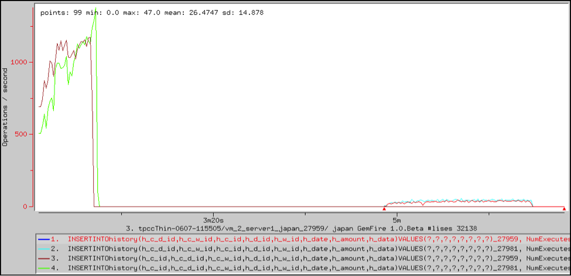

#  SQL Statement Performance

<ent>This feature is available only in the Enterprise version of SnappyData.  </ent> 

With statement-level statistics enabled, statistics are available for all DML statements.

An example follows the table.

|                 |                                                                                                                  |
|-----------------|------------------------------------------------------------------------------------------------------------------|
| **Type**        | `StatementStats`                                                              |
| **Name**        | `INSERT<dml>, SELECT<dml>, UPDATE<dml>, DELETE<dml> ` |
| **Statistic**   | `NumExecutesEnded`                                                            |
| **Description** | The number of times that a statement was executed.                                                               |

## Example: Prepared Statements

This VSD chart shows statistics for two fabric servers for prepared statements that insert rows in the history table. The first round of inserts occurs during initial data loading. The second round occurs as part of normal business operations. This chart also shows that the application used different prepared statements for data loading and subsequent transactions, with slightly different ordering in the fields. If the statements had been identical, there would be only one instance per server.

