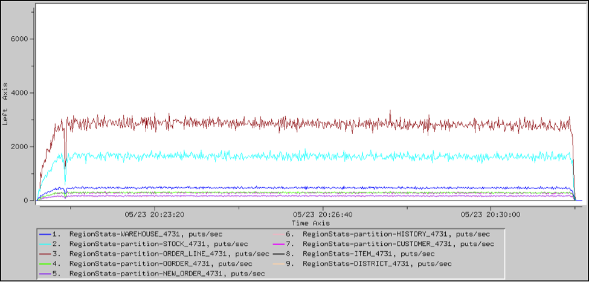
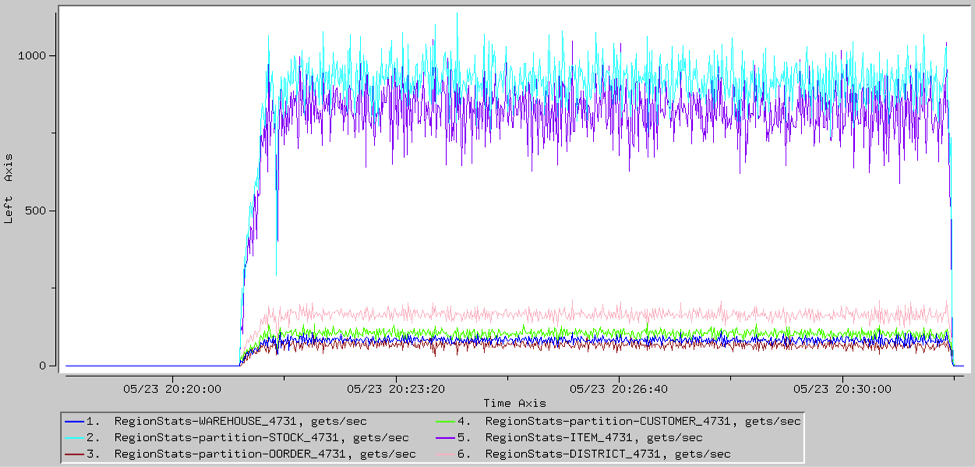
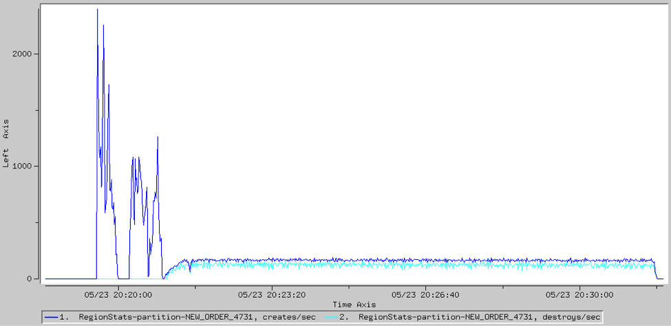

#  Table Performance

<ent>This feature is available only in the Enterprise version of SnappyData.  </ent> 

You can get an idea of the relative performance of inserts, updates, and selects by looking at the underlying statistics.

An example follows the table.

|                 |                                                                                            |
|-----------------|--------------------------------------------------------------------------------------------|
| **Type**        | `CachePerfStats`                                        |
| **Name**        | `RegionStats-<table> `                            |
| **Statistic**   | `creates, puts, deletes`                                |
| **Description** | Number of times that an entry is added to, replaced in, or read from the replicated table. |

|                 |                                                                                             |
|-----------------|---------------------------------------------------------------------------------------------|
| **Type**        | `CachePerfStats`                                         |
| **Name**        | `RegionStats-partition-<table> `                   |
| **Statistic**   | `creates, puts, deletes`                                 |
| **Description** | Number of times that an entry is added to, replaced in, or read from the partitioned table. |

## Example: Read and Write Performance

These VSD charts show the rates of reads and writes to the various tables in the application.

You can use these statistics to see that the NEW\_ORDER table is growing over time. After the initial orders are loaded, new orders are being placed (created) faster than customers are paying for (destroying) them.

