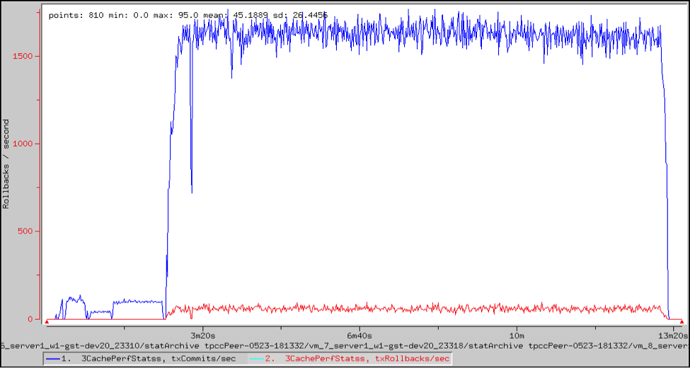
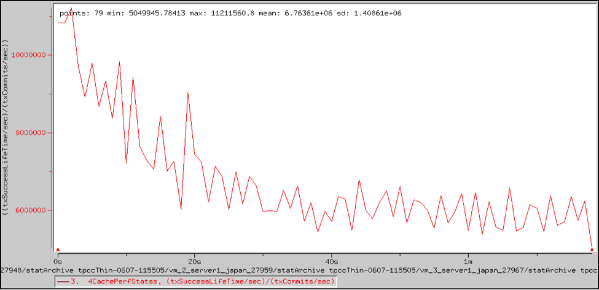

#  Transaction Performance

TIBCO ComputeDB provides statistics for transaction commits, rollbacks, and failures You can monitor TIBCO ComputeDB transactions with VSD.

You can use these statistics to see the transaction rate. An example follows the table.

|                 |                                                                 |
|-----------------|-----------------------------------------------------------------|
| **Type**        | `CachePerfStats`             |
| **Name**        | `cachePerfStats`             |
| **Statistic**   | `txCommits, txRollbacks`     |
| **Description** | The number of times a transaction has committed or rolled back. |

|                 |                                                                            |
|-----------------|----------------------------------------------------------------------------|
| **Type**        | `CachePerfStats`                        |
| **Name**        | `cachePerfStats`                        |
| **Statistic**   | `txSuccessLifeTime, txRollbackLifeTime` |
| **Description** | The total time spent in a transaction that committed or rolled back.       |

## Example: Transaction Rate and Latency

This VSD chart shows the aggregated transaction rate across three FabricServer instances, along with the rollback rate.

With time statistics enabled, you can compute the average latency for each sample point as the total time spent in the transaction divided by the number of transactions in each sample. The chart also shows that the average latency across all samples is 6.76 ms.

